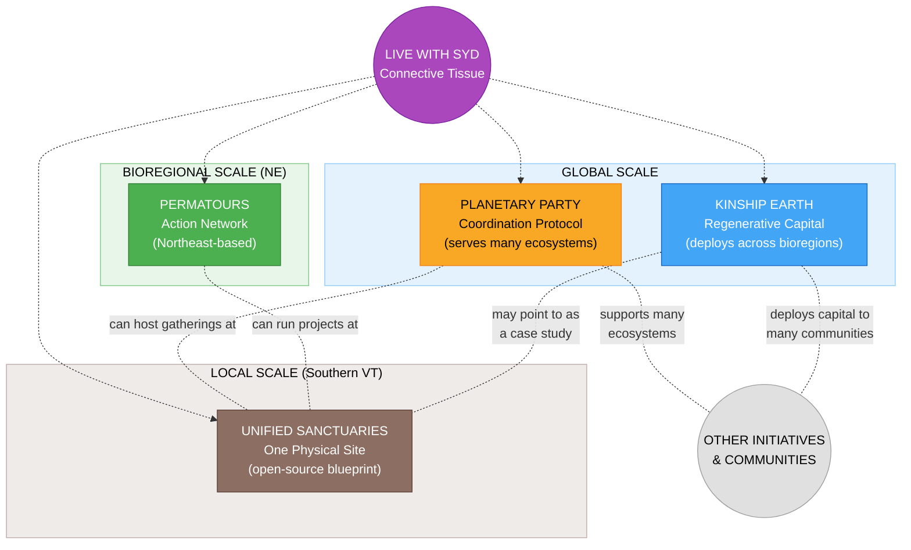

# Sydney's Projects

> *Four regenerative initiatives operating at different scales -- from local land stewardship to global coordination -- each participating in a wider movement beyond any single person's orbit.*

---

## Executive Summary

Syd Harvey Griffith is a community organizer, movement builder, and regenerative finance leader who stewards four interconnected initiatives spanning local, bioregional, and global scales. Together, they form a living ecosystem designed to shift how communities fund themselves, govern themselves, care for land, and care for each other -- moving away from extractive systems and toward regenerative, community-led alternatives.

This is not a closed system where four projects feed each other in a loop. These are **four distinct expressions of a wider regenerative movement**, each with its own integrity, its own communities, and its own outward purpose. They maintain explicit ethical boundaries -- especially around funding -- and are designed to make room for many other communities, organizations, and initiatives beyond Syd's direct orbit.

### The Four Initiatives at a Glance

**Kinship Earth** (Global) -- A 501(c)(3) nonprofit pioneering Bioregional Flow Funding, shifting financial decision-making away from institutional gatekeepers and into the hands of grassroots leaders embedded in their communities. Kinship Earth deploys trust-based capital across multiple bioregions and communities internationally -- no grant applications, no burdensome reporting, just direct resources flowing to the change-makers healing the places they call home. It targets USDA programs, state conservation funds, family foundations, flow funding networks (RSF Social Finance, Thousand Currents), climate and carbon credit markets, and impact investors focused on regenerative land stewardship. Kinship Earth's capital is meant to serve many communities, not primarily resource Syd's own projects.

**Permatours** (Northeast Bioregion) -- A permaculture action, education, and mutual aid network that has co-created **50+ learn-by-doing events** across **40+ land-based project sites** since 2021, with 2,000 email subscribers and 1,000 active members. Permatours activates people to rebuild practical life skills -- food, shelter, care, energy, collaboration -- while strengthening community hubs across the Northeast of Turtle Island. It is evolving into a **decentralized mutual aid network** with autonomous working circles, a **dual-token regenerative economy** (Utility Tokens for exchange, Voice Tokens for governance -- no speculation, no extraction), and a **replicable chapters model** designed to serve bioregions around the world. Permatours flows resources outward to the communities it serves. Fundraising goal: $1M by end of 2026.

**Planetary Party** (Global) -- A cultural and coordination protocol designed to serve many ecosystems, not just Syd's own. It produces regenerative festivals (e.g., Leave a Positive Trace), cultural gatherings, educational events, and cross-ecosystem convergences that build the relational fabric connecting people to regenerative living, to each other, and to the land. Planetary Party is a scaffold that many groups can plug into -- a **coordination layer, not an ownership layer**. Its gatherings serve as peak opportunities for communities to confront pressing challenges, showcase solutions, and unlock capital in service of people and planet. Every event includes built-in media production for documentary storytelling and ongoing distribution.

**Unified Sanctuaries** (Local -- Southern Vermont) -- A regenerative village being designed as an **open-source blueprint** that other communities could adapt. It integrates four pillars: a permaculture farm and education center, a retreat and healing arts center with bathhouse, an event venue and innovation hall, and a cooperative living neighborhood (20+ homes). Revenue potential: $1.4M - $4.5M+ annually across all pillars. Governed through a Community Land Trust with non-speculative land stewardship, earned equity through contribution, consent-based Anchor Circle governance, and a circular economy with its own token system. Currently in pre-acquisition / planning phase. Unified Sanctuaries is **a node, not the trunk** -- one expression among many, not the center everything flows into.

### The Connective Tissue: Live with Syd

Live with Syd is not a fifth project -- it is the nervous system that makes the four initiatives one living ecosystem. Weekly co-creative sessions (Mondays: regenerative capital flows, Wednesdays: Planetary Party governance and culture, Fridays: Unified Sanctuaries land development) plus monthly Heart Sharing and Grief Transmutation Circles create the relational infrastructure that powers everything: donor cultivation, guild building, volunteer mobilization, governance experimentation, storytelling, and the emotional sustainability of the people doing the work. Four dedicated Discord servers provide ongoing community coordination across all pillars.

### The Person Behind It

Syd Harvey Griffith is the rare leader who can hold a singing circle and a cap table in the same breath -- moving between festival stages and funding pipelines, soil science and systems design, ritual theater and real estate. As Executive Director of Kinship Earth, co-founder of Permatours, and lead designer of Planetary Party and Unified Sanctuaries, Syd has supported 40+ land-based projects, pioneered trust-based flow funding, and built networks that span from a single site in Vermont to global coordination. Every project she touches is interconnected by design, because she understands that the only way to build a regenerative future is to build it as a whole system, not in silos.

### Design Principles

1. **Scale is explicit** -- local (Unified Sanctuaries), bioregional (Permatours), global (Planetary Party, Kinship Earth)
2. **Ethical boundaries are visible** -- especially around funding flows between Syd's own projects
3. **No over-centralization** -- hubs exist, but no single project is the trunk everything feeds
4. **Syd's projects are participants in a wider ecosystem**, not the ecosystem itself
5. **Room exists for emergence** -- other organizations, communities, and initiatives beyond Syd's orbit are essential to the picture

---

## The Four Initiatives

| Project | Role | Current Scale | Description |
|---------|------|---------------|-------------|
| [Planetary Party](./planetary-party/) | Cultural & Coordination Protocol | **Global** | A coordination layer for regenerative gatherings, governance, and community engagement -- designed to serve many ecosystems |
| [Kinship Earth](./kinship-earth/) | Flow Funding & Regenerative Capital | **Global** | A nonprofit deploying flow funds across multiple bioregions and communities internationally |
| [Permatours](./permatours/) | Permaculture Action & Mutual Aid Network | **Northeast (bioregional)** | A network of permaculture practitioners and mutual aid connecting projects across the NE bioregion; model replicable elsewhere |
| [Unified Sanctuaries](./unified-sanctuaries/) | Land-Based Project & Community | **Local (one site)** | A regenerative village in Southern Vermont -- one physical expression, designed as an open-source blueprint others can adapt |

> **Note on scale**: These initiatives don't all operate at the same scale. Planetary Party and Kinship Earth are inherently global. Permatours is currently Northeast-based, though the model could be replicated through chapters or aligned groups. Unified Sanctuaries is presently one place, designed as a blueprint for adaptation elsewhere.

## How They Relate

These initiatives are deeply related but are **not designed as a closed loop** where all four equally resource or funnel into one another. They operate at different scales, serve different purposes, and maintain important ethical boundaries -- especially around funding.



- **Planetary Party** is a coordination protocol meant to support many initiatives and ecosystems -- not primarily an amplifier for Syd's own projects
- **Kinship Earth** deploys flow funds across multiple bioregions and communities internationally; ethical boundaries govern how it relates to Syd's other projects
- **Permatours** is currently a Northeast network; it flows resources outward to community members and ecosystems
- **Unified Sanctuaries** is one physical site that could host gatherings, trainings, or serve as a case study -- but it is a node, not the trunk
- **Live with Syd** weaves these initiatives together through weekly sessions, content, and community cultivation
- **Other initiatives, communities, and organizations** that are not directly affiliated with Syd are essential participants in this wider ecosystem

See [ecosystem-map.md](./ecosystem-map.md) for detailed relationship mapping.

## Current Phase

**Planning & Scoping** -- Defining each project's scope, identity, and initial action steps while building on existing work in Unified Sanctuaries and established relationships across all four domains.

## Folder Structure

```
sydney/
├── README.md                  # This file -- ecosystem overview
├── metadata.json              # Brand metadata
├── ecosystem-map.md           # Detailed project relationships and flows
├── planetary-party/           # Project 1
│   └── README.md
├── permatours/                # Project 2
│   └── README.md
├── unified-sanctuaries/       # Project 3
│   └── README.md
└── kinship-earth/             # Project 4
    └── README.md
```

## Related

- Full Unified Sanctuaries brand documentation: [`brands/unified-sanctuaries/`](../unified-sanctuaries/)

---

*These initiatives are stewarded by Syd Harvey Griffith -- community organizer, movement builder, and participant in a wider regenerative movement that is rewriting the rules of how communities fund, build, and sustain themselves. Her projects are part of that movement, not the whole of it.*
