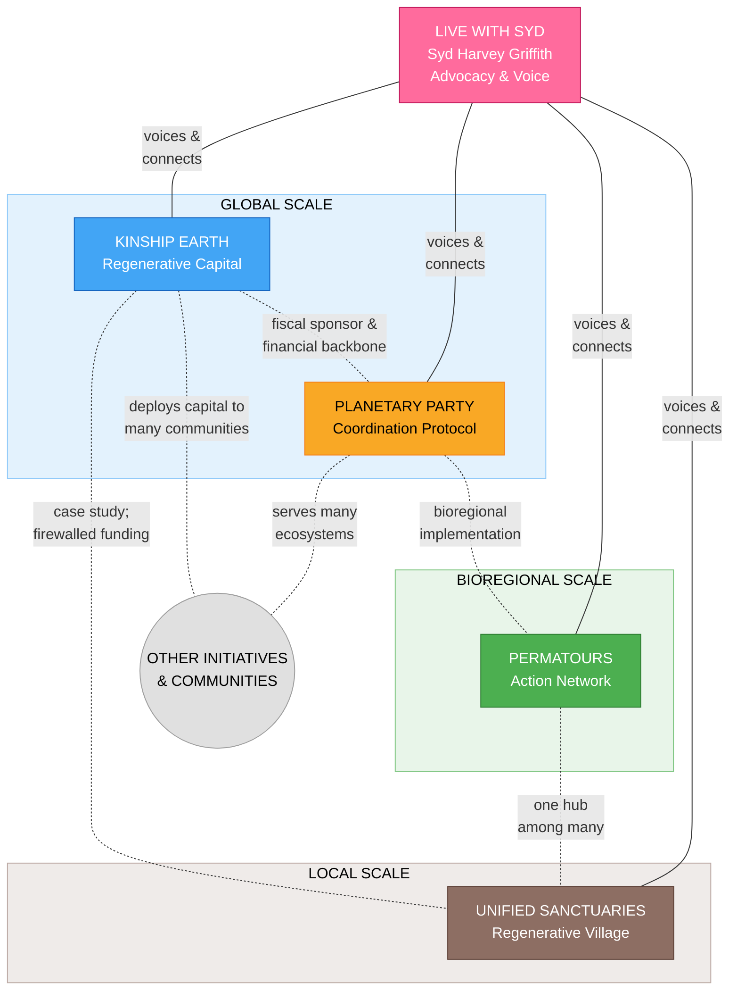

# Sydney's Regenerative Ecosystem

> *A constellation of interconnected initiatives -- from personal advocacy to global coordination -- each capable of operating independently while thriving together through shared values and vision.*

---

## The Ecosystem

At the center of this ecosystem is **[Live with Syd](./live-with-syd/)** -- Sydney's personal advocacy brand and the glue that holds everything together. Through weekly co-creative sessions, storytelling, and community cultivation, Live with Syd serves as the voice and connective tissue for all other initiatives.

| Initiative | Scale | Role | Status |
|------------|-------|------|--------|
| [**Live with Syd**](./live-with-syd/) | Personal/Global | Advocacy Brand & Ecosystem Connective Tissue | Active -- weekly programming & community |
| [**Kinship Earth**](./kinship-earth/) | Global | Flow Funding & Regenerative Capital | Active -- 18+ Flow Funders across 12+ bioregions |
| [**Planetary Party**](./planetary-party/) | Global | Cultural & Coordination Protocol | Active -- 5+ bioregional deployments |
| [**Permatours**](./permatours/) | Northeast Bioregion | Permaculture Action & Mutual Aid Network | Active -- 50+ events, 40+ project sites |
| [**Unified Sanctuaries**](./unified-sanctuaries/) | Local (Southern VT) | Land-Based Regenerative Village | Pre-acquisition / Planning |

### What Each Initiative Offers

- **Live with Syd** -- How do we build community and tell the story?
- **Kinship Earth** -- How does money move differently?
- **Planetary Party** -- How do we coordinate without centralizing?
- **Permatours** -- How do people learn and build together?
- **Unified Sanctuaries** -- What does this look like when rooted in land?

Together, they address the full spectrum of what regenerative transformation requires: **voice**, **capital**, **coordination**, **capacity**, and **place**.

---

## How They Relate

**Syd is the center** -- through Live with Syd, she serves as the voice, storyteller, and connective tissue for all initiatives. Each project can run independently with its own leadership and governance, while remaining interconnected through shared values, cross-pollination of learning, and Sydney's advocacy.

These initiatives are **not a closed loop**. They operate at different scales, serve different purposes, and maintain ethical boundaries -- especially around funding. Each weaves with many other organizations, communities, and initiatives beyond Syd's direct orbit, while the ecosystem thrives together through mutual support and coordination.



See [ecosystem-map.md](./ecosystem-map.md) for detailed relationship mapping.

---

## The Person Behind It

**Syd Harvey Griffith** is a community organizer, movement builder, and regenerative finance leader who stewards these four interconnected initiatives. As Executive Director of Kinship Earth, co-founder of Permatours, and lead designer of Planetary Party and Unified Sanctuaries, Syd has supported 40+ land-based projects, pioneered trust-based flow funding, and built networks spanning from a single site in Vermont to global coordination.

---

## Live with Syd: The Advocacy Platform

**[Live with Syd](./live-with-syd/)** is Sydney's personal advocacy brand and the connective tissue of the entire ecosystem. Through weekly co-creative sessions, storytelling, and community building, it serves as:

- **The voice** for all initiatives -- translating complex regenerative work into compelling narratives
- **The community hub** -- cultivating relationships and cross-pollination across projects
- **The nervous system** -- sensing what's emerging and facilitating coordination
- **The learning platform** -- sharing wisdom and building capacity across the network

### Weekly Programming

| Day | Theme | Initiative Served |
|-----|-------|-------------------|
| **Monday** | Regenerative Capital Flows | Kinship Earth |
| **Wednesday** | Planetary Party Ecosystem | Planetary Party |
| **Friday** | Unified Sanctuaries Development | Unified Sanctuaries |
| **Monthly** | Heart Sharing & Grief Transmutation | Whole ecosystem |

Dedicated Discord servers and regular programming create ongoing community coordination, while Sydney's advocacy amplifies the work across all initiatives.

---

## Combined Capital Strategy

| Initiative | Near-Term Target | Medium-Term Target |
|------------|-----------------|-------------------|
| **Kinship Earth** | $2M by end of 2026 | $20M by 2028 |
| **Planetary Party** | $5M by end of 2026 | $20M by 2028 |
| **Permatours** | $1M by end of 2026 | -- |
| **Unified Sanctuaries** | $10M by end of 2026 | $100M by 2028 |

---

## Design Principles

1. **Scale is explicit** -- local, bioregional, global
2. **Ethical boundaries are visible** -- especially around funding flows between Syd's own projects
3. **No over-centralization** -- hubs exist, but no single project is the trunk
4. **Participants in a wider ecosystem** -- Syd's projects are part of the movement, not the whole of it
5. **Room for emergence** -- other communities and initiatives beyond Syd's orbit are essential

---

## Folder Structure

```
sydney/
├── README.md                              # This file -- ecosystem overview
├── ecosystem-map.md                       # Detailed project relationships and flows
├── metadata.json                          # Repository metadata
│
├── ecosystem/                             # Combined ecosystem documentation
│   ├── ECOSYSTEM_EXECUTIVE_SUMMARY.md     # Combined executive summary
│   └── FUNDRAISING.md                     # Ecosystem fundraising roadmap
│
├── live-with-syd/                         # Sydney's advocacy platform (THE GLUE)
│   ├── README.md                          # Platform overview
│   └── [20+ docs]                         # Technical specs, community guides, programming
│
├── kinship-earth/                         # Flow funding & regenerative capital
│   ├── README.md                          # Project overview
│   └── EXECUTIVE-SUMMARY.md              # Pitch-ready executive summary
│
├── planetary-party/                       # Coordination protocol
│   ├── README.md                          # Project overview
│   └── EXECUTIVE-SUMMARY.md              # Pitch-ready executive summary
│
├── permatours/                            # Northeast bioregional network
│   ├── README.md                          # Project overview
│   └── EXECUTIVE-SUMMARY.md              # Pitch-ready executive summary
│
├── unified-sanctuaries/                   # Land-based regenerative village
│   ├── README.md                          # Project overview
│   └── EXECUTIVE-SUMMARY.md              # Pitch-ready executive summary
│
├── guilds/                                # Planetary Party guild coordination
│   ├── README.md                          # All 9 guilds overview
│   └── bio-regional-dashboard/            # First guild (sense-making & mapping)
│       └── README.md
│
└── reference/                             # Reference materials organized by project
    ├── ecosystem/                         # Cross-cutting ecosystem docs
    ├── kinship-earth/
    ├── permatours/
    ├── planetary-party/
    ├── unified-sanctuaries/
    └── live-with-syd/
```

---

*This ecosystem revolves around **Syd Harvey Griffith** -- community organizer, movement builder, and regenerative finance leader. Through [Live with Syd](./live-with-syd/), she serves as the voice and connective tissue for all initiatives, while each maintains its own independence and leadership. Together, they participate in a wider regenerative movement that is rewriting the rules of how communities fund, build, and sustain themselves.*
