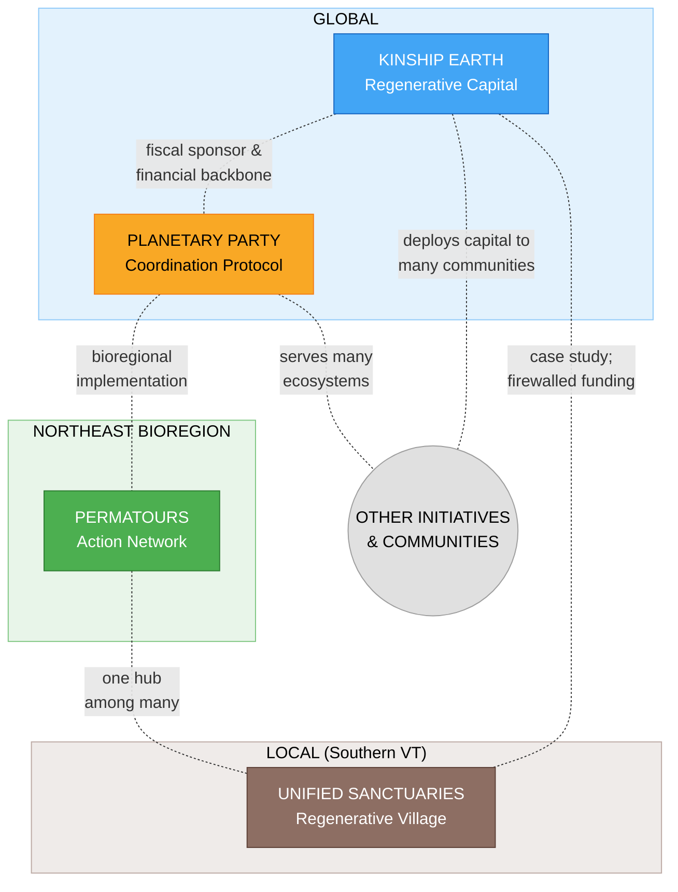

# Sydney's Regenerative Ecosystem

> *Four initiatives at different scales -- from local land stewardship to global coordination -- each participating in a wider movement beyond any single person's orbit.*

---

## The Four Initiatives

| Initiative | Scale | Role | Status |
|------------|-------|------|--------|
| [**Kinship Earth**](./kinship-earth/) | Global | Flow Funding & Regenerative Capital | Active -- 18+ Flow Funders across 12+ bioregions |
| [**Planetary Party**](./planetary-party/) | Global | Cultural & Coordination Protocol | Active -- 5+ bioregional deployments |
| [**Permatours**](./permatours/) | Northeast Bioregion | Permaculture Action & Mutual Aid Network | Active -- 50+ events, 40+ project sites |
| [**Unified Sanctuaries**](./unified-sanctuaries/) | Local (Southern VT) | Land-Based Regenerative Village | Pre-acquisition / Planning |

Each initiative answers a distinct question the others cannot:

- **Kinship Earth** -- How does money move differently?
- **Planetary Party** -- How do we coordinate without centralizing?
- **Permatours** -- How do people learn and build together?
- **Unified Sanctuaries** -- What does this look like when rooted in land?

Together, they address the full spectrum of what regenerative transformation requires: **capital**, **coordination**, **capacity**, and **place**.

---

## How They Relate

These initiatives are deeply related but are **not a closed loop**. They operate at different scales, serve different purposes, and maintain ethical boundaries -- especially around funding. Each weaves with many other organizations, communities, and initiatives beyond Syd's direct orbit.



See [ecosystem-map.md](./ecosystem-map.md) for detailed relationship mapping.

---

## The Person Behind It

**Syd Harvey Griffith** is a community organizer, movement builder, and regenerative finance leader who stewards these four interconnected initiatives. As Executive Director of Kinship Earth, co-founder of Permatours, and lead designer of Planetary Party and Unified Sanctuaries, Syd has supported 40+ land-based projects, pioneered trust-based flow funding, and built networks spanning from a single site in Vermont to global coordination.

---

## The Connective Tissue: Live with Syd

Live with Syd is the nervous system that weaves the four initiatives together through weekly co-creative sessions and community cultivation.

| Day | Theme | Initiative Served |
|-----|-------|-------------------|
| **Monday** | Regenerative Capital Flows | Kinship Earth |
| **Wednesday** | Planetary Party Ecosystem | Planetary Party |
| **Friday** | Unified Sanctuaries Development | Unified Sanctuaries |
| **Monthly** | Heart Sharing & Grief Transmutation | Whole ecosystem |

Four dedicated Discord servers provide ongoing community coordination across all initiatives.

---

## Combined Capital Strategy

| Initiative | Near-Term Target | Medium-Term Target |
|------------|-----------------|-------------------|
| **Kinship Earth** | $2M by end of 2026 | $20M by 2028 |
| **Planetary Party** | $5M by end of 2026 | $20M by 2028 |
| **Permatours** | $1M by end of 2026 | -- |
| **Unified Sanctuaries** | $10M by end of 2026 | $100M by 2028 |

---

## Design Principles

1. **Scale is explicit** -- local, bioregional, global
2. **Ethical boundaries are visible** -- especially around funding flows between Syd's own projects
3. **No over-centralization** -- hubs exist, but no single project is the trunk
4. **Participants in a wider ecosystem** -- Syd's projects are part of the movement, not the whole of it
5. **Room for emergence** -- other communities and initiatives beyond Syd's orbit are essential

---

## Folder Structure

```
sydney/
├── README.md                              # This file -- ecosystem overview
├── ecosystem-map.md                       # Detailed project relationships and flows
├── ecosystem/
│   └── ECOSYSTEM_EXECUTIVE_SUMMARY.md     # Combined executive summary (all 4 initiatives)
├── kinship-earth/
│   ├── README.md                          # Project overview
│   └── EXECUTIVE-SUMMARY.md              # Pitch-ready executive summary
├── planetary-party/
│   ├── README.md                          # Project overview
│   └── EXECUTIVE-SUMMARY.md              # Pitch-ready executive summary
├── permatours/
│   ├── README.md                          # Project overview
│   └── EXECUTIVE-SUMMARY.md              # Pitch-ready executive summary
├── unified-sanctuaries/
│   ├── README.md                          # Project overview
│   └── EXECUTIVE-SUMMARY.md              # Pitch-ready executive summary
└── docs/
    ├── live-with-syd/                     # Live with Syd programming docs
    └── the-field-is-ready/                # Planetary Party origin essay
```

---

*These initiatives are stewarded by Syd Harvey Griffith -- community organizer, movement builder, and participant in a wider regenerative movement that is rewriting the rules of how communities fund, build, and sustain themselves.*
