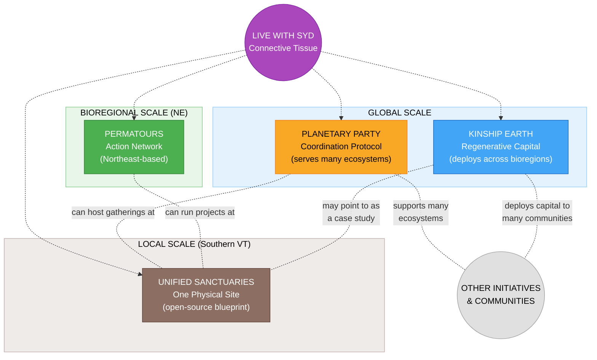

# Sydney's Projects

> *Four regenerative initiatives operating at different scales -- from local land stewardship to global coordination -- each participating in a wider movement beyond any single person's orbit.*

## The Force Behind It All

Syd Harvey Griffith is a community organizer, movement builder, and regenerative powerhouse operating at the intersection of grassroots action and regenerative finance. She doesn't just talk about a better world -- she architects it, funds it, and builds it with her own hands and an ever-growing network of co-conspirators.

As **Executive Director of Kinship Earth**, Syd is reshaping how capital moves -- pioneering Bioregional Flow Funding that shifts financial decision-making away from institutional gatekeepers and into the hands of grassroots leaders embedded in their communities. No grant applications. No burdensome reporting. Just trust-based resources flowing directly to the change-makers healing the places they call home.

As **Co-founder of Permatours**, she's built a permaculture-action network that has supported **40+ land-based projects** throughout the Northeast of Turtle Island -- rallying communities through educational festivals and mutual aid to strengthen local capacity for affordable housing, healthy food, and grassroots infrastructure.

Her latest and most ambitious creation is the **Planetary Party** -- a cultural and coordination protocol designed to serve many ecosystems, not just her own. Its gatherings serve as peak opportunities for communities to confront pressing challenges, showcase solutions both local and global, and unlock capital in service of people and planet. Planetary Party is a scaffold that many groups can plug into -- a coordination layer, not an ownership layer.

**Unified Sanctuaries** is the physical expression of many of these ideas in one place -- a regenerative village being designed as an open-source blueprint that other communities could adapt. It is one node in a much larger network, not the center everything flows into.

Syd is the rare leader who can hold a singing circle and a cap table in the same breath -- moving between festival stages and funding pipelines, soil science and systems design, ritual theater and real estate. Every project she touches is interconnected by design, because she understands that the only way to build a regenerative future is to build it as a whole system, not in silos.

## The Four Initiatives

| Project | Role | Current Scale | Description |
|---------|------|---------------|-------------|
| [Planetary Party](./planetary-party/) | Cultural & Coordination Protocol | **Global** | A coordination layer for regenerative gatherings, governance, and community engagement -- designed to serve many ecosystems |
| [Kinship Earth](./kinship-earth/) | Flow Funding & Regenerative Capital | **Global** | A nonprofit deploying flow funds across multiple bioregions and communities internationally |
| [Permatours](./permatours/) | Permaculture Action & Mutual Aid Network | **Northeast (bioregional)** | A network of permaculture practitioners and mutual aid connecting projects across the NE bioregion; model replicable elsewhere |
| [Unified Sanctuaries](./unified-sanctuaries/) | Land-Based Project & Community | **Local (one site)** | A regenerative village in Southern Vermont -- one physical expression, designed as an open-source blueprint others can adapt |

> **Note on scale**: These initiatives don't all operate at the same scale. Planetary Party and Kinship Earth are inherently global. Permatours is currently Northeast-based, though the model could be replicated through chapters or aligned groups. Unified Sanctuaries is presently one place, designed as a blueprint for adaptation elsewhere.

## How They Relate

These initiatives are deeply related but are **not designed as a closed loop** where all four equally resource or funnel into one another. They operate at different scales, serve different purposes, and maintain important ethical boundaries -- especially around funding.



- **Planetary Party** is a coordination protocol meant to support many initiatives and ecosystems -- not primarily an amplifier for Syd's own projects
- **Kinship Earth** deploys flow funds across multiple bioregions and communities internationally; ethical boundaries govern how it relates to Syd's other projects
- **Permatours** is currently a Northeast network; it flows resources outward to community members and ecosystems
- **Unified Sanctuaries** is one physical site that could host gatherings, trainings, or serve as a case study -- but it is a node, not the trunk
- **Live with Syd** weaves these initiatives together through weekly sessions, content, and community cultivation
- **Other initiatives, communities, and organizations** that are not directly affiliated with Syd are essential participants in this wider ecosystem

See [ecosystem-map.md](./ecosystem-map.md) for detailed relationship mapping.

## Current Phase

**Planning & Scoping** -- Defining each project's scope, identity, and initial action steps while building on existing work in Unified Sanctuaries and established relationships across all four domains.

## Folder Structure

```
sydney/
├── README.md                  # This file -- ecosystem overview
├── metadata.json              # Brand metadata
├── ecosystem-map.md           # Detailed project relationships and flows
├── planetary-party/           # Project 1
│   └── README.md
├── permatours/                # Project 2
│   └── README.md
├── unified-sanctuaries/       # Project 3
│   └── README.md
└── kinship-earth/             # Project 4
    └── README.md
```

## Related

- Full Unified Sanctuaries brand documentation: [`brands/unified-sanctuaries/`](../unified-sanctuaries/)

---

*These initiatives are stewarded by Syd Harvey Griffith -- community organizer, movement builder, and participant in a wider regenerative movement that is rewriting the rules of how communities fund, build, and sustain themselves. Her projects are part of that movement, not the whole of it.*
