# Ecosystem Map

> *How four initiatives at different scales relate to each other and to a wider movement -- with explicit boundaries around funding, scope, and centralization.*

This document maps the relationships, scale differences, ethical boundaries, and community infrastructure across the initiatives stewarded by Syd Harvey Griffith. These projects are **participants in a wider ecosystem**, not the ecosystem itself. They operate at different scales (local, bioregional, global), maintain important boundaries (especially around funding), and are designed to make room for many other communities, organizations, and initiatives beyond Syd's direct orbit.

---

## The Architect

Syd Harvey Griffith is a community organizer, movement builder, and regenerative finance leader who stewards four initiatives that are deeply related but operate at different scales and serve different purposes. She isn't designing a closed system where everything feeds everything else -- she's contributing to a wider regenerative movement through multiple expressions, each with its own integrity.

Syd holds Executive Director roles, co-founder titles, and lead design seats across all four projects -- but more than titles, she holds a connective vision that recognizes these projects as **participants in something larger**. She's supported 40+ land-based projects, pioneered trust-based flow funding, and built networks that span from a single site in Vermont to global coordination.

Through Live with Syd, she also serves as a primary facilitator, educator, and public interface -- hosting weekly sessions that make the relationships and boundaries between these initiatives visible and participatory.

```mermaid
graph TD
    SYD(("Syd Harvey Griffith\nArchitect & Steward"))

    SYD --- PP["PLANETARY PARTY\nCoordination Protocol\n🌍 Global"]
    SYD --- KE["KINSHIP EARTH\nRegenerative Capital\n🌍 Global"]
    SYD --- PT["PERMATOURS\nAction Network\n🌿 Northeast"]
    SYD --- US["UNIFIED SANCTUARIES\nPhysical Site\n📍 Local (VT)"]

    LWS{{"LIVE WITH SYD\nConnective Tissue"}}
    LWS -.-> PP & PT & US & KE

    SYD -.-|"participates in"| WIDER(("WIDER MOVEMENT\nOther communities,\norgs, & initiatives"))

    style SYD fill:#00796B,stroke:#004D40,color:#fff
    style PP fill:#F9A825,stroke:#F57F17,color:#000
    style PT fill:#4CAF50,stroke:#2E7D32,color:#fff
    style US fill:#8D6E63,stroke:#5D4037,color:#fff
    style KE fill:#42A5F5,stroke:#1565C0,color:#fff
    style LWS fill:#AB47BC,stroke:#7B1FA2,color:#fff
    style WIDER fill:#E0E0E0,stroke:#9E9E9E,color:#000
```

---

## The Four Initiatives (at Different Scales)

These are not four equal pillars that symmetrically feed each other. They operate at different scales, have different scopes, and maintain ethical boundaries around how they relate -- especially financially.

### 1. Planetary Party -- Coordination Protocol
**Role**: Cultural & Coordination Infrastructure | **Scale**: Global

A cultural and coordination protocol meant to serve many ecosystems, not just Syd's own projects. Planetary Party is a scaffold that many groups can plug into -- a coordination layer, not an ownership layer. It supports emergence beyond any single person's immediate orbit.

**What It Activates:**
- Regenerative festivals (e.g., Leave a Positive Trace) as entry points for diverse communities
- Cultural gatherings: singing circles, theater, immersive arts, ritual
- Educational events: governance, permaculture, community-building workshops
- Gatherings that bring together many different networks, organizations, and communities -- including but not limited to Syd's other initiatives
- Built-in media production for storytelling, documentary, and online distribution

**Weekly Programming (Live with Syd -- Wednesdays):**
- Guild-building and role clarity
- Governance design and experimentation
- Bioregional coordination models
- Cultural rituals and myth-making
- Collective intelligence practices
- DAO-inspired coordination tools
- Cross-bioregional collaboration
- Sensemaking around global crises
- Systems mapping and leverage points

**Who It Draws In:** Systems thinkers, DAO/governance designers, cultural workers, bioregional organizers, regen finance innovators, technologists, community weavers

**Key People:** Syd Harvey Griffith (lead designer), Eslerh (film, multimedia, ritual theater), Michael/Fuego (festival production, financial operations)

---

### 2. Permatours -- The Action Network
**Role**: Permaculture Action & Mutual Aid Network | **Scale**: Northeast (bioregional)

Currently a Northeast-based network linking permaculture practitioners, projects, and hubs through mutual aid. Permatours flows resources **outward** to community members and ecosystems -- it's not designed to funnel energy inward toward Syd's other projects. The model could be replicated through chapters or aligned groups elsewhere, but right now it is a localized expression within a much larger planetary context.

**What It Activates:**
- NE Hubs: self-organizing distributed nodes across the Northeast bioregion
- Mutual aid coordination and reciprocity-based resource sharing
- Permaculture education tours and hands-on work days, builds, plantings
- Documentary storytelling (Permatours docuseries -- every tour documented)
- Partnership building across land-based projects

**Network Model:** Not a single project but a network -- action-first, with mutual aid at its core. NE Hubs feed into and draw from the central network, creating a self-reinforcing regional web.

**Key People:** Syd Harvey Griffith (co-founder, 40+ projects supported), Pato (permaculture installations, global hub partnerships), Scotty (soil science, compost, natural building, educator)

---

### 3. Unified Sanctuaries -- One Physical Expression
**Role**: Land-Based Project & Community | **Scale**: Local (one site, Southern Vermont)

A regenerative village in Southern Vermont integrating farm, retreat center, event venue, and community living. Unified Sanctuaries is a place where multiple streams can intersect -- it could host Planetary Party gatherings, serve as a site for Permatours projects or trainings, and be a living example that Kinship Earth or others might point to as a case study. But it is **a node, not the trunk** -- one expression among many, not the central thing that everything flows into or out of. It is being designed as an open-source blueprint that other communities around the world could adapt.

**Four Sub-Pillars:**

| Sub-Pillar | What It Does | Revenue Potential |
|---|---|---|
| Permaculture Farm & Education Center | Food production, agri-tourism, education | $315k -- $1M+ |
| Retreat & Healing Arts Center + Bathhouse | Healing programs, ceremonies, somatic work | $570k -- $1.75M |
| Event Venue + Innovation Hall | Festivals, conferences, governance labs | $310k -- $1.16M |
| Community Living / Regenerative Neighborhood | 20+ homes, cooperative housing | $195k -- $580k |
| **Total Ecosystem Revenue Potential** | | **$1.4M -- $4.5M+** |

**Weekly Programming (Live with Syd -- Fridays):**
- Land acquisition and stewardship models
- Community land trusts and nested trust structures
- Governance and decision-making frameworks
- Cooperative living and shared ownership
- Regenerative agriculture and permaculture design
- Housing, infrastructure, and zoning navigation
- Healing arts, retreat, and education programming
- Financing land access: tokenization, community investment, membership models
- Replication pathways for other bioregions

**Governance Design:**
- Non-speculative land stewardship held in trust
- Earned equity through contribution (stewardship, not just capital)
- Anchor Circle governance (consent-based, rotating leadership)
- Circular economy with Sol Token (utility) and Voice Token (governance)
- Open-source blueprint shared for replication

**Who It Draws In:** Land stewards, permaculture designers, regenerative farmers, architects, natural builders, legal/financial innovators, healers, facilitators, cooperative housing advocates

**Key People:** Syd Harvey Griffith (lead visionary), Lynney, Nina, Josie, Tiff, Eslerh, Scotty, Jess, Michael/Fuego, Pato (farm, storytelling, earth law, somatic therapy, film, soil science, bathhouse, accounting, permaculture)

**Status:** Phase: Pre-acquisition / Planning

---

### 4. Kinship Earth -- Regenerative Capital
**Role**: Flow Funding & Regenerative Capital | **Scale**: Global

A nonprofit deploying flow funds across multiple bioregions and communities internationally. Kinship Earth's goal is to unlock capacity for **many communities**, not just reinforce a small internal network. It provides fiscal infrastructure and institutional credibility, but maintains important ethical boundaries around how it relates to Syd's other projects.

**Ethical Boundaries (In Development):**
- Whether Kinship Earth should fund Unified Sanctuaries directly is an open question -- it may represent a conflict of interest
- Kinship Earth has deployed flow funds to Permatours in the past, but specifically so Permatours could flow resources **outward to community members and ecosystems**, not to fund its own internal operations
- Kinship Earth's capital flows are meant to serve many communities internationally, not primarily resource Syd's own projects

**What It Activates:**
- Grant acquisition from foundations, government, and climate programs
- Flow funding: capital moves where needed across bioregions, not locked in rigid budgets
- Fiscal sponsorship for aligned projects
- Donor engagement and stewardship
- Impact reporting and storytelling-driven fundraising
- Deployment of resources to grassroots leaders and communities internationally

**Weekly Programming (Live with Syd -- Mondays):**
- Bioregional flow funding and participatory grantmaking
- Trust-based philanthropy and direct giving models
- Carbon, biodiversity, and ecosystem service credit markets
- Regenerative crypto, DAOs, Web3 coordination tools
- Green bonds and blended finance
- Social impact investing and community wealth-building
- Cooperative structures and shared ownership
- Resource pooling and commitment pooling
- Data collection, impact measurement, and storytelling
- Alternative metrics beyond GDP
- Funding land access, food sovereignty, community infrastructure

**Funding Targets:**
- USDA (Beginning Farmer, Community Facilities)
- Vermont Housing & Conservation Board
- Vermont Community Foundation
- Climate and soil carbon credit programs
- Family foundations (regenerative agriculture, land access, community resilience)
- Flow funding networks (RSF Social Finance, Thousand Currents)
- Impact investors (regenerative real estate, land stewardship)

**Who It Draws In:** Funders, grassroots organizers, regenerative entrepreneurs, DAO builders, philanthropy reformers, community leaders

**Key People:** Syd Harvey Griffith (Executive Director, pioneered Bioregional Flow Funding), Michael/Fuego (financial operations, accounting, compliance)

---

## Live with Syd -- The Nervous System

Live with Syd is not a fifth project -- it is the connective tissue that makes the four pillars one living system. These recurring, co-creative live sessions are where the ecosystem meets itself, processes together, builds coherence, and invites others in.

### Weekly Rhythm

| Day | Theme | Pillar Served |
|---|---|---|
| **Monday** | Regenerative Capital Flows | Kinship Earth + whole ecosystem |
| **Wednesday** | Planetary Party Ecosystem | Planetary Party + governance layer |
| **Friday** | Unified Sanctuaries Development | Unified Sanctuaries + land projects |
| **Monthly** | Heart Sharing & Grief Transmutation | Whole ecosystem (emotional infrastructure) |

### What It Does for the Ecosystem

- **Makes the invisible visible**: Resource flows, governance experiments, and funding strategies are discussed openly, creating shared understanding across the ecosystem
- **Recruits and filters**: Registration and intentionality screening bring in values-aligned participants who become volunteers, donors, collaborators, residents, and guild members
- **Generates content**: Every session becomes replays, clips, newsletters, and social media -- feeding the storytelling engine that powers fundraising and community growth
- **Builds relational trust**: Co-creative format cultivates the trust that makes flow funding, mutual aid, and consent-based governance possible
- **Processes grief and burnout**: Monthly heart sharing circles provide the emotional infrastructure that sustains long-haul movement work

### Heart Sharing & Grief Transmutation Circles

A distinct offering that serves the whole ecosystem. Non-recorded, sacred containers for processing:
- Grief for ecosystems, species, landscapes, lost futures
- Burnout from organizing, funding, and building
- Rage, despair, numbness, overwhelm
- Tenderness, gratitude, remembrance

**Practices:** Guided grounding, breathwork, somatic awareness, gentle movement, sound/song/silence, council-style sharing, ritual and symbolic acts, collective witnessing, grief transmutation into clarity and action.

**Design:** Always non-recorded. Closed, intentional container. Trauma-informed facilitation. No fixing, no advice-giving. Deep listening and mutual care.

---

## Relationships & Boundaries

The relationships between these initiatives are real, but they are **not meant to be financially or structurally circular in a closed way**. Important boundaries exist, especially around funding.

```mermaid
flowchart LR
    PP["PLANETARY PARTY\n🌍 Global Protocol"]
    PT["PERMATOURS\n🌿 NE Network"]
    US["UNIFIED SANCTUARIES\n📍 Local Site (VT)"]
    KE["KINSHIP EARTH\n🌍 Global Capital"]
    NE["NE HUBS\nDistributed Nodes"]
    EXT(("OTHER ORGS\n& COMMUNITIES\n(many)"))
    LWS(("LIVE WITH\nSYD"))

    PP -.-|"can host\ngatherings at"| US
    US -.-|"could provide\nvenue for"| PP

    PT -.-|"can run projects\nor trainings at"| US

    KE -.-|"may reference as\ncase study"| US
    KE ===|"⚠️ direct funding\nis an open question"| US

    KE -->|"flow funds to\ncommunities (outward)"| PT
    PT -->|"flows resources\noutward to"| EXT

    PP -->|"coordination layer\nfor many groups"| EXT
    KE -->|"deploys capital\nacross bioregions"| EXT

    NE <-->|"distributed nodes\nshared coordination"| PT

    LWS -.->|"Mon: Capital\neducation"| KE
    LWS -.->|"Wed: Guild\nbuilding"| PP
    LWS -.->|"Fri: Land\ndesign"| US
    LWS -.->|"Network\nconnections"| PT

    style PP fill:#F9A825,stroke:#F57F17,color:#000
    style PT fill:#4CAF50,stroke:#2E7D32,color:#fff
    style US fill:#8D6E63,stroke:#5D4037,color:#fff
    style KE fill:#42A5F5,stroke:#1565C0,color:#fff
    style NE fill:#81C784,stroke:#4CAF50,color:#000
    style LWS fill:#AB47BC,stroke:#7B1FA2,color:#fff
    style EXT fill:#E0E0E0,stroke:#9E9E9E,color:#000
```

### Ethical Boundaries Around Funding

These initiatives are not designed so that all four equally resource or funnel into one another. Key boundaries:

- **Kinship Earth -> Unified Sanctuaries**: Whether KE should fund US directly is an open question -- it may represent a conflict of interest given that Syd stewards both
- **Kinship Earth -> Permatours**: KE has deployed flow funds to Permatours in the past, but specifically so Permatours could flow resources **outward** to community members and ecosystems, not to fund its own internal operations
- **Planetary Party**: Meant to support many initiatives and ecosystems, not function primarily as an amplifier for Syd's own projects
- **Kinship Earth's capital flows guild**: The goal is to unlock capacity for many communities, not just reinforce a small internal network

### Where Intersections Can Happen

While maintaining ethical boundaries, these initiatives do relate to each other in specific ways:

**Planetary Party & Unified Sanctuaries**: PP could host gatherings at US when the site exists. US could provide venue. But PP's primary purpose is serving many ecosystems globally, not generating revenue for US.

**Permatours & Unified Sanctuaries**: Permatours could run projects or trainings at US. US could serve as one hub among many in the NE network. But US is not the center of Permatours -- the network's purpose is flowing resources outward.

**Kinship Earth & Unified Sanctuaries**: KE might point to US as a case study or example. The question of direct funding is being carefully considered given potential conflicts of interest.

**NE Hubs & Permatours**: Distributed nodes across the Northeast bioregion. They coordinate through shared values, not centralized control.

### Live with Syd -> Connective Tissue

- **LWS -> Kinship Earth**: Monday sessions educate around regenerative capital, cultivate donor relationships, and surface funding opportunities for many communities.
- **LWS -> Planetary Party**: Wednesday sessions build guild membership, test governance models, and recruit systems thinkers into active co-creation.
- **LWS -> Unified Sanctuaries**: Friday sessions advance land project design in public, attract aligned experts, and build the future resident/steward pipeline.
- **LWS -> Permatours**: Sessions surface volunteer energy, bioregional partnerships, and mutual aid connections that flow into the network.
- **LWS -> All**: Heart sharing circles sustain the emotional health of people across every initiative. Content pipeline feeds storytelling across all projects.

---

## Community Infrastructure

### Discord Architecture (4 Servers)

Each server maps to a core pillar, creating dedicated spaces for the communities that form around each:

| Server | Purpose | Tone | Growth Target |
|---|---|---|---|
| **Regenerative Capital Flows** | Learning and collaboration hub for unlocking capital | Strategic, experimental, grounded | 100 -- 500+ |
| **Planetary Party** | Coordination and governance laboratory | Visionary, mythic, strategic | 100 -- 1,000+ |
| **Unified Sanctuaries** | Real-time co-creation of land project | Place-based, grounded, practical | 50 -- 300 |
| **Grief & Transmutation Circles** | Sacred container for emotional processing | Gentle, quiet, reverent | 20 -- 150 |

**Cross-Server Patterns:** Each server includes welcome/orientation, general community space, topic-specific channels, collaboration zones, archives (replays + resources), and private mod/strategy channels. Unified Sanctuaries adds detailed channels for land, governance, design/build, funding, and programming. Planetary Party adds guild channels and bioregional hub channels.

### Participation Design

**Tiered Roles (fluid, not hierarchical):**
- **Listeners** -- Mic muted, camera optional, participate via chat
- **Contributors** -- Share reflections/questions when invited by moderators
- **Presenters/Guests** -- Offer talks, practices, case studies (confirmed in advance)

**Who It's For:** Curious, collaborative, values-aligned people oriented toward regeneration -- willing to listen, reflect, and co-create. Comfortable with ambiguity and emergence. Committed to care, consent, and respect.

**Who It's Not For:** Sales pitches, self-promotion, ideological combativeness, financial speculation, harassment, domination behaviors, or anyone unwilling to honor community agreements.

**Community Agreements (10 Core):**
1. Come with presence and intention
2. Honor confidentiality
3. Speak from lived experience
4. No harassment, hate, or harmful speech
5. Respect the container (raise-hand, wait to be invited)
6. Consent before recording or sharing
7. Honor time and space
8. Stay curious, not combative
9. Support collective coherence
10. Right to removal (moderators may mute, remove, or ban)

**Conflict & Accountability Pathway:**
1. Message moderator privately
2. Moderators may pause or redirect session
3. Serious cases: muted or removed
4. Follow-up dialogue or repair offered

---

## Content & Storytelling Pipeline

Storytelling is not an afterthought -- it is infrastructure. Every session, event, and gathering generates content that serves fundraising, community growth, and movement building.

**Content serves every pillar:**
- **Kinship Earth**: Impact narratives and case studies become the case for support
- **Planetary Party**: Event media drives visibility and cultural reach
- **Permatours**: Tour documentation feeds the docuseries and network storytelling
- **Unified Sanctuaries**: Development updates build the future resident pipeline and donor trust

---

## Operational Ecosystem

### Support Team Architecture (12 Roles, 6 Categories)

The Live with Syd documentation defines the operational team needed to run the ecosystem's connective programming:

**Minimum Viable Team:** 4-6 people covering: tech + automation, moderation + community, content + streaming, guest coordination + curation, heart sharing facilitation, administration.

### Tech Stack (Privacy-First, Open-Source)

| Layer | Tool | Why |
|---|---|---|
| Live Rooms | Jitsi (self-hosted) or BigBlueButton | Open-source, no accounts required, full moderator control |
| Registration | Tally Forms | Privacy-first, reCAPTCHA, email verification |
| Backend Database | Airtable | Speaker intake, session tracking, approval workflows |
| Public Hub | Notion (Phase 1) or WordPress/Ghost (Phase 2) | Low-friction launch, embeddable databases |
| Streaming & Recording | OBS Studio | Open-source, scene management, local recording |
| Automation | Tally -> Airtable -> Email -> Notion | Registration confirmations, reminders, replay links |
| Community | Discord (4 servers) | Pillar-aligned, role-gated, moderated |

**Non-Negotiable Guardrails:**
- No Zoom or Meta platforms
- No data resale or third-party sharing
- No ambiguous media rights clauses
- GDPR-friendly defaults
- Minimal data collection
- All recordings owned by Syd
- Participant opt-out supported at any time
- No forced account creation

---

## Economic Design

### Revenue Streams by Initiative

### Participation Economy (Live with Syd)

Offered in a spirit of generosity and reciprocity. No one turned away for lack of funds.

- **Sliding-scale donations** per session or monthly
- **Stewardship memberships** for ongoing supporters
- **Project-specific funding pools** for targeted contributions
- **Speaker/educator contributions** (co-creative, not transactional)

### Impact Tracking

- Number of sessions held
- Number of participants engaged
- Cross-bioregional collaborations formed
- Funding pathways unlocked
- Land/infrastructure projects seeded
- Governance experiments launched
- Stories of personal and community transformation

---

## Value Circulation Summary

The following shows how value moves through and beyond Syd's initiatives. Notably, value does **not** all converge on a single project. Each initiative has its own purpose, its own communities, and its own outward flow.

---

## Key Insight

These initiatives are deeply related, but they are **not a closed or self-feeding loop**. The design principles that matter most:

1. **Scale is explicit** -- local (Unified Sanctuaries), bioregional (Permatours), global (Planetary Party, Kinship Earth)
2. **Ethical boundaries are visible** -- especially around funding flows between Syd's own projects
3. **Hubs exist, but no single project is over-centralized** -- Unified Sanctuaries is a node, not the trunk
4. **Syd's projects are participants in a wider ecosystem**, not the ecosystem itself
5. **Room exists for emergence** -- other organizations, communities, and initiatives that are not affiliated with Syd are essential to the picture

Planetary Party is a scaffold many groups can plug into. Kinship Earth unlocks capacity for many communities. Permatours flows resources outward. Unified Sanctuaries is one blueprint among many possible expressions.

Live with Syd makes the connections between these initiatives visible, cultivates the relationships that power them, and holds the emotional container that sustains the people doing the work.

---

## What Participants Walk Away With

**Mondays (Capital Flows):**
- New funding models applicable to their own work
- Introductions to aligned funders and collaborators
- Clarity on project next steps
- Templates, tools, and case studies
- Stronger narrative for their work

**Wednesdays (Planetary Party):**
- Role or guild invitation within the ecosystem
- Governance tools they can adapt
- New collaborators in their bioregion
- Strategic clarity on systems change
- Felt sense of belonging to something larger

**Fridays (Unified Sanctuaries):**
- Practical land access and stewardship insights
- Governance and trust models to study
- Pathways into regenerative living
- Collaboration opportunities on the land project
- A real-world prototype to learn from

**Heart Sharing Circles:**
- Lighter nervous system
- Greater emotional clarity
- Sense of being witnessed and held
- Renewed energy for the work
- Tools for ongoing self-regulation
