# The Regenerative Ecosystem: How Four Platforms Interconnect

**A Comprehensive Executive Summary of Kinship Earth, the Planetary Party Protocol, Permatours, and Unified Sanctuaries**

*Prepared: February 2026*

---

## The Throughline

Four initiatives -- operating at local, bioregional, and global scales -- form a coherent arc of regenerative systems change. Each answers a distinct question that the others cannot:

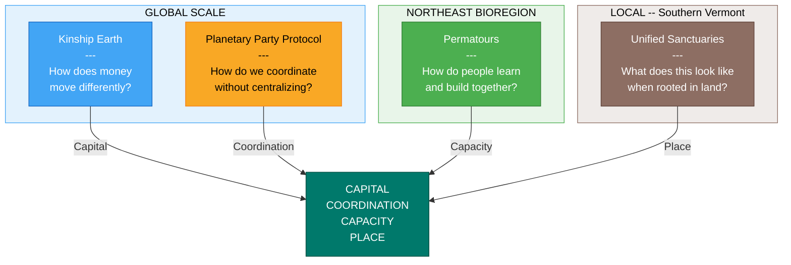

Together, they address the full spectrum of what regenerative transformation requires: **capital**, **coordination**, **capacity**, and **place**. They are nested, permeable systems -- not a circular pipeline. Each weaves with many other organizations, people, and ecosystems beyond this constellation. Capital, people, and ideas flow in and out -- not around in a closed circuit. This is open-system regeneration, not vertical integration.

All four are stewarded by **Syd Harvey Griffith** -- community organizer, movement builder, regenerative finance leader, and Executive Director of Kinship Earth -- who has supported 40+ land-based projects and pioneered trust-based Bioregional Flow Funding.

---

## The Four Platforms

### 1. Kinship Earth -- The Financial Infrastructure

**Entity:** Private Foundation (Nonprofit 501c3)
**Scale:** Global
**Website:** [kinshipearth.org](https://www.kinshipearth.org/) | [flowfunding.org](https://flowfunding.org)

Kinship Earth is the financial nervous system of the regenerative movement. It stewards **Flow Funding** -- a participatory, trust-based grantmaking model pioneered by Marian Rockefeller Weber that moves unrestricted resources directly to grassroots leaders and bioregional organizers. No grant applications. Minimal reporting. Maximum trust.

**How Flow Funding Works:**

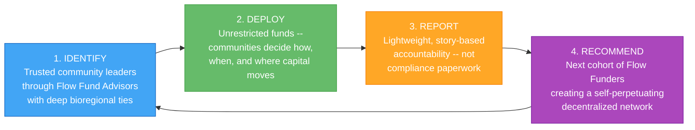

**What Makes It Different:**
Traditional philanthropy locks up 93% of assets in endowments, burdens changemakers with applications, and enforces top-down control. Flow Funding inverts this: it is invitation-driven, community-controlled, organized by bioregions rather than political boundaries, and governed by trust and relationship rather than donor preference. Indigenous peoples protect 80% of the world's biodiversity but receive less than 1% of climate finance -- Flow Funding is designed to correct these structural failures.

**Impact to Date:**
- $800,000+ raised since adopting Flow Funding in 2024
- $300,000+ deployed to 18+ Flow Funders across 12+ bioregions globally
- $150,000 grant received from NOBO/Novo Foundation
- Flow Funders active across the Ozarks, Cascadia, Greater Tkaronto, Northeast Turtle Island, Colombia, Jamaica, Mexico, and Guatemala
- Real-world outcomes: freeze dryers for food sovereignty on reservations, protection of sacred waters in Minnesota, family food security programs, the Ozarks Bioregional Congress

**Four Core Functions:**
1. Deploy unrestricted grants to trusted changemakers
2. Educate donors, family offices, DAFs, and foundations on trust-based philanthropy
3. Support communities in establishing their own Flow Funding foundations
4. Serve as both grantmaker and field-builder for the broader movement

**Fundraising Targets:**
- Near-term: $2M by end of 2026
- Medium-term: $20M by end of 2028
- 5-year: $10M+ deployed through 100+ grants; 20+ bioregional Flow Funds created
- 10-year vision: $200M raised and deployed

**Leadership:** Syd Harvey Griffith (Executive Director), Susan Davis Mora (Co-Founder), Michael/Fuego (Financial Operations), Marian Rockefeller Weber (Advisor)

---

### 2. Planetary Party Protocol -- The Coordination Layer

**Entity:** Cultural coordination protocol and living movement (fiscal sponsorship through Kinship Earth)
**Scale:** Global
**Website:** [planetaryparty.com](https://www.planetaryparty.com/)

The Planetary Party is both a cultural meme -- an open-source invitation for communities to organize regenerative celebrations anywhere on Earth -- and the **Planetary Party Protocol (PPP)**, the practical coordination layer that helps these efforts align, resource one another, and scale without centralization.

The core insight: **how resources flow is inseparable from how communities gather, relate, and make meaning together.**

**Three Integrated Layers:**

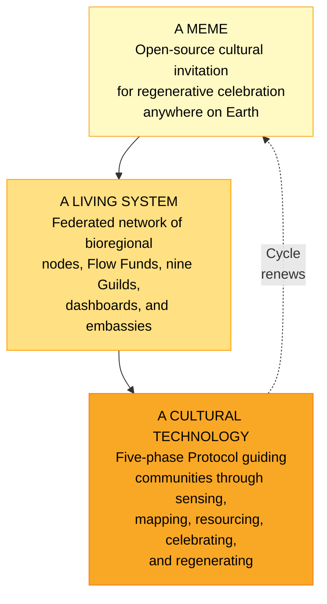

**The Five-Phase Protocol:**

Communities move through a living spiral rhythm:

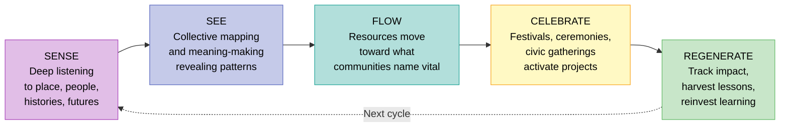

Each cycle produces lasting "positive-trace" infrastructure: gardens, governance models, strengthened relationships, water systems, and ongoing community capacity for collective action.

**Nine Functional Guilds:**

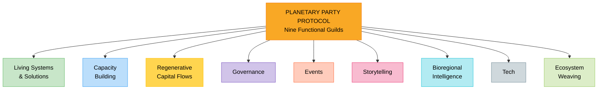

Guilds are open participation structures -- not departments -- that anyone can join and contribute through.

**Active Bioregional Deployments:**

| Bioregion | Status | Focus |
|-----------|--------|-------|
| **Colombia** | Active since Q1 2024 | Bioregioning across Aguaclara, Sinu, Sierra Nevada de Santa Marta, Bogota, Cali -- forest/watershed restoration, regenerative governance |
| **Jamaica** | Active since Aug 2025 | Partnership with Rastafari Indigenous Village on post-hurricane recovery and Indigenous-led stewardship |
| **Mexico** | Active since Oct 2025 | Relationship-building in Cloud Forest bioregion (Veracruz) and Mexico City |
| **Guatemala** | Active since Nov 2025 | Indigenous-led listening circles and consent-based action around Lake Atitlan |
| **Northeast Turtle Island** | Launching Q1 2026 | Bioregional activation and learning series -- mapping, collaboration, disaster preparedness, Flow Funding readiness |

**Governance Structure:**
- A Core Fractal coordinating body (Syd Harvey Griffith, Josie Watson, Juan Carlos Kaiten)
- An Earth Council of Indigenous wisdom keepers providing seasonal guidance
- Guild-based distributed participation and decision-making

**Funding Targets:**
- Phase 1: $5M by end of 2026
- Scaled Ecosystem: $20M by 2028

**Revenue Model:** Event/festival revenue, sponsorships, media/content licensing, Flow Fund administration, donor cultivation, and grant funding.

---

### 3. Permatours -- The Capacity Builder

**Entity:** Nonprofit (501c3) -- Permaculture Action & Mutual Aid Network
**Scale:** Northeast Bioregion of Turtle Island
**Website:** [permatours.org](https://www.permatours.org/)

Permatours is the hands-on action engine that mobilizes people into regenerative practice. It is a living network -- not a single place or program -- that connects permaculture practitioners, land projects, and aligned organizations through mutual aid, skill-sharing, and learn-by-doing events across the Northeast bioregion.

**Core Purpose:** To support people in learning how to meet their basic needs in alignment with their values -- food, shelter, energy, care -- with the support of community, land, and shared responsibility.

**Track Record (2021-2025):**
- 50+ learn-by-doing events across 40+ land-based project sites
- 2,000 email subscribers, 1,000 active members
- Partner sites include Sacred Nectar Sanctuary (NH), Diggers Co-Op (ME), Rooted Heart Farm (ME), Wild Island Center (ME), Blackbirds Daughter Botanicals (NH), Orange Peel Bakery (MA), and dozens more
- Programming: natural building workshops, permaculture design, bioconstruction immersions, hemp building, plant walks, water systems, community festivals, skill-shares, mutual aid coordination

**Next Evolution -- Three Dimensions:**

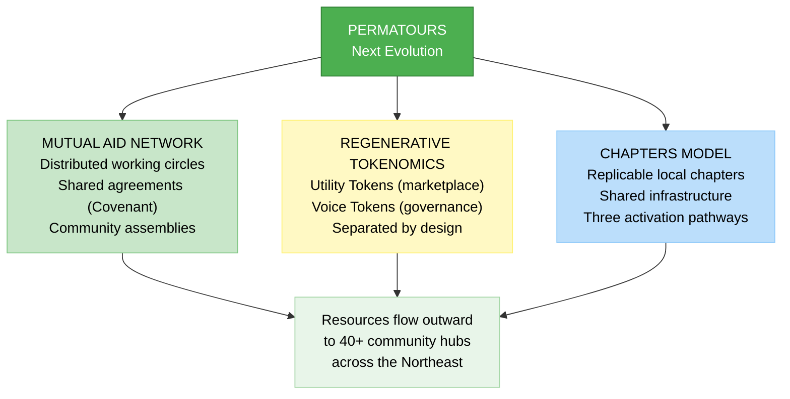

1. **Mutual Aid Network:** Restructuring into distributed working circles (Event Production, Communications, Conflict Resolution, Grant Writing, Mutual Aid & Rapid Response, Education) operating within shared agreements (the Permatours Covenant) with consistent event rhythms and transparent governance via community assemblies.

2. **Regenerative Tokenomics:** A dual-token system -- Utility Tokens (UT) as community currency for marketplace trades, and Voice Tokens (VT) as non-transferable governance tokens. Economic power, governance power, and cultural reputation are intentionally separated. Anti-speculation safeguards prevent wealth hoarding. Designed to be expandable as a Northeast bioregional token and adaptable for other bioregions.

3. **Chapters Model:** Replicable local chapters activated by volunteer point-people, with shared infrastructure (fiscal sponsorship, volunteer database, Discord coordination, marketing tools, educational resources) and three activation pathways (consulting, backend production, co-hosted pilot events).

**Funding Goal:** $1M by end of 2026

---

### 4. Unified Sanctuaries -- The Land-Based Anchor

**Entity:** Community Land Trust (in formation) -- Regenerative Village
**Scale:** Local (Southern Vermont -- Brattleboro / Guilford / Putney corridor)
**Current Phase:** Pre-acquisition / Planning

Unified Sanctuaries is where the abstract becomes embodied. It is a regenerative village integrating permaculture farming, healing arts, cultural programming, and cooperative living into a single, self-sustaining community. Designed as a living laboratory and open-source blueprint -- every governance framework, financial model, and operational design will be publicly shared so communities worldwide can adapt and replicate.

**The Four Pillars:**

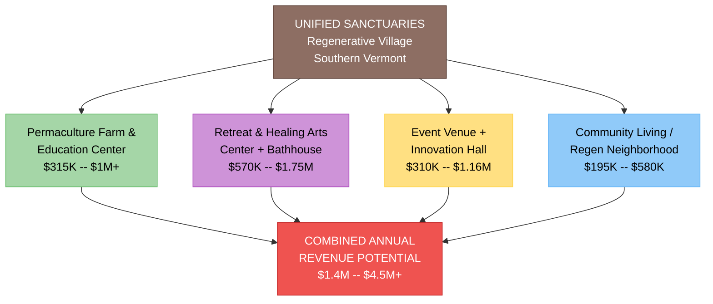

**Economic Model:**
- **Sol Token (Utility):** Community currency exchangeable for goods and services within the ecosystem
- **Voice Token (Governance):** Earned through participation and stewardship, granting decision-making weight
- **Trust Units:** Earned through infrastructure development, liquidatable upon exit -- contribution builds equity
- **Non-Speculative Land Stewardship:** Land held in trust (Sol Community Land Project), permanently removed from market speculation

**Governance:** Consent-based, rotating leadership blending sociocracy and holacracy principles. An Anchor Circle guides interconnected autonomous platforms. Each pillar self-governs while remaining accountable to the shared framework.

**Capital Targets:**
- Phase 1 (Seed): $10M by end of 2026
- Phase 2 (Growth): $100M by 2028

---

## How the Platforms Interconnect

### The Nested Architecture

These projects are nested at different scales -- not four equal pillars that symmetrically feed each other:

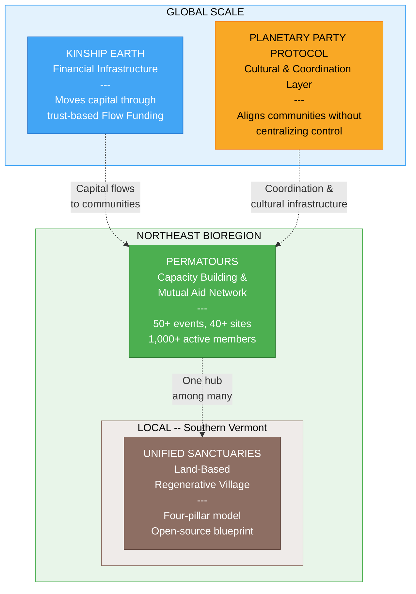

### Flow of Support and Activation

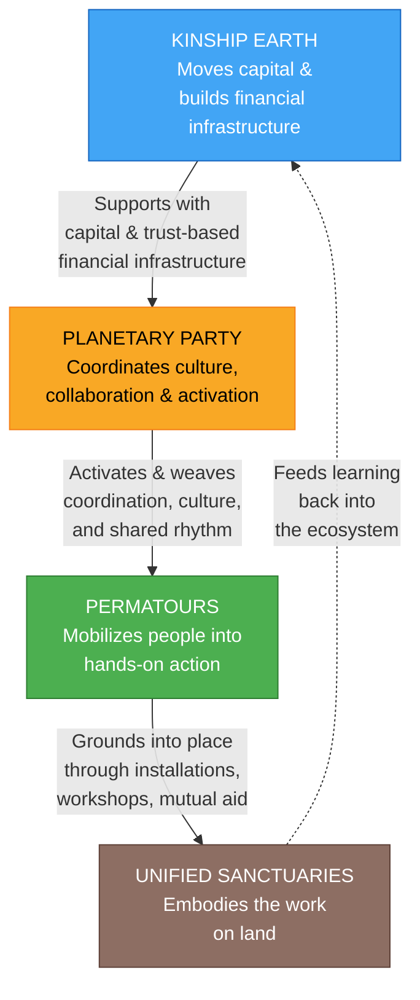

**Kinship Earth** moves capital and builds trust-based financial infrastructure. It funds people and bioregional efforts globally, creating the economic conditions for regenerative work to happen.

This **supports** the **Planetary Party Protocol**, which coordinates culture, collaboration, and activation. It provides shared rhythm and coherence across initiatives and helps capital, projects, and people find each other through the five-phase Protocol (Sense, See, Flow, Celebrate, Regenerate) and nine functional Guilds.

The Protocol **activates and weaves** into **Permatours**, which mobilizes people into hands-on action, builds capacity at community hubs, and serves as a bioregional implementation partner. Permatours grounds the Protocol's coordination into actual permaculture installations, natural building workshops, mutual aid response, and community festivals across 40+ sites.

Permatours **grounds into place** at **Unified Sanctuaries**, which embodies the work on land. It hosts gatherings, residents, businesses, and experimentation. It feeds learning back into the ecosystem. It serves as a hub for the bioregional/regeneration/environmental movement, bioregional congresses, and the operational work of Permatours, the Planetary Party, and Kinship Earth.

### Specific Interconnection Points

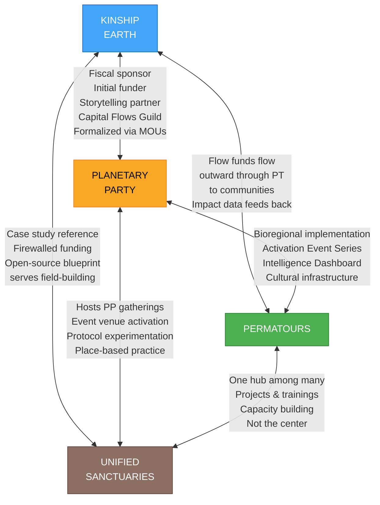

**Kinship Earth <-> Planetary Party Protocol:**
- Kinship Earth serves as the **fiscal sponsor** for the Planetary Party, receiving charitable donations and grant funding to support the PPP ecosystem
- Kinship Earth is the **initial funder**, providing capital for emerging bioregional Flow Funds as fundraising succeeds
- Kinship Earth is a **storytelling partner**, documenting ecosystem evolution and community impact narratives
- Kinship Earth provides **local activation support**, offering mentorship and Flow Fund resources for pilot gatherings
- Kinship Earth participates in the **Regenerative Capital Flows Guild**, co-creating frameworks for launching and sustaining Flow Funds
- The PPP operationalizes Kinship Earth's flow funding methodology at the global scale
- This relationship was formalized through a board-approved proposal with MOUs, compliance mechanisms, and clear accountability structures

**Kinship Earth <-> Permatours:**
- Kinship Earth has deployed flow funds to Permatours specifically so Permatours could flow resources **outward** to community members and ecosystems
- This is not internal funding of Permatours' operations -- it is capital flowing through Permatours to the communities it serves
- Permatours' impact data and storytelling feeds back into Kinship Earth's case for support and donor engagement

**Planetary Party Protocol <-> Permatours:**
- Permatours serves as the **bioregional implementation partner** for the PPP in the Northeast
- The Bioregional Activation Event Series (launching Q1 2026) is a direct collaboration between PPP, Permatours, Kinship Earth, and the Bioregional Embassy
- This series weaves connections between practitioners, technologies, community leaders, storytellers, public servants, and funders -- and supports Permatours' evolution into a bioregional mutual aid network
- Permatours network practitioners participate in Planetary Party gatherings; PPP provides cultural infrastructure and coordination tools
- Permatours' data collection, impact measurement, and community mapping feed into the PPP's Bioregional Intelligence Dashboard

**Planetary Party Protocol <-> Unified Sanctuaries:**
- Unified Sanctuaries can host Planetary Party gatherings and bioregional activations
- The PPP provides cultural programming infrastructure that activates the Event Venue + Innovation Hall pillar
- Unified Sanctuaries provides land-based context for protocol experimentation and learning
- The sanctuary offers space for convening, relationship-building, and celebration that grounds PPP's coordination work in lived, place-based practice

**Permatours <-> Unified Sanctuaries:**
- Unified Sanctuaries is one hub among many in the Permatours NE network
- Permatours runs projects and trainings at the site, builds capacity through the Permaculture Farm & Education Center
- Unified Sanctuaries is not the center of Permatours -- the network's purpose is flowing resources outward to many communities

**Kinship Earth <-> Unified Sanctuaries:**
- Kinship Earth may reference Unified Sanctuaries as a case study for regenerative community development
- Direct funding from Kinship Earth to Unified Sanctuaries is carefully managed with clear firewalls to prevent conflicts of interest given shared leadership
- The open-source blueprint that Unified Sanctuaries publishes serves Kinship Earth's broader field-building mission

### The Bioregional Activation Event Series -- A Living Example

The Bioregional Activation Event Series (launching Northeast, Q1 2026) is the most concrete example of all four platforms operating in concert:

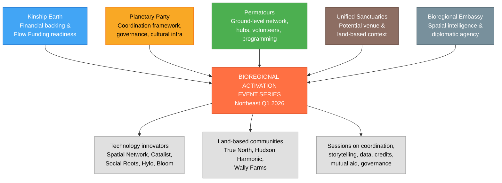

The series features interactive presentations from technology innovators (Spatial Network, Catalist, Social Roots, Hylo, Bloom Network) alongside direct contributions from land-based communities (True North, Hudson Harmonic, Wally Farms). Sessions cover coordination tools, storytelling and fundraising, data collection, biocultural/water/carbon credit access, mutual aid and living systems, and governance structures.

---

## Positioning Within the Planetary Party Protocol

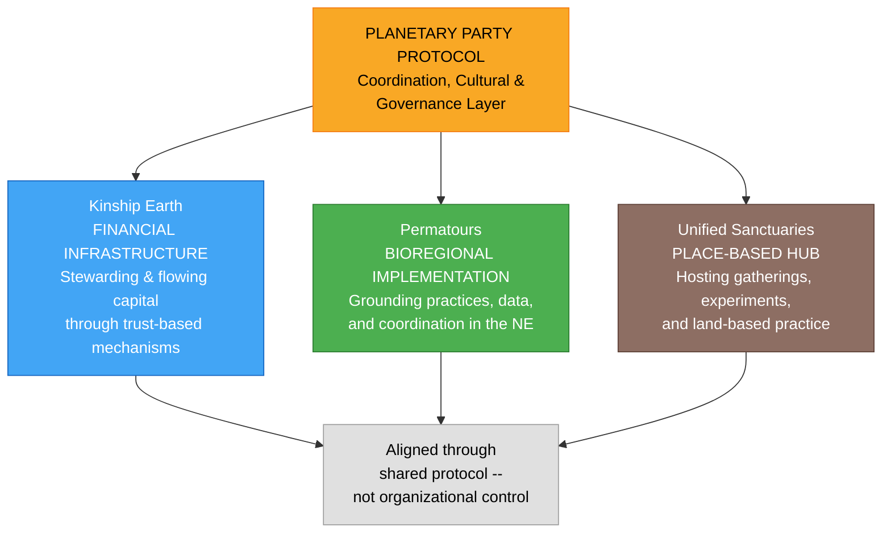

Permatours, Kinship Earth, and Unified Sanctuaries operate **within** the Planetary Party Protocol ecosystem. The PPP provides the coordination, cultural, and governance layer that allows multiple initiatives to move together without collapsing into a single organization.

Within this ecosystem:

- **Kinship Earth** functions as the **financial infrastructure**, stewarding and flowing capital through trust-based, participatory mechanisms
- **Permatours** functions as a **bioregional implementation and capacity-building partner**, grounding regenerative practices, data collection, and community coordination in the Northeast
- **Planetary Party Protocol** serves as the **shared protocol**, aligning culture, celebration, capital, governance, and tools across regions and initiatives
- **Unified Sanctuaries** functions as a **place-based hub**, hosting gatherings and bioregional activations, providing land-based context for protocol experimentation, offering space for convening and relationship-building, and grounding abstract coordination work in lived practice

---

## Why This Is Not a Closed Loop

```mermaid
flowchart TD
    subgraph OPEN["OPEN SYSTEM -- Not a Closed Loop"]
        KE["Kinship Earth<br/>12+ bioregions<br/>globally"]
        PP["Planetary Party<br/>Any community<br/>can plug in"]
        PT["Permatours<br/>40+ autonomous<br/>partner sites"]
        US["Unified Sanctuaries<br/>Open-source blueprint<br/>for any community"]
    end

    KE --> EXT1["Grassroots leaders &<br/>communities worldwide"]
    PP --> EXT2["Groups far beyond<br/>this constellation"]
    PT --> EXT3["NE communities<br/>with own missions"]
    US --> EXT4["Communities adapting<br/>the blueprint globally"]

    ALIGNED["ALIGNED ORGANIZATION NETWORK"] --> A1["The Pivot Earth"]
    ALIGNED --> A2["Holomovement"]
    ALIGNED --> A3["Nalu'ea Living Trust"]
    ALIGNED --> A4["Bioregional Embassy"]
    ALIGNED --> A5["Micelio Media"]
    ALIGNED --> A6["Mycelial Law"]
    ALIGNED --> A7["TerraLux Spatial Network"]

    style OPEN fill:#E8F5E9,stroke:#4CAF50,color:#000
    style KE fill:#42A5F5,stroke:#1565C0,color:#fff
    style PP fill:#F9A825,stroke:#F57F17,color:#000
    style PT fill:#4CAF50,stroke:#2E7D32,color:#fff
    style US fill:#8D6E63,stroke:#5D4037,color:#fff
    style EXT1 fill:#E0E0E0,stroke:#9E9E9E,color:#000
    style EXT2 fill:#E0E0E0,stroke:#9E9E9E,color:#000
    style EXT3 fill:#E0E0E0,stroke:#9E9E9E,color:#000
    style EXT4 fill:#E0E0E0,stroke:#9E9E9E,color:#000
    style ALIGNED fill:#00796B,stroke:#004D40,color:#fff
    style A1 fill:#B2DFDB,stroke:#80CBC4,color:#000
    style A2 fill:#B2DFDB,stroke:#80CBC4,color:#000
    style A3 fill:#B2DFDB,stroke:#80CBC4,color:#000
    style A4 fill:#B2DFDB,stroke:#80CBC4,color:#000
    style A5 fill:#B2DFDB,stroke:#80CBC4,color:#000
    style A6 fill:#B2DFDB,stroke:#80CBC4,color:#000
    style A7 fill:#B2DFDB,stroke:#80CBC4,color:#000
```

A critical design principle runs through the entire ecosystem: **these are participants in a wider movement, not the movement itself.**

**None of these depend exclusively on one another.** Each weaves with many other organizations, people, and ecosystems. Capital, people, and ideas flow in and out -- not around in a closed circuit.

**Kinship Earth** deploys flow funds to grassroots leaders and communities across 12+ bioregions globally. Syd's other projects are participants in this flow, not primary beneficiaries. Clear ethical firewalls prevent conflicts of interest.

**Planetary Party Protocol** is a scaffold that many groups can plug into. It is a coordination layer, not an ownership layer. Its Guilds, bioregional nodes, and Protocol are designed so groups far beyond this constellation can participate, adapt, and benefit.

**Permatours** flows resources outward to communities across the Northeast. Its chapters model is designed for replication by any community. Its 40+ partner sites are autonomous projects with their own missions.

**Unified Sanctuaries** is "a node, not the trunk" -- one expression among many. Its open-source blueprint is explicitly designed so other communities can adapt it without any connection to this ecosystem.

---

## The Connective Tissue: Live with Syd

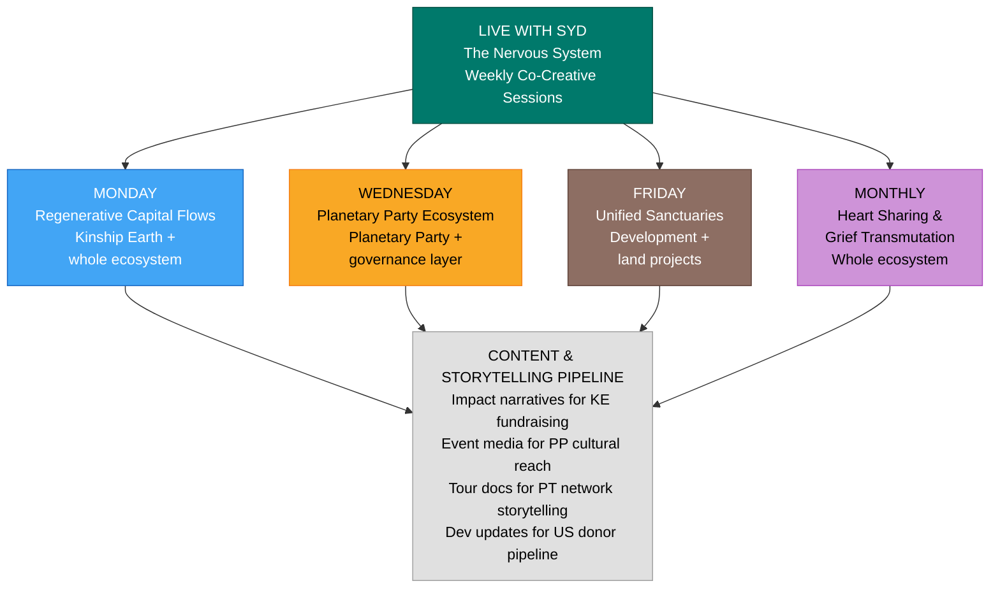

Live with Syd is the nervous system that makes the four platforms one living ecosystem. Recurring co-creative live sessions are where the ecosystem meets itself, processes together, builds coherence, and invites others in.

These sessions generate a content and storytelling pipeline that serves every platform: impact narratives for Kinship Earth's fundraising, event media for Planetary Party's cultural reach, tour documentation for Permatours' network storytelling, and development updates for Unified Sanctuaries' resident and donor pipeline.

---

## Shared Values Across the Ecosystem

All four platforms are anchored by consistent principles:

- **Bioregional Rootedness** -- Change rooted in specific places: watersheds, cultural landscapes, living ecologies
- **Rights of Nature** -- Prioritizing ecological integrity and future generations
- **Federated Sovereignty** -- Autonomous bioregions and communities supported by networks, not controlled by them
- **Trust-Based Relationships** -- Trust, relationship, and accountability to life over bureaucracy and compliance
- **Celebration as Catalyst** -- Joy, art, ritual, and gathering as transformation technologies
- **Open-Source Design** -- Governance models, financial systems, and operational blueprints shared for global replication
- **Contribution Over Capital** -- Stewardship, labor, and participation determine influence -- not just money
- **Positive-Trace Infrastructure** -- Every gathering and action leaves lasting regenerative outcomes

---

## Shared and Overlapping Team

The leadership team weaves across all four platforms, ensuring coherence while maintaining distinct operational integrity:

```mermaid
flowchart TD
    subgraph TEAM["SHARED LEADERSHIP TEAM"]
        SYD["Syd Harvey Griffith<br/>Exec Dir | Lead Architect<br/>Co-Founder | Lead Visionary"]
        MF["Michael / Fuego<br/>Financial Ops | Festival Production"]
        JW["Josie Watson<br/>Board | Core Steward<br/>Earth Law | Governance"]
        EO["Eslerh Oreste<br/>Film | Multimedia<br/>Ritual Theater | Healing"]
        PA["Pato<br/>Permaculture | Building<br/>Nonprofit Mgmt"]
        SC["Scotty<br/>Soil Science | Natural Building<br/>Infrastructure"]
        SDM["Susan Davis Mora<br/>Co-Founder"]
        JCK["Juan Carlos Kaiten<br/>Vision Holder | Core Steward"]
    end

    SYD --> KE["Kinship Earth"] & PP["Planetary Party"] & PT["Permatours"] & US["Unified Sanctuaries"]
    MF --> KE & PP & US
    JW --> KE & PP & US
    EO --> PP & US
    PA --> PT & US
    SC --> PT & US
    SDM --> KE
    JCK --> PP

    style TEAM fill:#F5F5F5,stroke:#9E9E9E,color:#000
    style SYD fill:#00796B,stroke:#004D40,color:#fff
    style MF fill:#78909C,stroke:#455A64,color:#fff
    style JW fill:#78909C,stroke:#455A64,color:#fff
    style EO fill:#78909C,stroke:#455A64,color:#fff
    style PA fill:#78909C,stroke:#455A64,color:#fff
    style SC fill:#78909C,stroke:#455A64,color:#fff
    style SDM fill:#78909C,stroke:#455A64,color:#fff
    style JCK fill:#78909C,stroke:#455A64,color:#fff
    style KE fill:#42A5F5,stroke:#1565C0,color:#fff
    style PP fill:#F9A825,stroke:#F57F17,color:#000
    style PT fill:#4CAF50,stroke:#2E7D32,color:#fff
    style US fill:#8D6E63,stroke:#5D4037,color:#fff
```

---

## Combined Capital Strategy

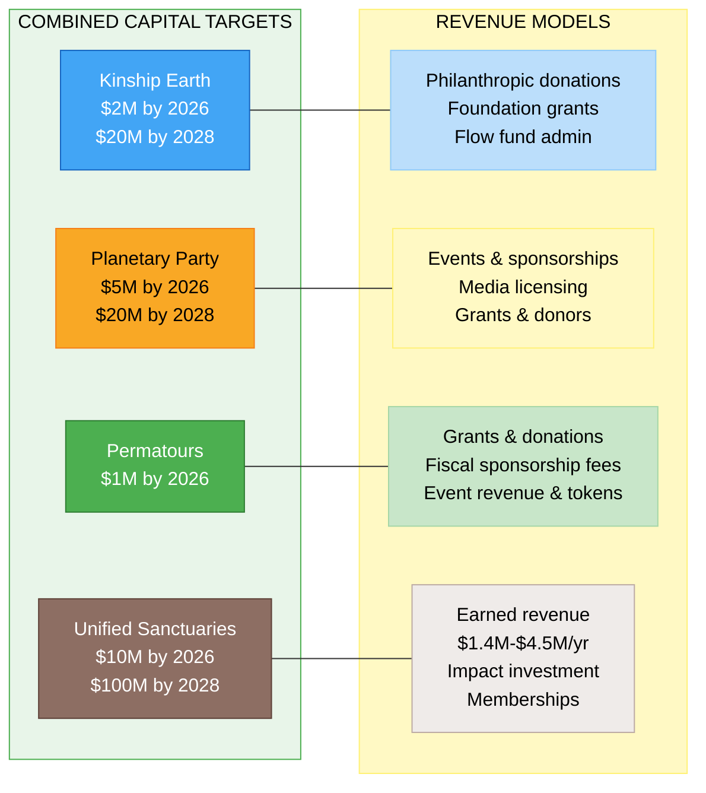

Capital flows through the ecosystem -- not in a closed circle, but along trust-based pathways that serve many communities. Kinship Earth raises and deploys philanthropic capital. The Planetary Party generates revenue through cultural activation and coordinates resource flows. Permatours mobilizes earned and granted resources into community capacity. Unified Sanctuaries generates earned revenue through its four-pillar model while attracting impact investment.

---

## The Case for the Ecosystem

The convergence of ecological, social, economic, and governance crises demands more than isolated interventions. The regenerative movement is no longer nascent -- it is a field phenomenon. Builders, organizers, funders, and cultural workers across every continent are arriving at the same conclusions independently. What is missing is not vision or will, but **coordination infrastructure**.

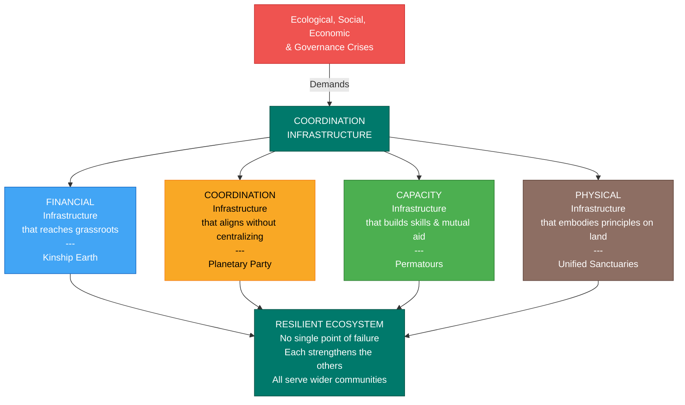

This ecosystem provides that infrastructure at every layer:

- **Financial infrastructure** that actually reaches grassroots leaders (Kinship Earth)
- **Coordination infrastructure** that aligns without centralizing (Planetary Party Protocol)
- **Capacity infrastructure** that builds skills and mutual aid networks (Permatours)
- **Physical infrastructure** that embodies regenerative principles on land (Unified Sanctuaries)

No single platform could accomplish what the interconnected ecosystem achieves. The financial innovation of Flow Funding becomes more powerful when it flows through coordinated cultural activations. The Protocol becomes more grounded when it has hands-on implementation partners. The land-based work becomes more replicable when it is documented and shared through a global network. And all of it becomes more resilient because none of it depends on a single point of failure.

> *"You never change things by fighting the existing reality. To change something, build a new model that makes the existing model obsolete."* -- Buckminster Fuller

The field is ready. The party has already begun.

---

## How to Participate

| Pathway | Description | Entry Point |
|---------|-------------|-------------|
| **Donate** | Support Flow Funds, coordination infrastructure, and community hubs | Kinship Earth |
| **Invest** | Align capital with regenerative outcomes and long-horizon stewardship | Unified Sanctuaries |
| **Join a Guild** | Contribute skills through one of nine functional Guilds | Planetary Party |
| **Volunteer** | Join hands-on events, builds, plantings, and mutual aid | Permatours |
| **Host a Planetary Party** | Activate the Protocol in your bioregion | Planetary Party |
| **Host an Event** | Open your community center, farm, or land project | Permatours |
| **Partner** | Bring your organization into the ecosystem as a collaborator | Any platform |
| **Create a Flow Fund** | Launch an autonomous, place-based Flow Fund in your bioregion | Kinship Earth |
| **Live On-Site** | Apply to become a resident in the regenerative neighborhood | Unified Sanctuaries |
| **Attend Live with Syd** | Join the weekly co-creative sessions | All platforms |

---

## Key Links

| Resource | URL |
|----------|-----|
| Kinship Earth | [kinshipearth.org](https://www.kinshipearth.org/) |
| Flow Funding | [flowfunding.org](https://flowfunding.org) |
| Planetary Party | [planetaryparty.com](https://www.planetaryparty.com/) |
| Permatours | [permatours.org](https://www.permatours.org/) |
| Kinship Earth & Planetary Party Overview | [Google Doc](https://docs.google.com/document/d/13QNkIoE_0Z9QBYotbjpzJ3ZJ09CQSFZW6gKe-aP4bRk/edit?usp=sharing) |
| Bioregional Activation Event Series | [Google Doc](https://docs.google.com/document/d/1AsSjCyReSl8_DOOuQzLALqP9XVyZJi2jgKs981iDuNo/edit?usp=sharing) |
| Kinship Earth Support for PPP (Board-Approved) | [Google Doc](https://docs.google.com/document/d/16jOEZGo7ljLhbfQ8cHFIxUjmIpJUzI6xr78967nejhA/edit?usp=sharing) |

---

*Stewarded by Syd Harvey Griffith and an expanding circle of core stewards, guild members, Flow Funders, community hubs, and bioregional hosts worldwide.*
