# Impact Roadmap: Scaling Regenerative Systems from $10K to $100M

**How the Sydney Regenerative Ecosystem Transforms Capital into Living Infrastructure**

*Prepared: February 2026*

---

## The Ecosystem at a Glance

Four interconnected initiatives -- operating at local, bioregional, and global scales -- form a coherent arc of regenerative systems change:

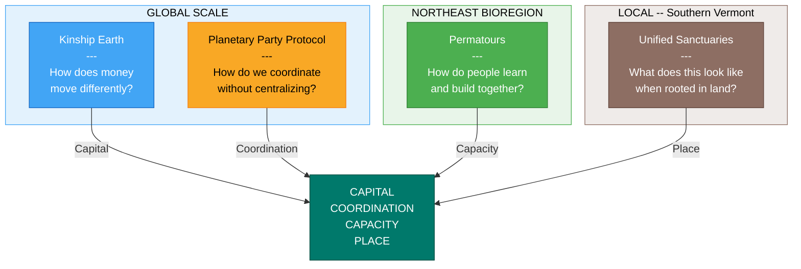

Together they address the full spectrum of regenerative transformation: **capital** (Kinship Earth), **coordination** (Planetary Party), **capacity** (Permatours), and **place** (Unified Sanctuaries). They are nested, permeable systems -- not a circular pipeline. Capital, people, and ideas flow in and out, serving many communities beyond this constellation.

**Kinship Earth is the financial infrastructure through which capital enters the ecosystem.** Every dollar raised strengthens the whole -- flowing outward through trust-based Flow Funding to grassroots leaders, bioregional organizers, and communities worldwide. The app and digital platform described throughout this document scales alongside all four entities, serving as the connective tissue that makes the ecosystem visible, participatory, and replicable.

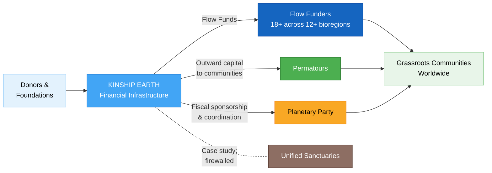

### How to Read This Document

This roadmap is **cumulative** -- each tier builds on everything before it. The $500K tier assumes all work from $10K through $250K is complete. Impact numbers are cumulative totals, not incremental additions. Dollar amounts represent total capital raised through Kinship Earth and deployed across the ecosystem.

This document focuses purely on **impact** -- what changes in the world at each funding milestone. It is not a financial return projection. It is a map of what becomes possible.

### What We've Already Proven

This roadmap does not start from zero. The ecosystem has real momentum:

- **$800,000+ raised** since adopting Flow Funding in 2024
- **$300,000+ deployed** to 18+ Flow Funders across 12+ bioregions globally
- **$150,000 grant** received from the NOBO/Novo Foundation
- **50+ learn-by-doing events** across 40+ land-based project sites
- **2,000+ community members** across email lists, Discord servers, and active networks
- **5+ bioregional deployments** active -- Colombia, Jamaica, Mexico, Guatemala, Northeast Turtle Island
- **Real-world outcomes**: food sovereignty on reservations, protection of sacred waters in Minnesota, family food security programs, the Ozarks Bioregional Congress

---

## The Scaling Arc

```mermaid
flowchart LR
    subgraph EARLY["EARLY STAGE"]
        T1["$10K<br/>Seed"]
        T2["$25K<br/>Sprout"]
        T3["$50K<br/>Roots"]
    end

    subgraph GROWTH["GROWTH STAGE"]
        T4["$100K<br/>Groundwork"]
        T5["$250K<br/>Canopy"]
        T6["$500K<br/>Grove"]
    end

    subgraph SCALE["SCALE STAGE"]
        T7["$1M<br/>Watershed"]
        T8["$5M<br/>Forest"]
        T9["$10M<br/>Mountain Range"]
    end

    subgraph PLANETARY_STAGE["PLANETARY STAGE"]
        T10["$25M<br/>Continental Shelf"]
        T11["$50M<br/>Ocean Current"]
        T12["$100M<br/>Planetary"]
    end

    T1 --> T2 --> T3 --> T4 --> T5 --> T6 --> T7 --> T8 --> T9 --> T10 --> T11 --> T12

    style EARLY fill:#E8F5E9,stroke:#81C784,color:#000
    style GROWTH fill:#C8E6C9,stroke:#66BB6A,color:#000
    style SCALE fill:#A5D6A7,stroke:#4CAF50,color:#000
    style PLANETARY_STAGE fill:#66BB6A,stroke:#2E7D32,color:#000
    style T1 fill:#E8F5E9,stroke:#81C784,color:#000
    style T2 fill:#E8F5E9,stroke:#81C784,color:#000
    style T3 fill:#E8F5E9,stroke:#81C784,color:#000
    style T4 fill:#C8E6C9,stroke:#66BB6A,color:#000
    style T5 fill:#C8E6C9,stroke:#66BB6A,color:#000
    style T6 fill:#C8E6C9,stroke:#66BB6A,color:#000
    style T7 fill:#A5D6A7,stroke:#4CAF50,color:#000
    style T8 fill:#A5D6A7,stroke:#4CAF50,color:#000
    style T9 fill:#A5D6A7,stroke:#4CAF50,color:#000
    style T10 fill:#66BB6A,stroke:#2E7D32,color:#fff
    style T11 fill:#66BB6A,stroke:#2E7D32,color:#fff
    style T12 fill:#4CAF50,stroke:#1B5E20,color:#fff
```

| Tier | Amount | Cumulative | Name | What Unlocks |
|------|--------|------------|------|-------------|
| 1 | $10K | $10K | **Seed** | Operational essentials, legal foundations, initial outreach |
| 2 | $25K | $35K | **Sprout** | First professional capacity, content production begins |
| 3 | $50K | $85K | **Roots** | New Flow Funders onboarded, bioregional map live |
| 4 | $100K | $185K | **Groundwork** | Full event season, first protocol deployment, governance tools |
| 5 | $250K | $435K | **Canopy** | Full-time core team, dual-token beta, significant Flow Fund cycle |
| 6 | $500K | $935K | **Grove** | Multi-bioregion protocol deployments, sanctuary design phase |
| 7 | $1M | $1.935M | **Watershed** | Chapters model launches, land search begins, platform v1 |
| 8 | $5M | $6.935M | **Forest** | Land acquired, guild activation, federated architecture |
| 9 | $10M | $16.935M | **Mountain Range** | Full sanctuary development, 10+ chapters, global protocol adoption |
| 10 | $25M | $41.935M | **Continental Shelf** | Multiple sanctuary sites, institutional-scale philanthropy |
| 11 | $50M | $91.935M | **Ocean Current** | Global sanctuary network, chapters on every continent |
| 12 | $100M | $191.935M | **Planetary** | Permanent regenerative infrastructure layer established worldwide |

---

## Impact Tracking Framework

Every tier is measured against consistent impact categories, allowing stakeholders to see exactly how the ecosystem grows:

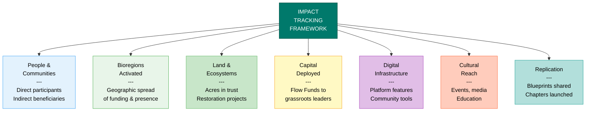

| Category | What We Track |
|----------|--------------|
| **People & Communities** | Direct participants, indirect beneficiaries, community members engaged |
| **Bioregions Activated** | Geographic spread of Flow Funding, protocol deployments, and chapter presence |
| **Land & Ecosystems** | Acres secured in trust, restoration projects supported, land projects funded |
| **Capital Deployed** | Flow Funds distributed to grassroots leaders and communities |
| **Digital Infrastructure** | App capabilities, platform features, community tools launched |
| **Cultural Reach** | Events hosted, media produced, educational content created |
| **Replication** | Blueprints published, chapters launched, sanctuaries seeded, communities adopting open-source models |

---

## The Twelve Tiers

---

## $10K -- Seed

**Cumulative Capital: $10,000**

The first dollars are foundation-laying. At this stage, the ecosystem formalizes its legal structures, secures the basic tools needed for coordination, and begins outreach to the communities and funders who will carry the work forward. This is the moment of intention made tangible -- registering domains, filing paperwork, purchasing the equipment that turns weekly live sessions into professional content.

These funds flow through Kinship Earth to cover the operational essentials that every grassroots organization needs but rarely has budget for. They also seed the very first connections between the four entities and the communities they serve, creating the relational infrastructure that everything else will grow from.

### Ecosystem Allocation

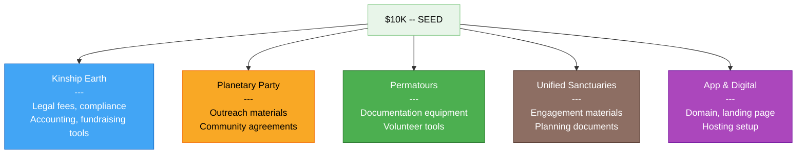

- **Kinship Earth Operations:** Legal fees, compliance setup, accounting infrastructure, basic fundraising tools
- **Planetary Party:** Initial outreach materials, community agreement documentation, first guild templates
- **Permatours:** Event documentation equipment, volunteer coordination tools, basic marketing materials
- **Unified Sanctuaries:** Initial community engagement materials, early planning documents
- **App & Digital Infrastructure:** Domain registration, landing page, hosting setup

### App & Digital Platform

At $10K, the digital layer is minimal but intentional: a registered domain, a landing page that orients visitors to the ecosystem, and wireframes for a community directory. This is Zone 0 in the Digital Permaculture framework -- observing the landscape, understanding what the community needs before building anything. The wireframes are informed by the existing Discord architecture and the relationships already flowing through Live with Syd sessions.

### Impact at This Stage

- **People & Communities:** 5-10 new community connections beyond existing network
- **Bioregions Activated:** Strengthened presence in 1-2 existing bioregions
- **Land & Ecosystems:** 1-2 pilot gatherings documented with impact data
- **Capital Deployed:** First operational grants supporting ecosystem coordination
- **Digital Infrastructure:** Landing page live, community directory wireframes complete
- **Cultural Reach:** Professional documentation of 2-3 events begins
- **Replication:** Core governance templates drafted and shared

---

## $25K -- Sprout

**Cumulative Capital: $35,000**

The ecosystem's first professional capacity comes online. Part-time hires allow Kinship Earth to move beyond founder-only operations, and content production begins in earnest -- turning the Live with Syd sessions, Permatours events, and Planetary Party activations into a storytelling pipeline that drives future fundraising. This is the stage where the ecosystem starts to look and feel like a professional operation, even while remaining deeply grassroots in its values.

Initial content production creates the case-for-support materials that unlock larger grants. Every story documented at this stage -- a Flow Funder's impact in the Ozarks, a natural building workshop in Maine, a listening circle in Guatemala -- becomes evidence for the next round of fundraising.

### Ecosystem Allocation

- **Kinship Earth Operations:** Part-time operations coordinator, donor management system, grant writing support
- **Planetary Party:** Initial content production, storytelling for bioregional deployments in Colombia and Jamaica
- **Permatours:** Part-time event coordinator, upgraded documentation equipment
- **Unified Sanctuaries:** Community engagement sessions, preliminary site research
- **App & Digital Infrastructure:** Basic community portal development

### App & Digital Platform

The first real digital tool emerges: a basic community portal with member profiles, an event calendar synced to Permatours and Planetary Party programming, and a resource directory connecting practitioners across the Northeast. This is built on open-source foundations -- no proprietary lock-in, no surveillance-based tools. Members can find each other, discover events, and access the growing content library. The portal becomes the first digital expression of the NE Hub model.

### Impact at This Stage

- **People & Communities:** 25-50 people directly engaged across events and programming
- **Bioregions Activated:** 2-3 bioregional connections actively nourished
- **Land & Ecosystems:** 3-5 land-based projects supported through Permatours events
- **Capital Deployed:** $5-10K in initial Flow Fund grants to community leaders
- **Digital Infrastructure:** Community portal live with member profiles, event calendar, resource directory
- **Cultural Reach:** Professional content pipeline producing weekly stories and documentation
- **Replication:** Event documentation templates shared with 5+ partner sites

---

## $50K -- Roots

**Cumulative Capital: $85,000**

The Flow Funding network expands meaningfully. Kinship Earth onboards 5-8 new Flow Funders across 2-3 additional bioregions, demonstrating that the model works beyond its founding geography. Each new Flow Funder represents a trusted community leader receiving unrestricted capital to deploy as they see fit -- and each one recommends the next cohort, making the network self-perpetuating. This is where the flywheel begins to turn.

Simultaneously, the digital infrastructure starts to reflect what's actually happening on the ground. An interactive bioregional map shows where Flow Funders are active, where Planetary Party deployments are underway, and where Permatours hubs are operating. For the first time, the ecosystem becomes legible -- not just to insiders, but to donors, partners, and communities considering participation.

### Ecosystem Allocation

- **Kinship Earth Operations:** Flow Fund deployment to 5-8 new Flow Funders, Community of Practice expansion
- **Planetary Party:** Documentation of Colombia and Jamaica deployments, preparation for Mexico activation
- **Permatours:** Full Northeast event season support, strengthening 10+ hub partnerships
- **Unified Sanctuaries:** Governance framework design workshops, community assembly pilot
- **App & Digital Infrastructure:** Bioregional map, Flow Fund tracking MVP

### App & Digital Platform

Two significant digital tools launch. First, an **interactive bioregional map** that visualizes the ecosystem's geographic reach -- Flow Funders, Permatours hubs, Planetary Party activations, and allied organizations all visible on a living, updating map. Second, a **Flow Fund tracking dashboard (MVP)** that lets donors and community members see where capital has been deployed, what stories have emerged, and how the network is growing. This is the beginning of radical financial transparency -- the foundation for trust-based fundraising at scale.

### Impact at This Stage

- **People & Communities:** 200+ people reached through events, content, and direct engagement
- **Bioregions Activated:** 3-5 bioregions with active Flow Funders or programming
- **Land & Ecosystems:** 8-12 land-based projects supported across the Northeast
- **Capital Deployed:** $15-20K deployed through Flow Funds to grassroots leaders
- **Digital Infrastructure:** Interactive bioregional map live, Flow Fund tracking dashboard (MVP)
- **Cultural Reach:** 10+ events documented, content library growing weekly
- **Replication:** Flow Funding Playbook draft begun, based on learnings from first cohorts

---

## $100K -- Groundwork

**Cumulative Capital: $185,000**

This is the tier where each entity begins operating with enough resources to deliver on its core promise. Permatours funds a full event season -- workshops, builds, plantings, and festivals across the Northeast. The Planetary Party completes its first full protocol deployment with comprehensive documentation, creating the template for every bioregion that follows. Kinship Earth's Community of Practice matures into a genuine peer-learning network among Flow Funders.

The mutual aid network infrastructure that Permatours has been building informally becomes formalized: working circles, the Permatours Covenant, and community assemblies begin operating as designed. This is the transition from founder-led coordination to distributed governance -- a critical proof point for the entire ecosystem's philosophy.

### Ecosystem Allocation

- **Kinship Earth Operations:** Community of Practice development, donor cultivation events, grant applications to larger foundations
- **Planetary Party:** First complete protocol deployment (Colombia) with full documentation, guild activation begins
- **Permatours:** Full event season funded (15+ events), mutual aid network infrastructure, working circle formation
- **Unified Sanctuaries:** Architectural and permaculture design consultations, preliminary site visits
- **App & Digital Infrastructure:** Member portal with governance tools, tokenomics design sandbox

### App & Digital Platform

The portal evolves from informational to participatory. **Governance tools** allow community members to participate in Permatours working circle decisions and Planetary Party guild activities through the platform. A **tokenomics design sandbox** lets the community experiment with the dual-token architecture (Utility Tokens and Voice Tokens) in a simulation environment -- understanding how economic and governance power separate, how seasonal decay works, how the anti-speculation safeguards function. This design sandbox is where the community co-creates the rules before any real tokens are minted. It serves as both education tool and participatory design process.

### Impact at This Stage

- **People & Communities:** 500+ people across events, portal membership, and Flow Funder networks
- **Bioregions Activated:** 5+ bioregions with active programming or Flow Fund presence
- **Land & Ecosystems:** 5-10 land projects directly supported through Permatours and Flow Funding
- **Capital Deployed:** $35-50K deployed through Flow Funds
- **Digital Infrastructure:** Governance tools live, tokenomics design sandbox in testing, portal at 200+ active members
- **Cultural Reach:** 15+ events hosted, first complete protocol deployment documented
- **Replication:** Protocol deployment template published, Permatours Covenant shared as open-source governance model

---

## $250K -- Canopy

**Cumulative Capital: $435,000**

The ecosystem reaches a critical threshold: full-time core team members across entities. This changes everything. Instead of passionate organizers squeezing ecosystem work around other jobs, dedicated professionals can focus entirely on Flow Fund deployment, protocol coordination, event production, storytelling, and community cultivation. Professional media production elevates the storytelling pipeline from documentation to compelling narrative -- the kind of content that moves donors, attracts partners, and inspires replication.

Kinship Earth executes a significant Flow Fund deployment cycle, demonstrating the model's capacity to move real resources at scale. The dual-token system moves from design sandbox to live beta, with early adopters in the Permatours network testing real Utility Tokens for marketplace exchanges and real Voice Tokens for governance participation.

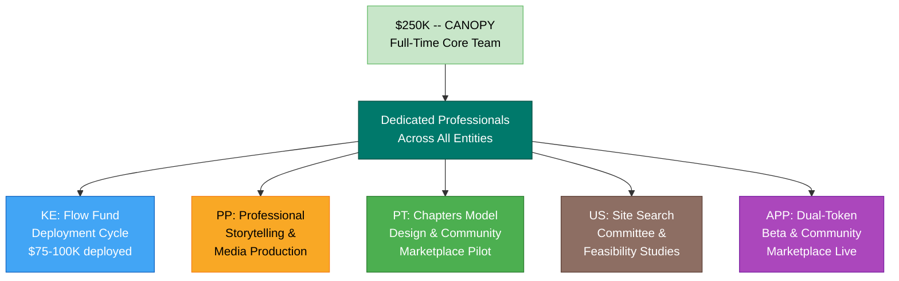

### Ecosystem Allocation

- **Kinship Earth Operations:** Full-time Executive Director support, operations team expansion, major donor cultivation, Flow Fund deployment cycle ($75-100K)
- **Planetary Party:** Full-time coordination support, professional storytelling and media production across bioregions
- **Permatours:** Full-time network coordinator, chapters model design, community marketplace pilot
- **Unified Sanctuaries:** Site search committee formation, detailed feasibility studies, early community engagement
- **App & Digital Infrastructure:** Dual-token system beta, community marketplace

### App & Digital Platform

Two major platform milestones. The **dual-token system enters live beta** -- graduating from the design sandbox at the prior tier into real community use: Utility Tokens (pegged 1:1 to USD) begin circulating in the Permatours community marketplace, enabling practitioners to exchange skills, workshop access, and resources without extractive payment platforms. Voice Tokens (non-transferable, capped at 40 per person with 20% seasonal decay) enter testing for governance decisions. Second, a **community marketplace** goes live -- the first concrete expression of the regenerative tokenomics vision, where the economy is circular and value stays local. This is the digital expression of what Permatours has been building physically: mutual aid made visible and scalable.

### Impact at This Stage

- **People & Communities:** 1,000+ people engaged across all platforms and programming
- **Bioregions Activated:** 8+ bioregions with active Flow Funders, protocol deployments, or chapter presence
- **Land & Ecosystems:** 12-15 land projects supported, early site identification for Unified Sanctuaries
- **Capital Deployed:** $75-100K in cumulative Flow Funds deployed to grassroots leaders across bioregions
- **Digital Infrastructure:** Dual-token beta live, community marketplace operational, 500+ platform members
- **Cultural Reach:** 25+ events, professional documentary content, media licensing begins
- **Replication:** Chapters model designed, 2-3 pilot chapters identified, Flow Funding Playbook v1 published

---

## $500K -- Grove

**Cumulative Capital: $935,000**

The Planetary Party Protocol proves it works across cultures, languages, and geographies. Multi-bioregion protocol deployments in Colombia, Jamaica, Mexico, and the Northeast demonstrate that the five-phase cycle (Sense, See, Flow, Celebrate, Regenerate) produces lasting positive-trace infrastructure everywhere it's practiced -- gardens in Aguaclara, governance models in the Northeast, watershed restoration partnerships in the Sierra Nevada de Santa Marta, Indigenous-led stewardship in Jamaica.

Unified Sanctuaries enters its design and planning phase in earnest -- architectural drawings, permaculture site design, community governance documentation, and financial modeling. This isn't speculative: it's the detailed blueprint work that makes a $10M capital raise credible. Meanwhile, Kinship Earth's growing track record and professional infrastructure position it for its first institutional grant conversations at the $500K+ level.

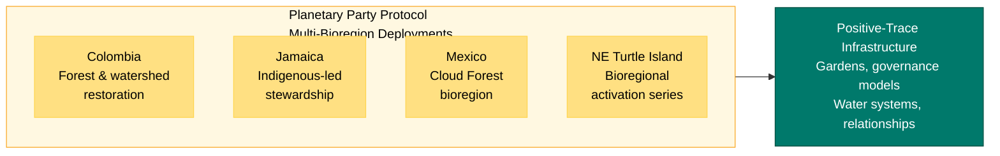

### Ecosystem Allocation

- **Kinship Earth Operations:** Institutional grant applications, donor cultivation at scale, 20+ active Flow Funders sustained and growing
- **Planetary Party:** Multi-bioregion protocol deployments (Colombia, Jamaica, Mexico, NE), guild activation across 4+ guilds
- **Permatours:** Chapters model pilot launch in 2 regions, full mutual aid network operations
- **Unified Sanctuaries:** Architectural and permaculture design, site evaluation, governance framework finalization, community assembly series
- **App & Digital Infrastructure:** Full tokenomics production launch, content library, community governance platform

### App & Digital Platform

The platform matures significantly. **Full tokenomics production launch** graduates the dual-token system from beta to production -- Utility Tokens circulating across the Permatours network and early Planetary Party marketplace exchanges, Voice Tokens governing real community decisions. A **content library with media licensing** aggregates the growing archive of event documentation, workshop recordings, storytelling content, and educational materials -- with licensing infrastructure that generates ongoing revenue. A **community governance platform** formalizes the consent-based decision-making that Permatours and Planetary Party have been practicing, making governance participation accessible to anyone in the network regardless of location.

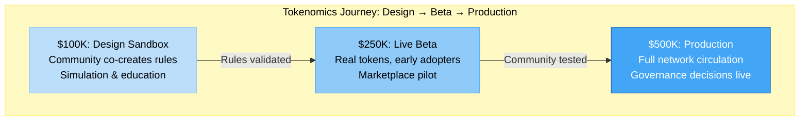

### Impact at This Stage

- **People & Communities:** 2,500+ people across all networks, events, and digital platforms
- **Bioregions Activated:** 10+ bioregions with active programming, Flow Funding, or protocol presence
- **Land & Ecosystems:** 15-20 land projects supported, Unified Sanctuaries site shortlist developed
- **Capital Deployed:** $150-200K in cumulative Flow Funds deployed
- **Digital Infrastructure:** Tokenomics live in production, content library with 100+ pieces, governance platform operational
- **Cultural Reach:** 40+ events hosted, media content reaching 10,000+ viewers, first media licensing revenue
- **Replication:** 2 pilot chapters operational, protocol deployment template adopted by 3+ allied organizations

---

## $1M -- Watershed

**Cumulative Capital: $1.935M**

A million dollars marks a watershed moment -- the point where the ecosystem transitions from promising proof of concept to recognized field leader. Kinship Earth approaches its near-term target of $2M, establishing itself as a trusted institution in the trust-based philanthropy space. The Permatours chapters model launches in 3-5 regions, proving that the mutual aid network architecture replicates. Unified Sanctuaries begins its land search in earnest, with deposits on promising properties in the Southern Vermont corridor.

This is also the moment the digital platform becomes a true product. Version 1 of the Digital Permaculture platform integrates everything built in prior tiers into a coherent experience: bioregional intelligence dashboard, transparent capital flow tracking, cross-entity membership, and media library. For the first time, a community member in Cascadia can see Flow Funds deployed in Guatemala, watch a natural building workshop from Maine, participate in governance decisions for their local chapter, and discover a Planetary Party activation near them -- all in one place.

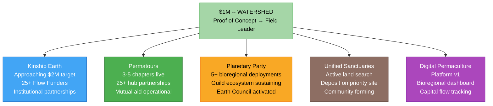

### Ecosystem Allocation

- **Kinship Earth Operations:** Major institutional partnerships, Flow Fund expansion to 25+ funders, Community of Practice serving multiple cohorts, education programming for family offices and DAFs
- **Planetary Party:** 5+ bioregional deployments operational, guild ecosystem self-sustaining, Earth Council activated
- **Permatours:** Chapters model live in 3-5 regions, 25+ hub partnerships, mutual aid network fully operational
- **Unified Sanctuaries:** Active land search, deposit on priority site, early community formation, governance piloting
- **App & Digital Infrastructure:** Full Digital Permaculture platform v1

### App & Digital Platform

**Digital Permaculture Platform v1** launches as the integrated digital home for the ecosystem. Key features:

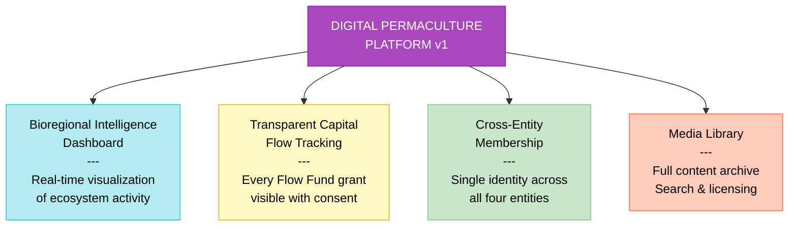

- **Bioregional Intelligence Dashboard** -- real-time visualization of where the ecosystem is active, what's emerging, and where resources are needed. Draws on Planetary Party's Bioregional Intelligence Guild and Permatours' network data.
- **Transparent Capital Flow Tracking** -- every Flow Fund grant visible (with Flow Funder consent), showing donors exactly where capital went, what stories emerged, and how communities used unrestricted resources. Radical transparency as fundraising infrastructure.
- **Cross-Entity Membership** -- a single identity that works across Kinship Earth, Planetary Party, Permatours, and Unified Sanctuaries. Members carry their participation history, governance tokens, and community reputation with them.
- **Media Library** -- the full archive of documented events, workshops, stories, and educational content, with search, licensing, and community curation.

### Impact at This Stage

- **People & Communities:** 5,000+ people across all platforms, chapters, events, and Flow Funder networks
- **Bioregions Activated:** 12+ bioregions with active presence
- **Land & Ecosystems:** 20+ land projects supported, Unified Sanctuaries site identified and under negotiation
- **Capital Deployed:** $300K+ in cumulative Flow Funds deployed to grassroots leaders
- **Digital Infrastructure:** Platform v1 live with 1,000+ members, bioregional dashboard operational
- **Cultural Reach:** 60+ events, content reaching 25,000+ people, media licensing generating revenue
- **Replication:** 3-5 active chapters, Flow Funding Playbook adopted by 5+ communities, protocol documentation translated into Spanish

---

## $5M -- Forest

**Cumulative Capital: $6.935M**

At $5M, the physical and digital visions converge. Unified Sanctuaries acquires land and begins Phase 1 development -- core infrastructure, first eco-homes, permaculture farm establishment, and the initial buildout of the retreat and healing arts center. For the first time, the ecosystem has a physical anchor: a place where all four entities can practice their principles on shared ground, where residents live in a regenerative neighborhood, where the bathhouse and event venue begin to take shape.

Simultaneously, the Planetary Party achieves full guild activation with 15+ bioregional deployments operational worldwide. Kinship Earth enters multi-million dollar Flow Fund cycles, with capital reaching dozens of communities across bioregions. The network is no longer an experiment -- it is infrastructure.

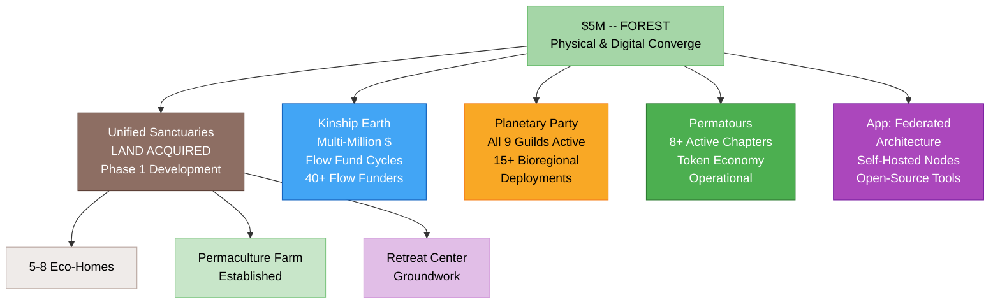

### Ecosystem Allocation

- **Kinship Earth Operations:** Multi-million dollar Flow Fund cycles, 40+ Flow Funders active, institutional partnerships with aligned foundations, Flow Funding Playbook supporting 10+ communities in launching their own funds
- **Planetary Party:** Full guild activation (all 9 guilds self-sustaining), 15+ bioregional deployments, Earth Council providing seasonal guidance, revenue from events and media licensing
- **Permatours:** 8+ active chapters across the Northeast and beyond, bioregional token economy operational, 40+ hub partnerships strengthened
- **Unified Sanctuaries:** Land acquisition complete, Phase 1 development (infrastructure, first 5-8 eco-homes, farm establishment, retreat center groundwork)
- **App & Digital Infrastructure:** Federated platform architecture, community-owned infrastructure, open-source blueprint tools

### App & Digital Platform

The platform architecture transforms from centralized to **federated**. Each Permatours chapter, each Planetary Party bioregional node, and eventually each sanctuary can run its own instance -- **self-hosted nodes** connected through shared protocols. This mirrors the NE Hub model digitally: locally sovereign, globally connected. **Community-owned infrastructure** means the ecosystem's digital presence isn't rented from a corporation -- it's held in trust, just like the land at Unified Sanctuaries. **Open-source blueprint tools** allow any community to fork the governance frameworks, tokenomics systems, and coordination tools the ecosystem has built and adapt them for their own context.

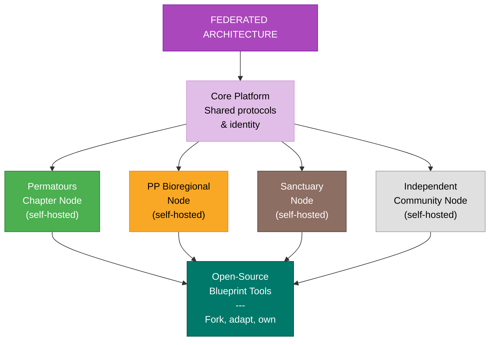

### Impact at This Stage

- **People & Communities:** 15,000+ people across all networks, chapters, Flow Funder communities, and digital platform
- **Bioregions Activated:** 20+ bioregions with active programming, funding, or protocol presence
- **Land & Ecosystems:** Land acquired for Unified Sanctuaries (50-200 acres), 30+ land projects supported through Flow Funds and Permatours network, farm establishment underway
- **Capital Deployed:** $1.5M+ in cumulative Flow Funds deployed to grassroots leaders worldwide
- **Digital Infrastructure:** Federated platform architecture live, 5+ self-hosted chapter nodes, open-source tools adopted by 10+ external communities
- **Cultural Reach:** 100+ events hosted, professional documentary content, media reaching 75,000+ people
- **Replication:** 8+ active chapters, 15+ bioregional deployments, 10+ communities launching their own Flow Funds using the Playbook, open-source governance frameworks forked by 20+ groups

---

## $10M -- Mountain Range

**Cumulative Capital: $16.935M**

This is the tier where Unified Sanctuaries becomes fully operational -- 20+ eco-homes occupied, the permaculture farm feeding residents and hosting agri-tourism, the retreat and healing arts center (including the bathhouse) open to visitors, the event venue hosting festivals, conferences, and bioregional congresses. The combined annual revenue potential of $1.4M-$4.5M+ begins to materialize, making the sanctuary increasingly self-sustaining.

Permatours operates 10+ active chapters across regions and countries, proving that the mutual aid network model works far beyond the Northeast. The Planetary Party Protocol is adopted by allied organizations as their coordination framework -- not just Syd's ecosystem, but the Holomovement, the Bioregional Embassy, TerraLux Spatial Network, and others recognize the five-phase protocol as infrastructure they can build on.

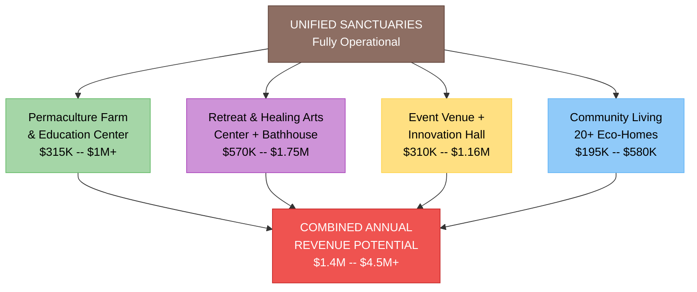

### Ecosystem Allocation

- **Kinship Earth Operations:** Approaching the $20M medium-term target, 60+ Flow Funders active across 30+ bioregions, institutional partnerships with major foundations, Community of Practice as a recognized model for trust-based philanthropy
- **Planetary Party:** Global coordination protocol adopted by allied organizations, full guild ecosystem with cross-bioregional exchange, event revenue and media licensing sustaining core operations
- **Permatours:** 10+ active chapters across regions/countries, bioregional token economy mature, national mutual aid network coordination
- **Unified Sanctuaries:** Full Phase 2 development -- 20+ eco-homes, operational farm, retreat center and bathhouse open, event venue active, circular economy (Sol Token, Voice Token, Trust Units) live
- **App & Digital Infrastructure:** Digital Unified Sanctuaries platform, digital bathhouse, community-supported digital agriculture model

### App & Digital Platform

The digital layer now mirrors the physical sanctuary. The **Digital Unified Sanctuaries platform** manages community governance, resource allocation, and shared economy for the physical village -- and serves as the open-source template for every sanctuary that follows. The **digital bathhouse** applies restorative design principles to digital space: slow channels, consent-embedded interfaces, notification-free zones, and rhythms designed to calm rather than hijack the nervous system. A **community-supported digital agriculture model** (inspired by CSA shares) lets supporters invest in the ecosystem's annual digital operations and receive access, content, and governance participation in return. A **cross-community federation protocol** connects all chapters, sanctuaries, and nodes through shared identity and interoperable tools.

### Impact at This Stage

- **People & Communities:** 30,000+ people across all networks, with 50+ residents at the first Unified Sanctuaries site
- **Bioregions Activated:** 30+ bioregions with active programming, funding, or protocol presence
- **Land & Ecosystems:** 50-200 acres held in community land trust, 40+ land projects supported, permaculture farm operational, retreat center open
- **Capital Deployed:** $3M+ in cumulative Flow Funds deployed
- **Digital Infrastructure:** Digital Sanctuaries platform operational, federation protocol connecting 15+ nodes, 5,000+ platform members
- **Cultural Reach:** 150+ events, Unified Sanctuaries generating $1M+ annual revenue, content reaching 150,000+ people
- **Replication:** 10+ chapters, protocol adopted by 5+ allied organizations, open-source sanctuary blueprint downloaded by 50+ communities, 20+ independent Flow Funds operational worldwide

---

## $25M -- Continental Shelf

**Cumulative Capital: $41.935M**

The blueprint proves replicable at scale. Second and third Unified Sanctuaries sites begin development in other bioregions -- perhaps Cascadia, Colombia, or the Ozarks -- using the open-source blueprint refined at the Vermont site. Each new sanctuary is locally governed, culturally distinct, and connected to the network through shared protocols and values. Kinship Earth approaches major philanthropic institution scale, with the operational infrastructure, track record, and relationships to deploy capital at the level of established foundations.

The Planetary Party Protocol becomes a recognized standard for bioregional coordination -- not just within this ecosystem, but adopted by dozens of communities and organizations worldwide as their framework for sensing, mapping, resourcing, celebrating, and regenerating. The protocol's success is measured not by how much it's controlled, but by how widely it's adopted and adapted by communities the founders have never met.

### Ecosystem Allocation

- **Kinship Earth Operations:** Approaching major philanthropic institution scale, 80+ Flow Funders active, supporting 30+ independent Flow Funds worldwide, education programs reaching family offices and institutional funders
- **Planetary Party:** Protocol recognized as global standard for bioregional coordination, 25+ bioregional deployments, full guild ecosystem self-perpetuating, Earth Council guiding seasonal rhythms globally
- **Permatours:** 15+ active chapters, national and international presence, mutual aid coordination at continental scale
- **Unified Sanctuaries:** Second and third sanctuary sites under development in new bioregions, Vermont site fully operational and generating surplus revenue for network support
- **App & Digital Infrastructure:** Multi-sanctuary network platform, AI-assisted bioregional intelligence, open-source adoption at scale

### App & Digital Platform

The platform evolves into a **multi-sanctuary network** -- connecting all sanctuary sites, chapters, and nodes through a unified but federated interface. **Real-time impact dashboards** show capital flows, community growth, land under stewardship, and ecological outcomes across the entire network. **AI-assisted bioregional intelligence** helps communities identify emerging needs, match resources to opportunities, and surface patterns across bioregions -- augmenting human wisdom rather than replacing it. The **open-source platform is adopted by 10+ external communities** with no formal connection to the ecosystem, proving that the digital infrastructure is genuinely replicable and useful beyond its origin.

### Impact at This Stage

- **People & Communities:** 75,000+ people across all networks and platforms worldwide
- **Bioregions Activated:** 50+ bioregions with active programming, funding, protocol presence, or chapters
- **Land & Ecosystems:** 3+ sanctuary sites in development or operational (500+ total acres in community land trust), 60+ land projects supported through Flow Funds
- **Capital Deployed:** $8M+ in cumulative Flow Funds deployed to grassroots leaders and communities
- **Digital Infrastructure:** Multi-sanctuary platform, AI-assisted intelligence, 15,000+ platform members, platform adopted by 10+ external communities
- **Cultural Reach:** 200+ events annually across the network, professional media reaching 500,000+ people
- **Replication:** 15+ chapters, 30+ independent Flow Funds, 3+ sanctuary sites, protocol adopted by 15+ allied organizations, open-source blueprint adapted on 4+ continents

---

## $50M -- Ocean Current

**Cumulative Capital: $91.935M**

A network of 5-10 sanctuary sites operates globally -- each a living laboratory, each locally governed, each contributing its learnings back to the commons. Kinship Earth deploys $15M+ annually through Flow Funds, making it one of the most significant trust-based philanthropic channels in the world. Permatours chapters exist on every inhabited continent, proving that the mutual aid network model transcends cultural and geographic boundaries. The Planetary Party is no longer an initiative -- it is a movement protocol practiced by hundreds of communities.

The ecosystem's annual impact now rivals that of established international NGOs, but with a fundamentally different architecture: decentralized, trust-based, community-controlled, and rooted in place. Capital flows outward through relationships, not downward through bureaucracy.

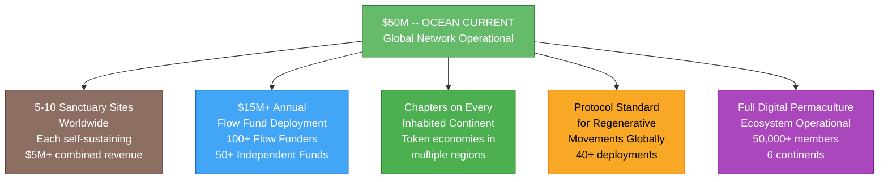

### Ecosystem Allocation

- **Kinship Earth Operations:** $15M+ annual Flow Fund deployment, 100+ Flow Funders active, recognized as a leading institution in trust-based philanthropy, supporting 50+ independent Flow Funds worldwide, Flow Funding Playbook translated into 10+ languages
- **Planetary Party:** Protocol practiced on every continent, 40+ bioregional deployments, full event revenue and media licensing sustaining global operations, Earth Council as recognized voice in international regenerative coordination
- **Permatours:** Chapters on every inhabited continent, bioregional token economies operational in multiple regions, continental mutual aid coordination networks
- **Unified Sanctuaries:** 5-10 sanctuary sites operational worldwide, each self-sustaining through four-pillar revenue model, network generating $5M+ combined annual revenue
- **App & Digital Infrastructure:** Full Digital Permaculture ecosystem operational

### App & Digital Platform

The **full Digital Permaculture ecosystem** reaches operational maturity:

- **Global community network** connecting 50,000+ members across sanctuaries, chapters, guilds, and bioregional nodes
- **Decentralized governance at scale** -- consent-based decision-making, Voice Tokens, and community assemblies functioning across dozens of autonomous communities
- **Transparent capital flows visible worldwide** -- every Flow Fund grant, every sanctuary revenue stream, every community marketplace transaction visible to those with permission, demonstrating radical financial transparency at institutional scale
- **Community-owned media network** -- the content library, documentary archive, and educational resources held in digital commons, generating ongoing revenue through ethical licensing while remaining accessible to communities in need

### Impact at This Stage

- **People & Communities:** 200,000+ people across all networks, 500+ residents across sanctuary sites
- **Bioregions Activated:** 75+ bioregions with active presence worldwide
- **Land & Ecosystems:** 5-10 sanctuary sites (2,000+ total acres in community land trust), 100+ land projects supported through Flow Funds, measurable ecological restoration across multiple watersheds
- **Capital Deployed:** $20M+ in cumulative Flow Funds deployed
- **Digital Infrastructure:** 50,000+ platform members, federated network spanning 6 continents, community-owned infrastructure fully operational
- **Cultural Reach:** 500+ events annually across the network, media reaching 2M+ people, documentary content distributed internationally
- **Replication:** 25+ chapters, 50+ independent Flow Funds, 5-10 sanctuary sites, protocol standard for 50+ organizations, open-source tools used by 100+ communities worldwide

---

## $100M -- Planetary

**Cumulative Capital: $191.935M**

At $100M, the ecosystem approaches Kinship Earth's ten-year vision of $200M raised and deployed. This is not the finish line -- it is the moment where the infrastructure becomes self-perpetuating. A network of 15-20+ sanctuaries worldwide serves as permanent regenerative infrastructure -- land held in trust forever, communities practicing alternative economics, governance models proven across cultures. The open-source blueprint has been adopted by dozens of independent communities with no formal connection to this ecosystem, each adapting the model to their own bioregion, culture, and needs.

Kinship Earth has transformed trust-based philanthropy from a niche practice pioneered by Marian Rockefeller Weber in the early 1990s into a recognized field with hundreds of practitioners, dozens of independent Flow Funds, and a proven track record of getting resources where they're needed without the bureaucratic overhead that keeps traditional philanthropy locked up. The Planetary Party Protocol is the coordination standard for regenerative movements globally -- not because it was imposed, but because it was practiced, refined, and freely shared until communities everywhere found it useful.

The digital layer has achieved what Digital Permaculture envisioned from the beginning: **the regenerative internet made real** -- federated, community-owned, consent-based, and rooted in the same principles that govern the land.

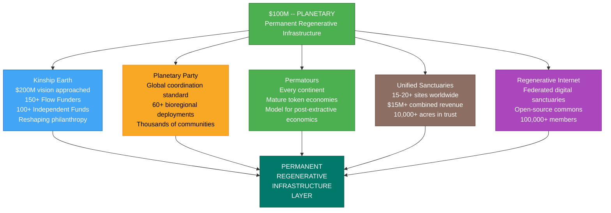

### Ecosystem Allocation

- **Kinship Earth Operations:** Approaching $200M deployed (10-year vision), 150+ Flow Funders active across 50+ bioregions, institution recognized alongside established foundations, supporting 100+ independent Flow Funds, education programs reshaping philanthropic practice globally
- **Planetary Party:** Standard coordination protocol for regenerative movements globally, 60+ bioregional deployments self-sustaining, full guild ecosystem, cultural infrastructure serving thousands of communities
- **Permatours:** Chapters on every continent, mature bioregional token economies, mutual aid infrastructure serving as model for post-extractive economics
- **Unified Sanctuaries:** 15-20+ sanctuary sites worldwide, blueprint adopted by dozens of independent communities, network generating $15M+ combined annual revenue, permanent land trust stewardship for thousands of acres
- **App & Digital Infrastructure:** The regenerative internet

### App & Digital Platform

The digital platform has become what it was always meant to be:

- **A federated network of community-owned digital sanctuaries worldwide** -- each node sovereign, each reflecting local culture and governance, all connected through shared protocols. No single point of failure. No corporate landlord. Digital land held in trust, just like the physical land.
- **Open-source digital commons** -- every governance framework, every tokenomics system, every coordination tool, every blueprint freely available for any community to use, adapt, and build upon. The digital equivalent of Unified Sanctuaries' open-source blueprint.
- **Trust-based funding infrastructure serving hundreds of communities globally** -- Kinship Earth's transparent capital flow tracking, community investment portals, and Flow Fund coordination tools used by independent foundations worldwide.
- **A living proof of concept that ethical digital infrastructure is possible** -- demonstrating that technology built on permaculture principles, community ownership, and consent-based governance can function at global scale without extracting from the communities it serves.

### Impact at This Stage

- **People & Communities:** 500,000+ people across all networks, 2,000+ residents across sanctuary sites, millions reached through media and educational content
- **Bioregions Activated:** 100+ bioregions with active programming, funding, or protocol presence
- **Land & Ecosystems:** 15-20+ sanctuary sites (10,000+ total acres in community land trust), 200+ land projects supported, measurable ecological restoration across dozens of watersheds
- **Capital Deployed:** $50M+ in cumulative Flow Funds deployed to grassroots leaders and communities worldwide
- **Digital Infrastructure:** Federated network spanning every continent, 100,000+ platform members, community-owned infrastructure adopted by hundreds of communities
- **Cultural Reach:** 1,000+ events annually, media distributed internationally, educational content in 10+ languages
- **Replication:** 50+ chapters, 100+ independent Flow Funds, 15-20+ sanctuary sites, protocol standard adopted by 100+ organizations, open-source blueprint adapted by dozens of independent communities. **A permanent regenerative infrastructure layer established.**

---

## The Compounding Effect

Every tier in this roadmap multiplies the impact of the next. This is not linear growth -- it is ecological compounding.

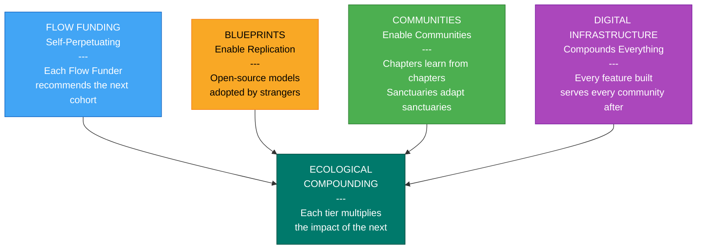

**Flow Funding is self-perpetuating.** Each Flow Funder recommends the next cohort. Each independent Flow Fund creates its own network. Capital deployed at the $50K tier seeds relationships that unlock $5M in institutional funding five years later. Trust compounds. Relationships deepen. The network grows from within.

**Blueprints enable replication without control.** The open-source governance frameworks, tokenomics systems, and sanctuary blueprints published at the $500K tier are adopted by communities at the $5M tier that the founders have never met. Replication is the highest form of impact -- not because the ecosystem grows larger, but because the ideas grow legs and walk into communities that need them.

**Communities enable communities.** A Permatours chapter in the Ozarks learns from a chapter in Cascadia. A sanctuary in Colombia adapts the Vermont blueprint. A Flow Funder in Jamaica mentors one in Guatemala. The ecosystem becomes a learning network where every node strengthens every other node -- not through centralized coordination, but through shared practice and relational trust.

**Digital infrastructure compounds everything.** The platform built at $100K is the foundation for the federated architecture at $5M. The tokenomics tested at $250K become the economic infrastructure for 50+ communities at $50M. Every feature built serves every community that follows. And because the infrastructure is open-source and community-owned, it cannot be extracted from, shut down, or sold.

This is Digital Permaculture in practice: tilling the digital land to grow a living internet. The same principles that govern regenerative agriculture -- observe and interact, catch and store energy, produce no waste, design from patterns to details, integrate rather than segregate -- govern the digital systems that connect the ecosystem worldwide.

### What We've Already Proven

This roadmap is ambitious, but it is grounded in real work:

- Kinship Earth has raised $800K+ and deployed $300K+ to 18+ Flow Funders in its first year of operation -- demonstrating that trust-based philanthropy works and scales
- Permatours has organized 50+ events across 40+ sites with a team of under-resourced organizers -- proving that mutual aid networks can mobilize communities at bioregional scale
- The Planetary Party Protocol is active in 5+ bioregions across three countries -- showing that coordination without centralization is not theoretical but practiced
- The founding team has supported 40+ land-based projects, navigated complex governance design, and built relationships across 12+ bioregions -- establishing the relational foundation on which everything else is built

The infrastructure exists. The relationships are real. The communities are active. What this roadmap describes is not a new beginning -- it is the natural unfolding of what has already taken root.

### An Invitation

Every tier in this roadmap represents a choice: to move capital toward life, toward trust, toward communities that know what they need. This is not charity. It is infrastructure investment in a regenerative future.

The party has already begun. The question is not whether this work will happen -- it is already happening, in every Flow Fund deployment, every natural building workshop, every listening circle, every seed planted. The question is how fast it grows, how many communities it reaches, and how permanent the infrastructure becomes.

Capital deployed through this ecosystem does not disappear into overhead. It flows -- through trust, through relationships, through bioregions, through communities -- and every dollar leaves the soil healthier than it found it.

---

*Stewarded by Syd Harvey Griffith and an expanding circle of core stewards, Flow Funders, guild members, community hubs, and bioregional hosts worldwide.*

*Part of [Sydney's ecosystem](../README.md) | [Ecosystem Overview](./README.md) | [Ecosystem Executive Summary](./ECOSYSTEM_EXECUTIVE_SUMMARY.md)*
