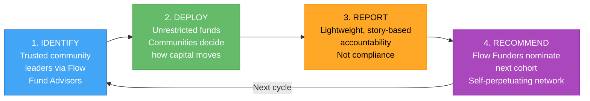
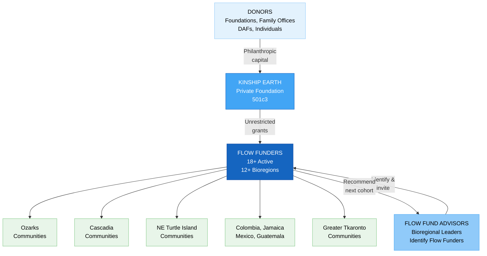
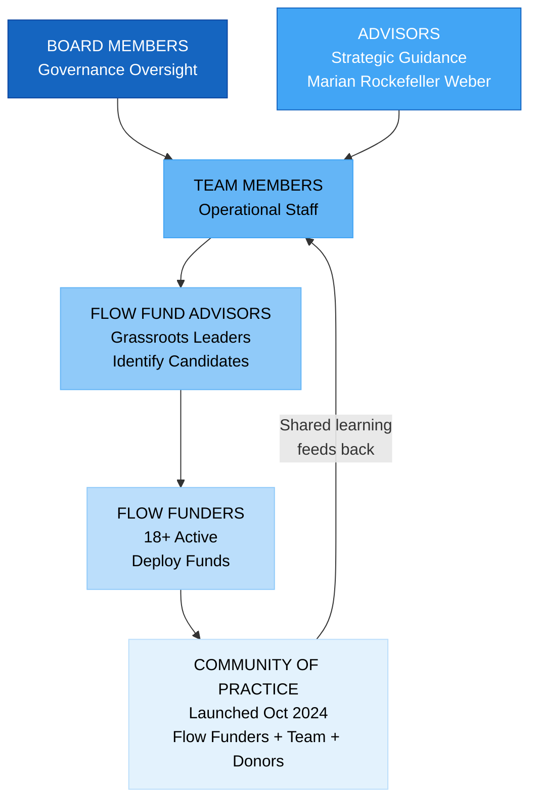
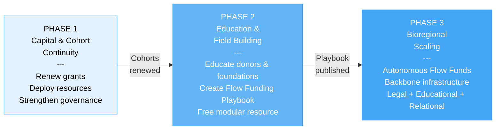
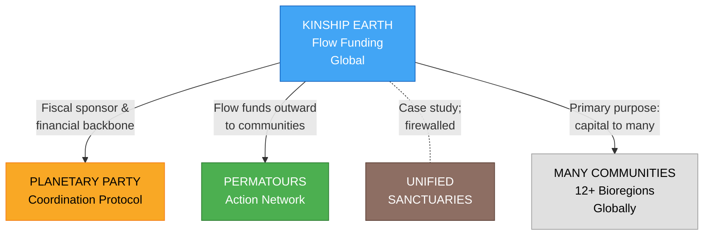

# Kinship Earth -- Executive Summary

## Overview

Kinship Earth is a private foundation stewarding **Flow Funding** -- a participatory, trust-based grantmaking model that moves unrestricted resources directly to grassroots leaders and bioregional organizers. No grant applications. Minimal reporting. Maximum trust. Founded by **Sydney Griffith** (Executive Director) and **Susan Davis Mora** (Co-Founder), Kinship Earth exists to catalyze planetary regeneration by transforming how philanthropy functions. The organization serves as both **financial infrastructure** and **education platform**, addressing the structural gaps in traditional institutional philanthropy that keep resources locked away from the communities that need them most.

**Website:** [kinshipearth.org](https://www.kinshipearth.org/) | [flowfunding.org](https://flowfunding.org)
**Entity:** Private Foundation (Nonprofit 501c3)
**Scale:** Global
**Status:** Active -- deploying flow funds across 12+ bioregions
**Executive Director:** Sydney Griffith

---

## Mission & Vision

**Mission:** To catalyze planetary regeneration and systemic healing by transforming how philanthropy functions -- moving unrestricted capital directly to trusted grassroots leaders and bioregional organizers through participatory, trust-based grantmaking.

**Vision:** A world where financial resources reliably flow to the communities and ecosystems that need them most -- governed by trust, relationship, and accountability to life rather than bureaucracy, compliance, and donor preference. Flow Funding is not an alternative to philanthropy. It is philanthropy redesigned for the moment we're in.

---

## The Problem

Traditional philanthropy is structurally broken:

- **Locks up capital:** Foundations distribute only ~7% of assets annually -- 93% stays locked in endowments
- **Burdens changemakers:** Grassroots leaders spend countless hours finding grants and writing applications, pulling them away from the work that matters
- **Enforces conformity:** Recipients must conform to what foundations think they should do -- not what communities actually need
- **Excludes the most effective actors:** Grassroots groups -- often operating on less than $50,000/year -- consistently deliver more effective, cost-efficient, and responsive solutions, yet remain the most underfunded
- **Perpetuates inequity:** Indigenous peoples protect 80% of the world's biodiversity but receive less than 1% of climate finance

---

## The Core Model: Flow Funding

Flow Funding is a **financial nervous system** that reliably moves resources where they're needed -- not a one-off intervention, but a repeatable, durable system designed to function across time, bioregions, and cohorts.

### How It Works -- Four Steps

1. **Identify Trusted Community Leaders** -- Kinship Earth, guided by Flow Fund Advisors with deep bioregional ties, identifies trusted community leaders. If they accept the invitation, they receive **unrestricted funds** to deploy in service of their communities.
2. **Flow Funders Deploy Resources** -- Flow Funders decide how, when, and where to move resources based on emergent community needs -- **without submitting applications or asking permission**.
3. **Lightweight Reporting & Impact Stories** -- Flow Funders share basic reports and are invited to share stories of impact. This model replaces cumbersome compliance with relational accountability.
4. **Flow Funders Recommend the Next Round** -- Flow Funders recommend the next cohort of trusted community leaders, creating a **self-perpetuating, decentralized network** governed by trust and accountability to life.

### Capital Flow Architecture

### What Makes Flow Funding Different

| Traditional Philanthropy | Flow Funding |
|---|---|
| Application-driven | Invitation-driven |
| Foundation controls decisions | Communities control decisions |
| Heavy compliance and reporting | Lightweight, story-based accountability |
| Siloed by issue area | Intersectional -- economic, social, environmental, humanitarian |
| Organized by political boundaries | Organized by bioregions (natural ecosystems & culture) |
| Top-down power dynamics | Trust-based, relational |
| One-off grants | Repeatable, durable system |

### Four Core Functions

1. Deploy unrestricted grants to trusted changemakers
2. Educate donors, family offices, DAFs, and foundations on trust-based philanthropy
3. Support communities in establishing their own Flow Funding foundations
4. Serve as both grantmaker and field-builder for the broader movement

### Impact Areas Funded

1. Regeneration of natural systems
2. Advancing Indigenous rights and land rematriation
3. Strengthening food sovereignty, food security, and housing security
4. Supporting social justice and economic equity
5. Backing community-led disaster preparedness and relief
6. Improving ecosystem and human health

---

## Capital Strategy & Financial Targets

| Timeframe | Target |
|-----------|--------|
| Near-term (2025-2026) | **$2M** by end of 2026 |
| Medium-term (2026-2028) | **$20M** by end of 2028 |
| 5-year target | **$10M+** deployed through **100+ flow funding grants** |
| 5-year target | **20+ bioregional Flow Funds** created |
| 10-year vision | **$200M** raised and deployed |

### Where Capital Goes

- Renew grants to Cohorts 1 & 2 of Flow Funders
- Deploy flow funds to bioregional organizing groups around the world
- Help bioregional communities create their own unique Flow Funds and financially seed them
- Educate family offices, DAFs, high-net-worth individuals, and foundations on embracing flow funding

---

## Impact to Date

| Date | Milestone |
|------|-----------|
| Early 1990s | Marian Rockefeller Weber gives Susan Davis Mora one of the first-ever flow funding grants |
| June 2024 | Kinship Earth Flow Fund officially launched |
| August 2024 | $500,000 raised |
| October 2024 | First Community of Practice launched; Ozarks Bioregional Congress held |
| February 2025 | $150,000 grant received from NOBO Foundation |
| By mid-2025 | $300,000 in flow funding grants deployed to 18+ Flow Funders |
| December 2025 | Continued fundraising and deployment beyond pitch figures |

**Total raised:** $800,000+ since adopting Flow Funding in 2024
**Total deployed:** $300,000+ to 18+ Flow Funders across 12+ bioregions globally

### Real-World Examples

- **Food Sovereignty on Reservations:** A Flow Funder purchased a freeze dryer for a reservation so produce and herbs could be preserved through winter -- strengthening nutrition, reducing reliance on processed foods, and building long-term community resilience.
- **Protecting Sacred Waters in Minnesota:** A Flow Funder helped prevent toxic mining waste from being dumped in a waterway -- protecting sacred waters, uplifting treaty rights, preserving ecosystems, and affirming Indigenous sovereignty.
- **Family Food Security:** A Flow Funder expanded a program teaching families to grow food and raise chickens -- creating lasting food security, self-sufficiency, and empowerment.
- **Ozarks Bioregional Congress (October 2024):** Strengthened intergenerational networks, deepened ecological literacy, and catalyzed cross-state collaborations around land trusts, water stewardship, and community-rooted solutions.

---

## Governance Structure

### Governance Layers

1. **Board Members** -- Governance oversight
2. **Advisors** -- Strategic guidance (including Marian Rockefeller Weber)
3. **Team Members** -- Operational staff
4. **Flow Fund Advisors** -- Grassroots community leaders who identify Flow Funder candidates
5. **Flow Funders** -- Trusted community leaders who receive and deploy funds (18+ active)
6. **Community of Practice** -- Launched October 2024, bringing Flow Funders, team, and donors together

---

## Legal & Entity Structure

- **Entity Type:** Private Foundation (Nonprofit 501c3)
- **Fiscal Sponsor:** Serves as fiscal sponsor for the Planetary Party Protocol
- **Ethical Boundaries:** KE's capital flows serve many communities internationally, not primarily Syd's own projects. Clear firewalls exist to prevent conflicts of interest.
  - KE -> Permatours: flow funds deployed so Permatours could flow resources **outward** to communities
  - KE -> Unified Sanctuaries: direct funding is an open question due to potential conflict of interest

---

## Development Phases

### Phase 1 -- Capital & Cohort Continuity
- Renew grants to Cohorts 1 & 2 Flow Funders
- Support Flow Funders in deploying resources within their bioregions
- Strengthen internal governance, compliance, and reporting clarity

### Phase 2 -- Education & Field Building
- Develop educational materials for family offices, DAF holders, foundations, and high-net-worth individuals
- Co-create the **Flow Funding Playbook** -- a free, modular resource to help communities launch their own flow funds

### Phase 3 -- Bioregional Scaling
- Support the emergence of autonomous, place-based Flow Funds worldwide
- Serve as backbone infrastructure -- not a centralized controller:
  - **Legal** -- fiscal sponsorship and compliance support
  - **Educational** -- training, tools, and the Flow Funding Playbook
  - **Relational** -- connecting bioregional leaders, facilitating shared learning

---

## Active Bioregions & Collaborations

| Bioregion | Status |
|-----------|--------|
| **The Ozarks** | Site of October 2024 bioregional congress |
| **Cascadia** | Active collaboration with bioregional organizers |
| **Greater Tkaronto** | Active collaboration area |
| **Northeast / Turtle Island** | Connected through Permatours network |
| **Unity, Maine** | Site of aligned bioregional activation |
| **Colombia, Jamaica, Mexico, Guatemala** | Expanding engagement internationally |

---

## Ecosystem & Strategic Partnerships

Kinship Earth operates within a constellation of four interconnected projects:

| Partner Entity | Relationship |
|---------------|-------------|
| **Planetary Party** | KE serves as fiscal sponsor; provides financial backbone for PPP ecosystem |
| **Permatours** | Has deployed flow funds so Permatours could flow resources outward to communities |
| **Unified Sanctuaries** | May reference as case study; direct funding carefully managed with firewalls |
| **Many communities** | Primary purpose is deploying capital across bioregions internationally |

**Core principle:** All four are participants in a wider ecosystem, not a closed loop. Kinship Earth capital flows serve many communities, with Sydney's projects as participants, not primary beneficiaries.

---

## Founding Team

| Name | Role | Focus |
|------|------|-------|
| **Syd Harvey Griffith** | Executive Director | Vision, strategy, fundraising, systems design. Pioneered Bioregional Flow Funding, supported 40+ land-based projects. |
| **Susan Davis Mora** | Co-Founder | Original flow funding recipient (early 1990s from Marian Rockefeller Weber), co-founding vision |
| **Michael (Fuego)** | Financial Operations | Accounting, compliance, financial operations |
| **Marian Rockefeller Weber** | Advisor | Pioneer of flow funding; replace philanthropy's paperwork, reporting, and bureaucracy with relationships, trust, and generosity |

---

## How to Get Involved

| Pathway | Description |
|---------|-------------|
| **Donate** | Make a gift aligned with your vision for a regenerative bioregional future |
| **Create a Bioregional Flow Fund** | Kinship Earth provides the legal, educational, and relational backbone |
| **Make Introductions** | Connect Kinship Earth with aligned donors, family offices, foundations, and grantors |
| **Invite Sydney to Speak** | Available for events, conferences, podcasts, and gatherings |
| **Share Your Story** | If you're practicing flow funding or trust-based philanthropy, share your approach |

---

## What Makes Kinship Earth Unique

1. **Flow funding model** -- capital moves where needed, not locked in rigid program budgets
2. **Many-communities approach** -- deploys across bioregions internationally, not just a small internal network
3. **Invitation-driven** -- no grant applications; communities control decisions
4. **Organized by bioregions** -- natural ecosystems and culture, not political boundaries
5. **Self-perpetuating network** -- each cohort of Flow Funders recommends the next, creating decentralized growth
6. **Storytelling-integrated fundraising** -- content from across the movement supports donor cultivation
7. **Field-building mission** -- not just deploying capital but helping communities build their own Flow Funds
8. **Pioneer lineage** -- direct intellectual and relational lineage from Marian Rockefeller Weber's original flow funding vision

---

## Key Risks & Open Questions

- **Fundraising execution:** Achieving $2M by end of 2026 and $20M by 2028 requires significant donor cultivation and foundation engagement
- **Scaling without centralizing:** As bioregional Flow Funds emerge, maintaining coherence and accountability without imposing top-down control
- **Conflict of interest management:** Ensuring clear firewalls between KE's capital flows and Syd's other projects, particularly Unified Sanctuaries
- **Flow Funder accountability:** Balancing trust-based, lightweight reporting with sufficient transparency for donors and foundations
- **Institutional credibility:** Building the organizational track record to unlock larger institutional grants and foundation partnerships
- **Sustainability:** Transitioning from founder-dependent fundraising to a self-sustaining model with diversified revenue

---

## Summary

Kinship Earth represents a fundamental redesign of how philanthropic capital reaches the communities and ecosystems that need it most. With $800,000+ raised and $300,000+ deployed to 18+ Flow Funders across 12+ bioregions in its first year, the model has demonstrated real traction. The self-perpetuating Flow Funder network, trust-based accountability structure, and bioregional organizing framework position Kinship Earth to scale from a promising proof of concept to a global infrastructure for regenerative capital deployment -- targeting $200M raised and deployed over the next decade.

---

> *"We're trusting those who know the needs of their communities to do the work and to deploy capital however they see fit. That's what flow funding is."*
> -- Sydney Griffith

---

**Website:** [kinshipearth.org](https://www.kinshipearth.org/) | [flowfunding.org](https://flowfunding.org)

*Prepared February 2026 | Kinship Earth*
