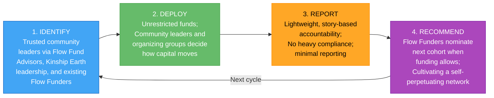
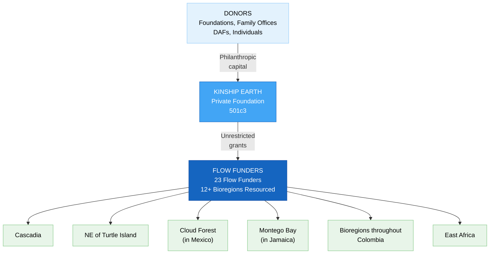
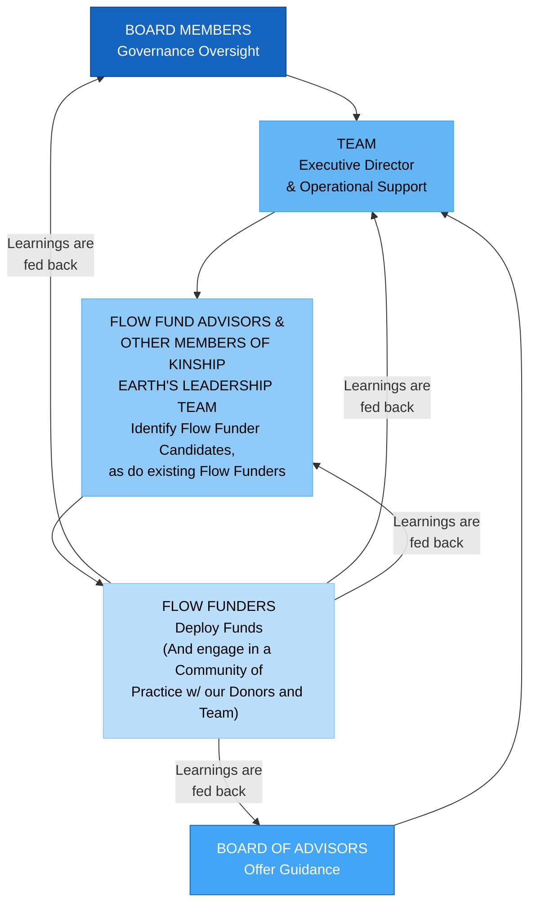
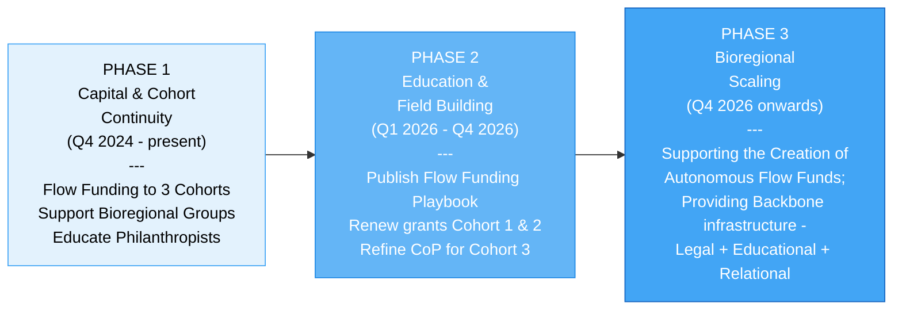

# Kinship Earth -- Executive Summary

## Overview

Kinship Earth is a private foundation stewarding **Flow Funding** -- a participatory, trust-based grantmaking model that moves unrestricted resources directly to grassroots leaders and bioregional organizers. No grant applications. Minimal reporting. Grounded in trust and in the wisdom of those closest to their communities' needs. Founded by **Stephen Gomes**, **Susan Davis Moora**, and **Walter Moora**, Kinship Earth exists to catalyze planetary regeneration by transforming how philanthropy functions. In 2024, **Sydney Griffith** was brought on as Executive Director to lead the organization's pivot to embracing Flow Funding as its primary objective. The organization serves as both **financial infrastructure** and **education platform**, addressing the structural gaps in traditional institutional philanthropy that keep resources locked away from the communities that need them most.

**Website:** [kinshipearth.org](https://www.kinshipearth.org/) | [flowfunding.org](https://flowfunding.org)
**Entity:** Private Foundation (Nonprofit 501c3)
**Scale:** Global
**Status:** Active -- deploying flow funds across 12+ bioregions
**Executive Director:** Sydney Griffith

---

## Mission & Vision

**Mission:** To catalyze planetary regeneration and systemic healing by transforming how philanthropy functions -- moving unrestricted capital directly to trusted grassroots leaders and bioregional organizing groups through participatory, trust-based grant-making.

**Vision:** A world where financial resources reliably flow to the communities and ecosystems that need them most -- governed by trust, relationship, and accountability to life rather than bureaucracy, compliance, and donor preference. Flow Funding is not an alternative to philanthropy. It is philanthropy redesigned for the moment we're in.

---

## The Problem

Traditional philanthropy is structurally broken:

- **Locks up capital:** Foundations distribute only ~7% of assets annually -- 93% stays locked in endowments
- **Burdens changemakers:** Grassroots leaders spend countless hours finding grants and writing applications, pulling them away from the work that matters
- **Enforces conformity:** Recipients oftentimes must conform to what foundations think they should do -- not what communities actually need
- **Excludes the most effective actors:** Grassroots groups -- often operating on less than $50,000/year -- consistently deliver more effective, cost-efficient, and responsive solutions, yet remain the most underfunded
- **Perpetuates inequity:** Indigenous peoples protect 80% of the world's biodiversity but receive less than 1% of climate finance

---

## The Core Model: Flow Funding

Flow Funding is a **financial nervous system** that reliably moves resources where they're needed -- not a one-off intervention, but a repeatable, durable system designed to function across time, bioregions, and cohorts.

### How It Works -- Four Steps

1. **Identify Trusted Community Leaders** -- Kinship Earth, guided by its Flow Fund Advisors and leadership team with deep bioregional ties, identifies trusted community leaders, non profits, and bioregional organizing groups. If they accept the invitation, they receive **unrestricted funds** to deploy in service of their communities.
2. **Flow Funders Deploy Resources** -- Flow Funders decide how, when, and where to move resources based on emergent community needs -- **without submitting applications or asking permission**.
3. **Lightweight Reporting & Impact Stories** -- Flow Funders share basic reports and are invited to share stories of impact. This model replaces cumbersome compliance with relational accountability.
4. **Flow Funders Recommend the Next Round** -- Flow Funders recommend the next cohort of trusted community leaders, creating a **self-perpetuating network** governed by trust and accountability to life.

### Capital Flow Architecture

### What Makes Flow Funding Different

| Traditional Philanthropy | Flow Funding |
|---|---|
| Application-driven | Invitation-driven |
| Foundation controls decisions | Communities control decisions |
| Heavy compliance and reporting | Lightweight, story-based accountability |
| Siloed by issue area | Intersectional -- economic, social, environmental, humanitarian |
| Organized by political boundaries | Organized by bioregions (natural ecosystems & culture) |
| Top-down power dynamics | Trust-based, relational |
| One-off grants | Repeatable, durable system |

### Four Core Functions

1. Deploy unrestricted grants to trusted changemakers and bioregional organizing groups
2. Educate donors, family offices, DAFs, and foundations on trust-based philanthropy
3. Support communities in establishing their own Flow Funding foundations
4. Serve as both grantmaker and field-builder for the broader movement

### Impact Areas Funded

1. Regeneration of natural systems
2. Advancing Indigenous rights and land rematriation
3. Strengthening food sovereignty, food security, and housing security
4. Supporting social justice and economic equity
5. Backing community-led disaster preparedness and relief
6. Improving ecosystem and human health

---

## Capital Strategy & Financial Targets

| Timeframe | Target |
|-----------|--------|
| Near-term (2025-2026) | **$2M** by end of 2026 |
| Medium-term (2026-2028) | **$20M** by end of 2028 |
| 5-year target | **$10M+** deployed through **100+ flow funding grants** |
| 5-year target | **Supporting the launch of and financially seeding 20+ bioregional Flow Funds** |
| 10-year vision | **$200M** raised and deployed |

### Where Capital Goes

- Renew grants to Cohorts 1 & 2 of Flow Funders
- Deploy flow funds to bioregional organizing groups around the world
- Help bioregional communities create their own unique Flow Funds and financially seed them
- Educate family offices, DAFs, high-net-worth individuals, and foundations on embracing flow funding

---

## Impact to Date

| Date | Milestone |
|------|-----------|
| Early 1990s | Marion Rockefeller Weber gives Susan Davis Moora one of the first-ever flow funding grants |
| May 2021 | Kinship Earth Founded |
| June 2024 | Kinship Earth Flow Fund officially launched |
| August 2024 | $500,000 raised |
| October 2024 | Flow Funding Cohort 1 launched, funds deployed, and First Community of Practice kicked off |
| February 2025 | $150,000 grant received from Novo Foundation |
| By mid-2025 | $300,000 in flow funding grants deployed to 18+ Flow Funders |
| Nov 2025 | Another $150,000 grant received from Novo Foundation |
| December 2025 | Continued fundraising and deployment beyond pitch figures |
| Q1 2026 | $70K deployed to bioregional organizing groups around the world, including in Jamaica, Colombia, Mexico, and the Northeast of Turtle Island |

**Total raised:** $800,000+ since adopting Flow Funding in 2024
**Total deployed:** $370,000+ to 23 Flow Funders across 12+ bioregions globally

### Real-World Examples

- **Food Sovereignty on Reservations:** A Flow Funder purchased a freeze dryer for a reservation so produce and herbs could be preserved through winter -- strengthening nutrition, reducing reliance on processed foods, and building long-term community resilience.
- **Protecting Sacred Waters in Minnesota:** A Flow Funder helped prevent toxic mining waste from being dumped in a waterway -- protecting sacred waters, uplifting treaty rights, preserving ecosystems, and affirming Indigenous sovereignty.
- **Family Food Security:** A Flow Funder expanded a program teaching families to grow food and raise chickens -- creating lasting food security, self-sufficiency, and empowerment.
- **Tumianuma Women's Gardens (Ecuador):** Cultivating permaculture food forests and gardens, as well as cultural exchange, run by local women.
- **The Slim Butte Agricultural Program (Pine Ridge, South Dakota, USA):** Gaining critical winter heating and a truck for food delivery (Via The Fountain).
- **The East African Coastal Forest Women's Flow Fund:** Supporting 10 women restoring ecosystems across five countries (Via Regenerosity).
- **Regenerate Cascadia:** Piloting 8 landscape hubs across the Cascadia Bioregion (Pacific Northwest, USA, & Canada) that coordinate regeneration and finance at a bioregional scale.

---

## Governance Structure

### Governance Layers

1. **Board Members** -- Governance oversight
2. **Advisors** -- Strategic guidance (including Marion Rockefeller Weber)
3. **Team Members** -- Operational staff
4. **Flow Fund Advisors** -- Grassroots community leaders who identify Flow Funder candidates
5. **Flow Funders** -- Trusted community leaders, non profits, and bioregional organizing groups who receive and deploy funds
6. **Communities of Practice (CoP)** -- First CoP launched in October 2024 - bringing Flow Funders, team members, and donors together for shared learning and growth

---

## Legal & Entity Structure

- **Entity Type:** Private Foundation (Nonprofit 501c3)
- **Fiscal Sponsor:** Serves as fiscal sponsor for the Planetary Party Protocol

---

## Development Phases

### Phase 1 -- Capital & Cohort Continuity (Q4 2024 - present)
- Flow Funding to 3 Cohorts
- Supporting Bioregional Organizing Groups with creating their own Flow Funding Foundations
- Educating Family Offices, Foundations, DAFs, and high net worth individuals on how and why to practice Flow Funding

### Phase 2 -- Education & Field Building (Q1 2026 - Q4 2026)
- Publish a **Bioregional Flow Funding Playbook** -- a free, modular resource to help communities launch their own flow funds (Q1, 2026)
- Renew grants to Flow Funders in Cohort 1 & 2
- Refine our Community of Practice Processes for Cohort 3, just beginning (Q1, 2026)

### Phase 3 -- Bioregional Scaling (Q4 2026 onwards)
- Support the emergence of autonomous, place-based Flow Funds worldwide
- Serve as backbone infrastructure -- not a centralized controller, offering:
  - **Legal** -- compliance support
  - **Educational** -- training, tools, and the Flow Funding Playbook
  - **Relational** -- connecting bioregional leaders, facilitating shared learning

---

## Active Bioregions & Collaborations

| Bioregion | Status |
|-----------|--------|
| **Cascadia** | Active collaboration with bioregional organizers |
| **Greater Tkaronto Bioregion** | Active collaboration area |
| **Northeast (Turtle Island)** | Active collaboration area |
| **Montego Bay (in Jamaica)** | Active engagement internationally |
| **Bioregions throughout Colombia** | Active engagement internationally |
| **East Africa** | Active engagement internationally |
| **Cloud Forest (in Mexico)** | Active engagement internationally |

---

## Founders & Leadership

| Name | Role | Focus |
|------|------|-------|
| **Stephen Gomes** | Founder, Board Member | Co-founded Kinship Earth |
| **Susan Davis Moora** | Founder | Co-founded Kinship Earth; original flow funding recipient (early 1990s from Marion Rockefeller Weber) |
| **Walter Moora** | Founder, Board Member | Co-founded Kinship Earth, bioregional tokenomics, community gardening |
| **Sydney Griffith** | Executive Director | Brought on in 2024 to lead the pivot to Flow Funding. Vision, strategy, fundraising, systems design. Supported 40+ land-based projects. |
| **George Orbelian** | Board Member | Ocean conservation, Buckminster Fuller Institute, and network weaving |
| **Terry Mollner** | Board Member | The Sensation of Oneness and Common Good Capitalism |
| **Josie Watson** | Board Member | Earth law / Mycelial Law, network building, NE of Turtle Island bioregional tending |
| **Marion Rockefeller Weber** | Advisor | Pioneer of flow funding |

---

## How to Get Involved

| Pathway | Description |
|---------|-------------|
| **Donate** | Make a gift aligned with your vision for a regenerative bioregional future |
| **Create a Bioregional Flow Fund** | Kinship Earth provides the legal, educational, and relational backbone |
| **Make Introductions** | Connect Kinship Earth with aligned donors, family offices, foundations, and grantors |
| **Invite Sydney to Speak** | Available for events, conferences, podcasts, and gatherings |
| **Share Your Story** | If you're practicing flow funding or trust-based philanthropy, share your approach |

---

## What Makes Kinship Earth Unique

1. **Flow funding model** -- capital moves where needed, not locked in rigid program budgets
2. **Many-communities approach** -- deploys across bioregions internationally, not just a small internal network
3. **Invitation-driven** -- no grant applications; communities control decisions
4. **Organized by bioregions** -- natural ecosystems and culture, not political boundaries
5. **Self-perpetuating network** -- each cohort of Flow Funders recommends the next, creating decentralized growth
6. **Storytelling-integrated fundraising** -- content from across the movement supports donor cultivation
7. **Field-building mission** -- not just deploying capital but helping communities build their own Flow Funds
8. **Pioneer lineage** -- direct intellectual and relational lineage from Marion Rockefeller Weber's original flow funding vision

---

## Key Risks & Open Questions

- **Fundraising execution:** Achieving $2M by end of 2026 and $20M by 2028 requires significant donor cultivation and foundation engagement
- **Scaling without centralizing:** As bioregional Flow Funds emerge, maintaining coherence and accountability without imposing top-down control
- **Flow Funder accountability:** Balancing trust-based, lightweight reporting with sufficient transparency for donors and foundations
- **Institutional credibility:** Building the organizational track record to unlock larger institutional grants and foundation partnerships
- **Sustainability:** Transitioning from founder-dependent fundraising to a self-sustaining model with diversified revenue

---

## Summary

Kinship Earth represents a fundamental redesign of how philanthropic capital reaches the communities and ecosystems that need it most. With $800,000 raised since August 2024 and $370,000 deployed thus far across 23 Flow Funders in 12+ bioregions, the model has demonstrated real traction. Beyond deploying capital, Kinship Earth is actively educating philanthropists and foundations in trust-based, participatory approaches to giving, while supporting bioregional communities to design and launch their own Flow Funds. This trust-based accountability structure and bioregional resourcing focus position Kinship Earth to scale from a proven model into a global learning and deployment infrastructure for regenerative capital - targeting $200M raised and deployed over the next decade.

---

> *"We're trusting those who know the needs of their communities to do the work and to deploy capital however they see fit. That's what flow funding is."*
> -- Sydney Griffith

---

**Website:** [kinshipearth.org](https://www.kinshipearth.org/) | [flowfunding.org](https://flowfunding.org)

*Prepared February 2026 | Kinship Earth*
