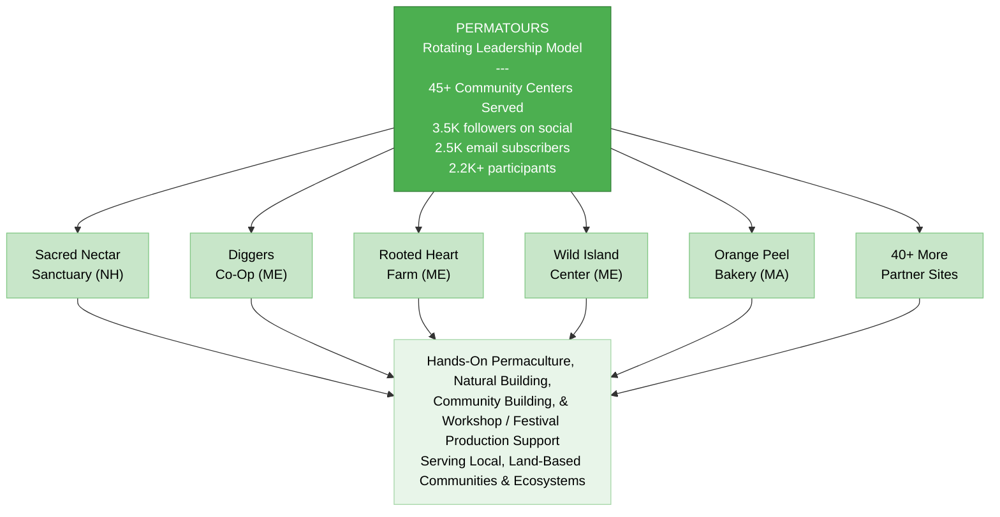
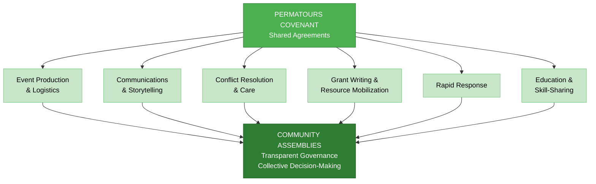
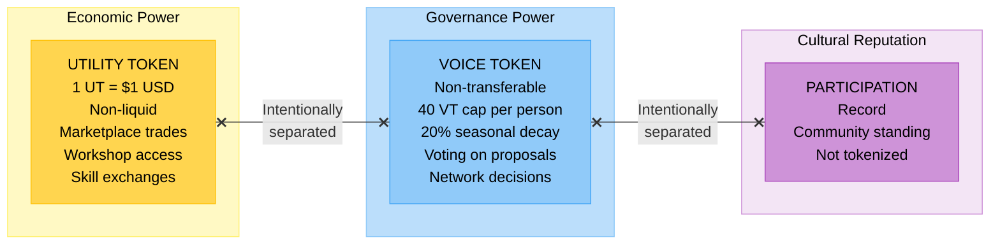
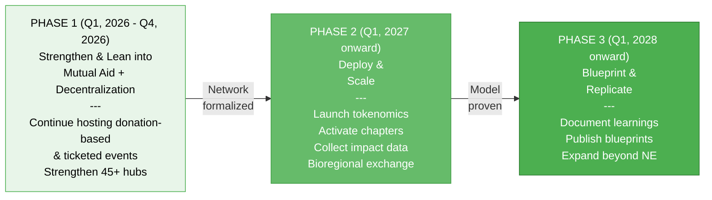

# Permatours -- Executive Summary

## Overview

Based in the Northeast of Turtle Island, Permatours is a permaculture action, education, and mutual aid network that activates people to learn-by-doing, while increasing the capacity of land-based community hubs across the bioregion.

Co-founded Syd Harvey Griffith and Scotty Guzman, Permatours has co-created **50+ learn-by-doing events** across **40+ land-based project sites** since 2021, building a mycelial network of communities, organizers, educators, and volunteers dedicated to regenerating ecosystems, empowering local stewardship, and addressing essential needs: food, water, shelter, energy, and belonging.

Permatours is a **living network** -- a capacity-builder and mobilizer that attracts hands-on volunteer support to the communities it serves.

**Website:** [permatours.org](https://www.permatours.org/)
**Entity:** Nonprofit (501c3)
**Scale:** Northeast Bioregion of Turtle Island
**Status:** Active -- increasing its mutual aid focus, exploring a chapter model, developing a bioregional token

---

## Mission & Vision

**Mission:** To support people in learning how to meet their basic needs in alignment with their values, with the support of community, land, and shared responsibility -- reducing dependency on extractive or misaligned systems and returning to ways of living that genuinely nourish people and place.

**Vision:** A bioregional network where people can rebuild practical life skills, reconnect with land-based relational ways of living, transition from passive participation to active stewardship -- co-creating resilient alternatives rooted in place, season, and reciprocity.

---

## The Core Model: Permaculture Action Network

Permatours connects permaculture practitioners, land projects, and aligned organizations through hands-on action: natural building workshops, food forest installations, herbal education, community festivals, skill-shares, and mutual aid coordination. Every event is documented, creating an ongoing body of educational media and storytelling that amplifies impact and inspires replication.

### Programming Delivered (2021-2025)

- Natural building workshops (cob ovens, hempcrete structures, A-frame tiny homes, earthen construction)
- Permaculture design and food forest installations
- Bioconstruction immersions (including international collaborations in Chiapas, Mexico)
- Hemp building and fiber systems workshops
- Plant walks, herbal wisdom circles, and medicinal cultivation
- Water systems creation and ecological restoration
- Community festivals, convergences, and ceremonial gatherings
- The Northeast Eco Communities Convergence
- Skill-sharing, volunteer coordination, and mutual aid rapid response

### Network Scale

With over 45 Community Centers Served, 3.5K followers on social, 2.5K email subscribers, and 2.2K+ participants -- Permatours is a proven model for mobilizing volunteers, coordinating land-based projects, and co-creating educational experiences that build real capacity.

---

## The Next Evolution

Permatours is evolving from a small team of under-resourced organizers into a **decentralized mutual aid network** with five interconnected dimensions:

### 1. Mutual Aid Network

Co-creating within distributed working groups, each operating under shared agreements (the Permatours Covenant) with transparent governance and community assemblies.

### 2. Regenerative Tokenomics

A dual-token system designed to recognize contributions, coordinate participation, and enable shared exchange -- without speculation or extraction. Economic power (UT), governance power (VT), and cultural reputation are intentionally separated to prevent concentration.

### 3. Chapters Model

The Chapters Model is a replicable framework that allows communities in other bioregions to launch their own locally-rooted Permatours chapters while staying connected to the broader network. Each chapter operates autonomously under shared agreements (the Permatours Covenant), with access to Permatours' 501(c)(3) fiscal sponsorship, volunteer coordination infrastructure, marketing tools, educational resources, and Discord-based communication. Chapters can be activated through consulting support, backend production assistance, or co-hosted pilot events -- enabling communities to adapt the model to their own land, people, and needs.

### 4. Paid Workshops and Festivals

Permatours plans to continue hosting paid events alongside its volunteer and mutual aid work, creating opportunities for its community of educators, practitioners, artists, and others to earn income for their contributions. Paid events serve as a revenue stream that supports the broader network while ensuring that skilled community members are fairly compensated. All paid events include work trade opportunities and scholarships to maintain accessibility and align with Permatours' commitment to inclusion and mutual aid.

### 5. Trade Circles

Permatours plans to increase opportunities for members of its community to trade goods and services at events. This practice is already common at the festivals Permatours has produced, and the goal is to make it a regular feature across all events -- supporting each other's livelihoods and creating a culture of direct exchange. Trade Circles also create opportunities for community members to use the utility tokens earned through participation in Permatours events, building toward a regenerative local economy rooted in reciprocity.

---

## Capital Strategy & Financial Targets

| Timeframe | Target |
|-----------|--------|
| Near-term | **$200K** by end of 2026 |
| By end of 2027 | **$500K** raised |
| By 2030 | **$5M** raised |

### Revenue Strategy

Grants, donations, fiscal sponsorship fees, skilled-labor contracting, event revenue, and tokenized marketplace activity.

---

## Governance Structure

- **Community Assemblies** -- Transparent governance through collective decision-making
- **Working Circles** -- Six autonomous circles operating within shared agreements (the Permatours Covenant)
- **Consistent Event Rhythm** -- Regular programming and clear expectations and community upheld agreements maintains coherence and reduces the need for paid staff / centralized oversight
- **Clear Host Criteria** -- Standards for partner sites ensure quality and alignment
- **Dual-Token Governance** -- Voice Tokens (non-transferable, decaying) separate governance power from economic participation
- **Quest System** -- Any member can propose and complete valued work with peer verification

---

## Legal & Entity Structure

- **Entity Type:** Nonprofit (501c3)
- **Fiscal Sponsorship:** Provides 501(c)(3) fiscal sponsorship to aligned programs and to local chapters

---

## Development Phases

### Phase 1 -- Strengthen & Restructure
- Continue hands-on, land-based learning events across the NE bioregion
- Invite wider community to contribute to working groups and to uphold our culture and agreements collectively to reduce dependency on paid team members
- Formalize the Permatours Covenant and community assemblies
- Strengthen partnerships with 40+ existing hub sites

### Phase 2 -- Deploy & Scale
- Launch the dual-token regenerative tokenomics system (UT + VT)
- Activate the chapters model with pilot chapters
- Collect and share impact data with partner communities to unlock larger grants
- Support bioregional exchange of food, fiber, water, skills, tools, and services

### Phase 3 -- Blueprint & Replicate
- Document all learnings -- governance, tokenomics, chapters model, mutual aid processes
- Publish replicable blueprints for other bioregions
- Expand chapters model beyond the Northeast

---

## Ecosystem & Strategic Partnerships

- **Diggers Cooperative** -- Connected through founding team; worker-owned composting and landscaping
- **Birds Nest Builders** -- Connected through founding team; natural builders co-op
- An ecosystem of aligned producers, service providers, local makers, educators, artists, engineers, scientists, etc.

---

## Founding Team

- **Syd Harvey Griffith** -- Co-founder of Permatours, community organizer, event producer, fundraising strategist, grant writer
- **Scotty Guzman** -- Co-founder of Permatours, Permatours Council member, builder, engineer, soil scientist, permaculturist, community organizer
- **Riana Kernan** -- Permatours Council member, water engineer, permaculturist, community organizer
- **Buttons Can** -- Permatours Council member, local maker, community organizer
- **Joy Masicotte** -- Grant writer, educational program developer
- **Blaize Green** -- Permatours Council member, community organizer, festival producer
- **Citrine Glenn** -- Permatours Council member, grant researcher and writer, program developer, community organizer
- **Soma** -- Community organizer
- A plethora of volunteers who support on an event-by-event basis

---

## How to Get Involved

| Pathway | Description |
|---------|-------------|
| **Volunteer** | Join an event or contribute remotely |
| **Host an Event** | Open your community center, farm, or land project |
| **Donate** | Support the network and the hubs it serves |
| **Educate** | Teach at an event -- in person or online |
| **Utilize the Chapters Model** | Activate Permatours in your bioregion |
| **Co-create and launch our Tokenomics model** | Help design and test regenerative economic systems |
| **Build the Mutual Aid Network** | Contribute to governance, circle work, and collective stewardship |

---

## What Makes Permatours Unique

1. **Network model, not a single project** -- distributed across the bioregion rather than anchored to one location
2. **Action-first** -- work days, builds, plantings, harvests, mutual aid
3. **Mutual aid at the core** -- not transactional; built on reciprocity, solidarity, and shared agreements
4. **NE Hub system** -- local nodes that self-organize under shared values and coordination
5. **Regenerative tokenomics** (under development) -- a dual-token system that separates economic and governance power, prevents extraction, and aligns incentives with participation
6. **Built-in media engine** -- every tour and project is documented, creating ongoing educational content and storytelling
7. **Designed for replication** -- the chapters model (under development), tokenomics, and governance framework are blueprints for other bioregions

---

## Key Risks & Open Questions

- **Fundraising execution:** Achieving $200K by the end of 2026, $500K by the end of 2027, and $5M by 2030, requires grants, donations, and event revenue at a scale beyond current operations
- **Decentralization transition:** Moving from a founder-led small team to distributed working circles without losing coherence or momentum
- **Tokenomics implementation:** Designing, testing, and deploying a dual-token system that works in practice and gains community adoption
- **Chapter activation:** Building replicable chapters requires pilot testing, documentation, and volunteer point-people in new bioregions
- **Sustainability without burnout:** The network has been built by under-resourced organizers; scaling requires sustainable funding and distributed labor
- **Data and impact measurement:** Collecting rigorous impact data across 40+ distributed sites to unlock larger grants and credit markets

---

## Summary

Permatours has built a proven bioregional network with 50+ events across 45+ sites and a community of 2K+ active members, demonstrating that action-first, mutual-aid-centered permaculture education can mobilize people and strengthen land-based communities at scale. The next evolution -- into a decentralized mutual aid network with regenerative tokenomics and a replicable chapters model, plus more intensive data collection efforts -- positions Permatours to become both the bioregional implementation engine for the wider regenerative ecosystem and a blueprint that communities in any bioregion can adapt to meet their own needs.

---

**Website:** [permatours.org](https://www.permatours.org/)

**Key Links:**
- [2021-2024 Portfolio](https://drive.google.com/file/d/125mPQD985PyH_O6eUfzG9UaaiR58yKe2/view?usp=sharing)
- [Governance & Tokenomics Plan](https://docs.google.com/document/d/1DL4CVXZZOKqOp_u0MYtyLJ1uO-df84VPDOuyVpthD-c/edit?usp=sharing)
- [Mutual Aid Network Evolution](https://docs.google.com/document/d/1gTzrE2U7B_SkNo80X2lkpntyGdeZY1bjXnFjv9rxftY/edit?usp=sharing)
- [Chapters Model Exploration](https://docs.google.com/document/d/14tL6JezB26g3D0sfYio4Ul8o8weYs_TxrIZCVeGMG3E/edit?usp=sharing)

*Prepared February 2026 | Permatours | Northeast Bioregion of Turtle Island*
