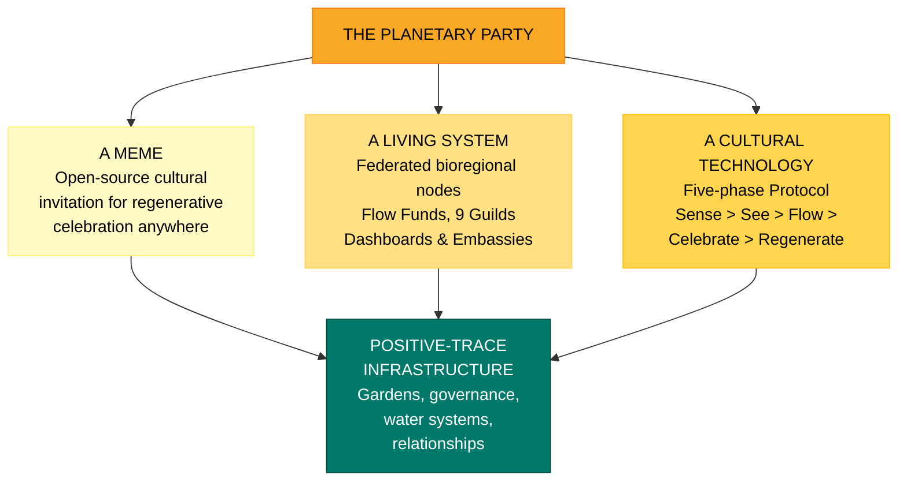
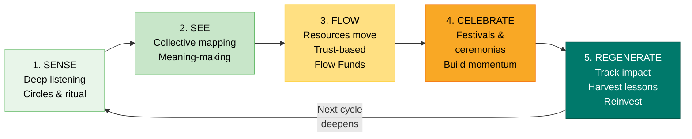
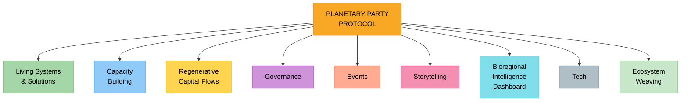
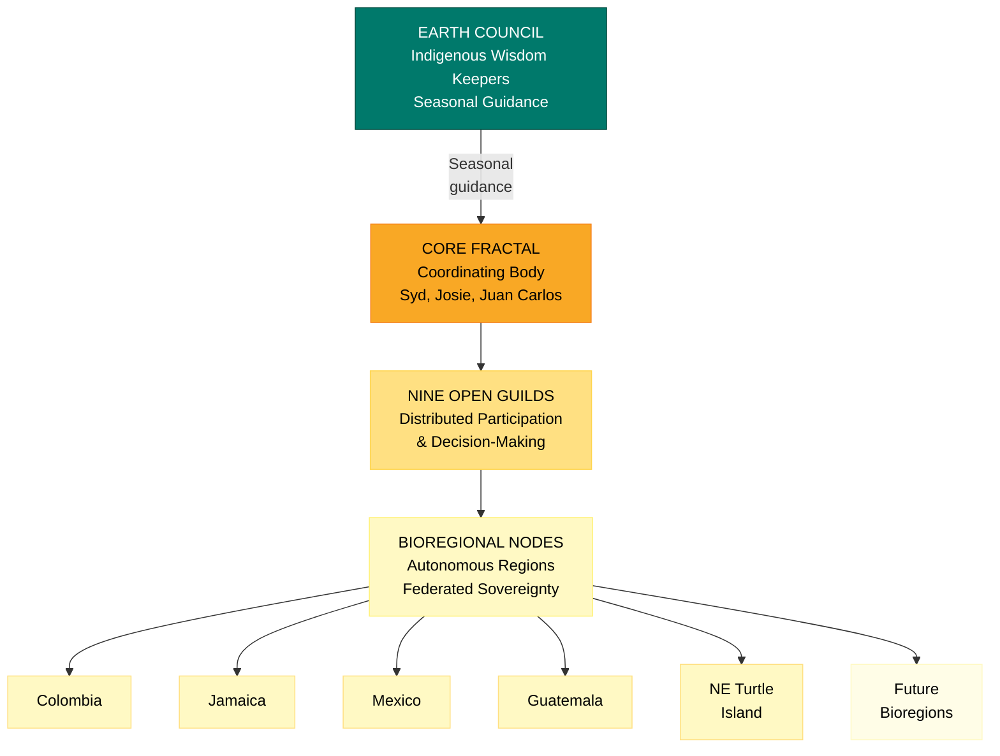
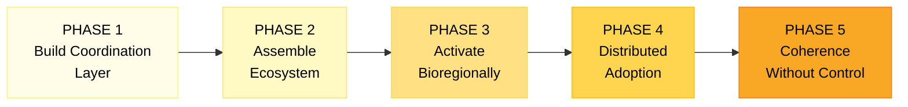
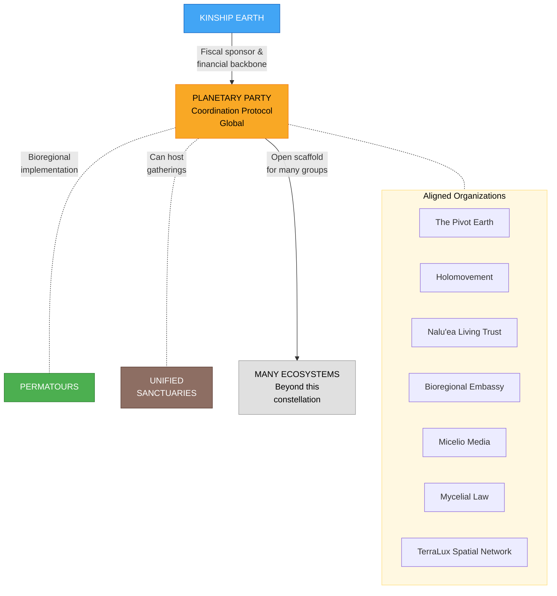

# The Planetary Party -- Executive Summary

## Overview

The Planetary Party is both a cultural meme -- an open-source invitation for communities to organize regenerative celebrations anywhere on Earth -- and the **Planetary Party Protocol (PPP)**, a practical coordination layer that helps regenerative efforts align, resource one another, and scale without centralization. It exists to connect what is already emerging: an extraordinary field of regenerative builders, bioregional organizers, governance innovators, and cultural workers worldwide -- largely uncoordinated, under-resourced, and operating in silos.

The Planetary Party is a **coordination layer, not an ownership layer** -- designed so many groups can participate, adapt, and benefit without centralized control.

**Website:** [planetaryparty.com](https://www.planetaryparty.com/)
**Entity:** Cultural coordination protocol (fiscal sponsorship through Kinship Earth)
**Scale:** Global
**Status:** Active -- planning and activation across 5+ bioregions

---

## Mission & Vision

**Mission:** To provide the coordination infrastructure that allows regenerative builders, bioregional organizers, funders, governance innovators, and cultural workers to align, resource one another, and scale their work -- without centralization or loss of local sovereignty.

**Vision:** A world where communities move through cycles of sensing, seeing, flowing resources, celebrating, and regenerating -- producing lasting "positive-trace" infrastructure (gardens, governance models, water systems, strengthened relationships) with each cycle. A whole-system catalyst for building a world that works for all.

---

## The Opportunity

We are witnessing converging crises -- a legitimacy crisis in institutions, a meaning crisis in culture, a trust crisis in financial systems, a coherence crisis in governance, a relational crisis in communities, and a worldview crisis as fragmentation gives way to interdependence. At the same time, an extraordinary field of regenerative builders is emerging worldwide. What is missing is not vision or will, but **coordination infrastructure**.

---

## The Core Model: Three Integrated Layers

| Layer | Description |
|-------|-------------|
| **A Meme** | An open-source cultural invitation for communities to organize regenerative celebrations anywhere on Earth |
| **A Living System** | A federated network of bioregional nodes, Flow Funds, nine functional Guilds, intelligence dashboards, and embassies |
| **A Cultural Technology** | A five-phase Protocol guiding communities through sensing, mapping, resourcing, celebrating, and regenerating |

### The Five-Phase Protocol

Communities move through a living spiral rhythm cyclically. Each cycle produces lasting "positive-trace" infrastructure: gardens, governance models, strengthened relationships, water systems, and ongoing community capacity.

### Nine Functional Guilds

| Guild | Focus |
|-------|-------|
| **Living Systems & Solutions** | Land, food, water, energy, ecological restoration |
| **Capacity Building** | Training, healing, leadership development |
| **Regenerative Capital Flows** | Flow Funds, investment, multi-capital design |
| **Governance** | Participatory systems, collective decision-making, legal scaffolding |
| **Events** | Gatherings, festivals, cultural activations |
| **Storytelling** | Media, myth, narrative infrastructure |
| **Bioregional Intelligence Dashboard** | Sense-making, mapping, data collection, impact visibility |
| **Tech** | Regenerative tooling and interoperability support |
| **Ecosystem Weaving** | Cross-guild synergy and coordination |

Guilds are not departments -- they are open participation structures that anyone can join and contribute through.

---

## Capital Strategy & Financial Targets

| Milestone | Target | Timeline |
|-----------|--------|----------|
| Phase 1 Target | **$5M** | End of 2026 |
| Scaled Ecosystem | **$20M** | 2028 |

### Revenue & Sustainability Model

| Stream | Description |
|--------|-------------|
| **Event & Festival Revenue** | Ticket sales, vendor fees, marketplace revenue |
| **Sponsorships & Partnerships** | Aligned brands, foundations, and institutional partners |
| **Media & Content Licensing** | Documentary content, event media, storytelling assets |
| **Flow Fund Administration** | Coordination of trust-based capital deployment |
| **Donor Cultivation** | Individual and institutional philanthropy |
| **Grant Funding** | Foundation, government, and climate program grants |

### Where Capital Goes

- Core coordination infrastructure and team
- Bioregional Flow Funds
- Guild development and capacity building
- Storytelling and media production
- Governance design and legal scaffolding
- Technology and interoperability tooling
- Event production and cultural activations

---

## Traction: Active Bioregional Deployments

| Bioregion | Status | Focus |
|-----------|--------|-------|
| **Colombia** | Active since Q1 2024 | Bioregioning across Aguaclara, Sinu, Sierra Nevada de Santa Marta, Bogota, Cali -- forest/watershed restoration, regenerative governance. Flow Funds preparing for Q1 2026. |
| **Jamaica** | Active since Aug 2025 | Partnership with Rastafari Indigenous Village (Montego Bay) on post-hurricane recovery and Indigenous-led stewardship |
| **Mexico** | Active since Oct 2025 | Relationship-building in Cloud Forest bioregion (Veracruz) and Mexico City |
| **Guatemala** | Active since Nov 2025 | PPP moved from framework to practice through Indigenous-led listening circles and community action around Lake Atitlan |
| **Northeast Turtle Island** | Launching Q1 2026 | Bioregional activation and learning series -- mapping, collaboration, disaster preparedness, and Flow Funding readiness |

---

## Governance Structure

- **Core Fractal** -- Coordinating body (Syd Harvey Griffith, Josie Watson, Juan Carlos Kaiten)
- **Earth Council** -- Indigenous wisdom keepers providing seasonal guidance
- **Guild-Based Participation** -- Distributed decision-making through nine open Guilds
- **Federated Sovereignty** -- Autonomous bioregions supported by a global network, not controlled by it
- **Consent-Based Process** -- Decisions rooted in deep listening, collective mapping, and relational accountability

### Core Values

- **Bioregional Rootedness** -- Change rooted in specific places: watersheds, cultural landscapes, living ecologies
- **Rights of Nature** -- Prioritizing ecological integrity and future generations
- **Federated Sovereignty** -- Autonomous bioregions, not centralized control
- **Distributed Intelligence** -- Knowledge-sharing across bioregions without hierarchy
- **Celebration as Catalyst** -- Joy, art, ritual as transformation technologies
- **Positive-Trace Infrastructure** -- Every gathering leaves lasting regenerative outcomes

---

## Legal & Entity Structure

- **Entity Type:** Cultural coordination protocol (not a standalone legal entity)
- **Fiscal Sponsor:** Kinship Earth (Nonprofit 501c3) -- receives charitable donations and grant funding for the PPP ecosystem
- **Relationship formalized** through a board-approved proposal with MOUs, compliance mechanisms, and clear accountability structures
- **Design Principle:** The Planetary Party is a scaffold that many groups can plug into -- a coordination layer, not an ownership layer

---

## Development Phases

### Phase 1 -- Build the Coordination Layer
Fund core coordination, storytelling, and governance infrastructure to establish a coherent backbone for the Protocol.

### Phase 2 -- Assemble the Ecosystem
Onboard collaborators, partners, and guild members. Launch cross-domain Guilds (Storytelling, Tech, Finance, Governance, Land, Culture).

### Phase 3 -- Activate Bioregionally
Connect projects, capital, and capacity through shared rhythms. Pilot Planetary Party activations. Support bioregional hosts in adapting the Protocol locally.

### Phase 4 -- Enable Distributed Adoption
Support other regions in hosting Planetary Parties independently using shared documentation, tooling, and learnings.

### Phase 5 -- Maintain Coherence Without Control
Hold alignment through shared values, community agreements, and relational accountability -- without centralization or hierarchy.

---

## Ecosystem & Strategic Partnerships

| Partner Entity | Relationship |
|---------------|-------------|
| **Kinship Earth** | Fiscal sponsor and financial backbone; provides Flow Funding infrastructure. The PPP operationalizes Kinship Earth's flow funding methodology at global scale. |
| **Permatours** | Bioregional implementation partner in the Northeast; network practitioners participate in PP gatherings; PP provides cultural infrastructure |
| **Unified Sanctuaries** | Could host gatherings; provides land-based context for protocol experimentation |
| **Many ecosystems** | PP is a scaffold that groups beyond this constellation plug into |

### Aligned Organizations

- **The Pivot Earth** -- Women-led ecosystem weaver supporting bioregional regeneration
- **Holomovement** -- A "movement of movements" oriented around conscious collaboration
- **Nalu'ea Living Trust** -- Intergenerational stewardship vehicle for land and assets
- **Bioregional Embassy** -- Diplomatic agency bridging governance, finance, and culture
- **Micelio Media** -- Storytelling studio amplifying bioregional voices
- **Mycelial Law** -- Earth-law practice exploring biomimicry-inspired legal structures
- **TerraLux Spatial Network** -- Innovation lab and spatial intelligence platform

**Critical design principle:** These four initiatives are not a closed system. Each maintains its own integrity, communities, and ethical boundaries. The Planetary Party is a scaffold that many groups beyond this constellation can plug into.

---

## Founding Team

| Name | Role | Focus |
|------|------|-------|
| **Syd Harvey Griffith** | Lead Architect | Community organizer, movement builder, regenerative finance leader. Executive Director of Kinship Earth. Supported 40+ land-based projects. Pioneered trust-based Bioregional Flow Funding. |
| **Juan Carlos Kaiten** | Vision Holder & Core Steward | Social Alchemist |
| **Eslerh Oreste** | Core Steward | Film production, multimedia, ritual theater |
| **Michael / Fuego** | Core Steward | Festival production, financial operations |
| **Josie Watson** | Core Steward | Kinship Earth board, Mycelial Law founder |
| **Susanna Choe** | Core Steward | |
| **Nadim Hamdan** | Core Steward | Regenerative Leadership Consultancy |
| **Jenny Heinze** | Core Steward | |
| **Sheri Herndon** | Core Steward | |

---

## How to Get Involved

| Pathway | Description |
|---------|-------------|
| **Donate** | Support the coordination infrastructure and bioregional Flow Funds through Kinship Earth |
| **Invest** | Align capital with regenerative outcomes and long-horizon stewardship |
| **Join a Guild** | Contribute your skills through one of nine functional Guilds |
| **Partner** | Bring your organization into the ecosystem as a collaborator |
| **Host a Planetary Party** | Activate the Protocol in your bioregion using shared documentation and support |
| **Join an Existing Activation** | Plug into Planetary Party activations already underway across bioregions |

---

## What Makes the Planetary Party Unique

1. **Protocol, not platform** -- a coordination layer that many groups can plug into without centralized ownership
2. **Celebration as catalyst** -- joy, art, and ritual as transformation technologies, not afterthoughts
3. **Positive-trace infrastructure** -- every gathering leaves lasting regenerative outcomes (gardens, governance models, water systems)
4. **Federated sovereignty** -- autonomous bioregions supported by a global network, not controlled by it
5. **Built-in media production** -- every event documented for storytelling and distribution
6. **Nine open Guilds** -- participation structures anyone can join and contribute through
7. **Five-phase living spiral** -- a repeatable cycle (Sense, See, Flow, Celebrate, Regenerate) that deepens with each turn
8. **Already active across 5+ bioregions** -- not theoretical; the Protocol is being practiced in Colombia, Jamaica, Mexico, Guatemala, and the Northeast

---

## Key Risks & Open Questions

- **Fundraising execution:** Achieving $5M by end of 2026 and $20M by 2028 requires significant donor cultivation and institutional partnership
- **Coordination complexity:** Operating across 5+ bioregions with different languages, cultures, and governance traditions while maintaining protocol coherence
- **Fiscal structure:** Currently fiscally sponsored by Kinship Earth; may need its own legal entity as it scales
- **Guild activation:** Moving from designed Guild structures to active, self-sustaining participation circles
- **Centralization risk:** Ensuring the Protocol remains a coordination layer, not a centralized organization, as it grows
- **Measuring impact:** Demonstrating the tangible outcomes of "positive-trace infrastructure" across diverse bioregions
- **Sustainability:** Transitioning from philanthropic funding to diversified revenue (events, media licensing, sponsorships) at sufficient scale

---

## Summary

The Planetary Party addresses the critical coordination gap in the global regenerative movement -- connecting builders, organizers, funders, and cultural workers who are arriving at the same conclusions independently but working in silos. With active deployments across 5+ bioregions, a five-phase Protocol that produces lasting infrastructure with each cycle, nine functional Guilds for distributed participation, and a federated governance model that preserves local sovereignty, the Planetary Party is already demonstrating that regenerative coordination at global scale is possible without centralization. The immediate priorities are funding the coordination layer, deepening bioregional activations, and building the Guild ecosystem to the point of self-sustaining distributed adoption.

---

> *"You never change things by fighting the existing reality. To change something, build a new model that makes the existing model obsolete."* -- Buckminster Fuller

---

**Website:** [planetaryparty.com](https://www.planetaryparty.com/)

**Key Links:**
- [Funding Needs (Proof of Concept)](https://docs.google.com/document/d/1AGP-2gTkmhJp5MWGMHx_6AMLfuJKW4D_a9xhj1Pn49A/edit?usp=sharing)

*Prepared February 2026 | The Planetary Party*
