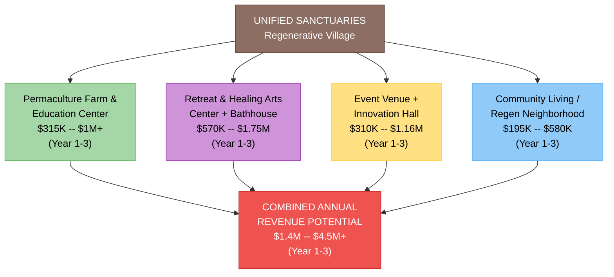
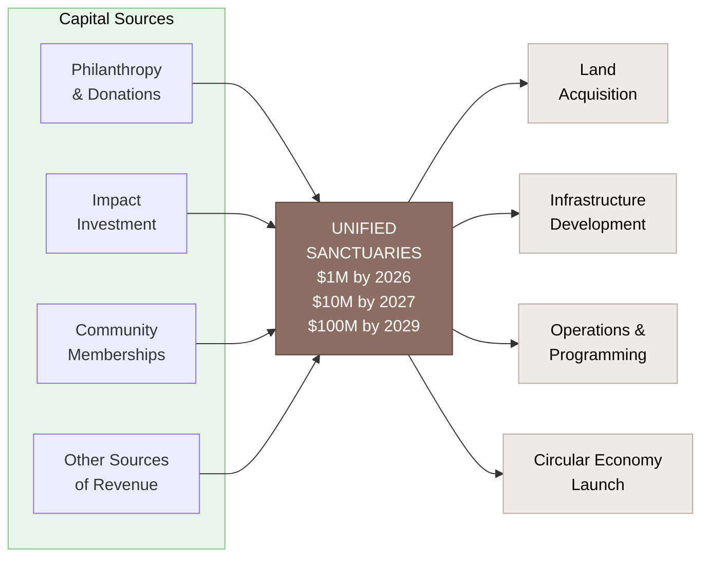
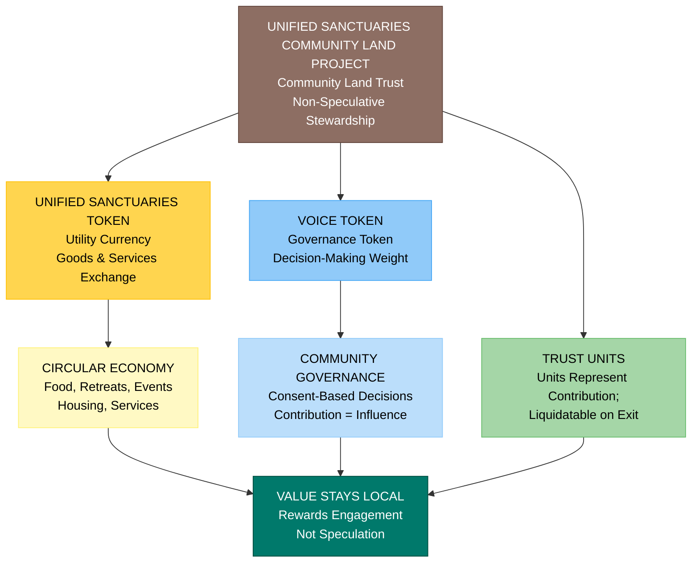
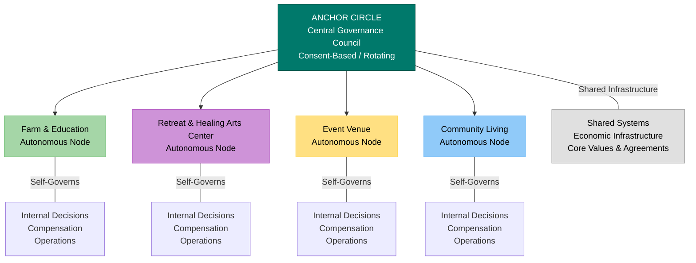
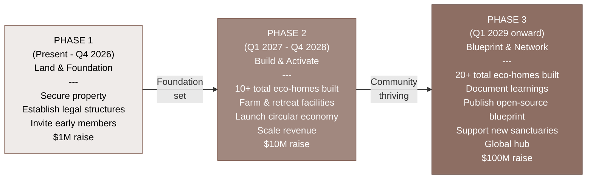
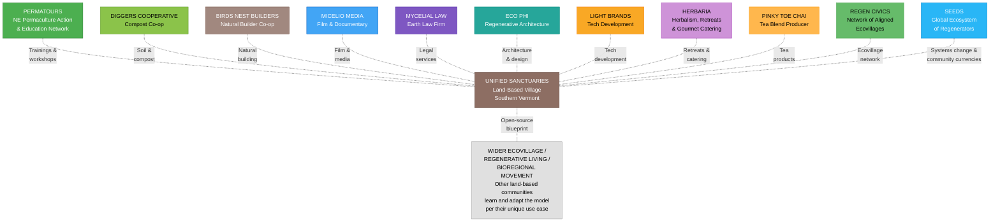

# Unified Sanctuaries -- Executive Summary

**Land-Based Regenerative Village -- Southern Vermont**

*Prepared: February 2026*

---

## Overview

Unified Sanctuaries is a land-based regenerative community planned for Southern Vermont (Brattleboro / Guilford / Putney corridor) that integrates permaculture farming, healing arts, cultural programming, and cooperative living into a single, self-sustaining village. Conceived as a living laboratory for regenerative development, the project operates at the intersection of ecological stewardship, community economics, and cultural innovation. It is designed from the ground up as an open-source blueprint -- every governance framework, financial model, and operational design will be publicly shared so that communities worldwide can learn from and adapt the model per their own unique use case.

- **Current Phase:** Searching for Land, Planning
- **Contact:** sydney.griffith123@gmail.com

---

## Mission & Vision

**Mission:** To establish a thriving, multi-pillar sanctuary that regenerates land, culture, and livelihoods; hosts aligned businesses, residents, and gatherings; and demonstrates a viable alternative to extractive real estate development.

**Vision:** Unified Sanctuaries is an experimental hub for learning -- a living lab and museum exploring healing approaches through permaculture, healing arts, community living, and education. It aims to serve as a regenerative model of village-scale living rooted in equity, Indigenous wisdom, and ecological stewardship -- and to catalyze a global network of similar sanctuaries.

---

## The Four Pillars

The community is organized around four interdependent platforms, each operating with internal autonomy while sharing infrastructure, governance, and economic systems.

### 1. Permaculture Farm & Education Center
Regenerative agriculture, farm stand, a community cafe, forest school programming, agritourism / you pick programs, and hands-on education. This pillar anchors the land ethic of the project and provides the nutritional and educational foundation for residents and visitors alike.

**Annual Revenue Potential:** $315K -- $1M+

### 2. Retreat & Healing Arts Center + Bathhouse
Immersive retreats, healing arts (visual, performing, and circus arts; art therapy), somatic therapy, herbalism, a spa/bathhouse, a campground, a makerspace for crafts and design, and dwellings to stay overnight. This pillar serves as the restoration and wellness engine of the community, drawing visitors and retreat participants year-round.

**Annual Revenue Potential:** $570K -- $1.75M

### 3. Event Venue + Innovation Hall
Festivals, concerts, weddings, markets, conferences, knowledge-sharing gatherings, and AV/multimedia production. This pillar positions the sanctuary as a cultural and economic hub, generating revenue and visibility while providing programming infrastructure for the broader movement.

**Annual Revenue Potential:** $310K -- $1.16M

### 4. Community Living / Regenerative Neighborhood
Eco-homes, tiny dwellings, shared stewardship, and cooperative living for 20+ households. Residents contribute to and benefit from the sanctuary's circular economy, forming the stable social fabric that sustains all other pillars.

**Annual Revenue Potential:** $195K -- $580K

### Combined Revenue Potential: $1.4M -- $4.5M+ annually (Year 1-3, at maturity)

---

## Capital Strategy & Financial Targets

| Milestone | Target | Timeline |
|-----------|--------|----------|
| Seed / Phase 1 Capital Raise | $1,000,000 | End of 2026 |
| Growth / Phase 2+ | $10,000,000 | 2027 |
| Mature / Phase 3+ | $100,000,000 | 2029 |

Capital sources include philanthropic donations, impact investment, earned revenue, community memberships, and aligned partnerships. The project is actively engaging donors and impact investors during the current pre-acquisition phase.

---

## Economic Model

Unified Sanctuaries employs a circular internal economy designed to keep value local and reward contribution over capital:

- **Sol Token (Utility):** A community currency exchangeable for goods and services within the ecosystem -- food, retreat sessions, event access, housing credits, and more.
- **Voice Token (Governance):** Earned through participation and stewardship, granting decision-making weight in community governance. Contribution, not capital, determines influence.
- **Trust Units:** Earned through infrastructure development and improvements to the land. Trust units can be liquidated upon exit, ensuring that contributors build tangible equity through their work.
- **Non-Speculative Land Stewardship:** Land is held in a Trust, removing it from market speculation and ensuring permanent community stewardship.

Each pillar autonomously structures its own way of operating and governing itself, including its compensation and reward mechanisms while participating in the shared economic infrastructure of Unified Sanctuaries.

---

## Governance Structure

Unified Sanctuaries blends **sociocracy** and **holacracy** principles into a consent-based, rotating governance model:

- **Anchor Circle (Council):** The central governance body that guides interconnected autonomous platforms, maintains shared infrastructure, upholds core values, and stewards the economic systems.
- **Autonomous Nodes:** Each of the four pillars operates as a self-governing unit with its own internal decision-making, compensation structures, and operational authority -- while remaining accountable to the shared governance framework.
- **Consent-Based Decision-Making:** Decisions are made through consent rather than consensus or majority rule, ensuring that no one is overruled while maintaining operational agility.
- **Rotating Leadership:** Governance roles rotate to distribute power and develop leadership capacity across the community.

---

## Legal & Entity Structure

- **Unified Sanctuaries Land Trust:** Owns and stewards the land in perpetuity, keeping it outside market speculation. Its role is asset protection and long-term stewardship, not operations.

- **Pillar Trusts:** Each core pillar operates through its own trust:
  - Retreat & Healing Arts Trust
  - Event Venue Trust
  - Farm Trust
  - Community Living Trust

  Each pillar trust has an agreement with the Land Trust and governs activities within its domain.

- **Businesses & Partnerships:** Existing businesses can partner with the relevant pillar trust through agreements, while new ventures may be created within a pillar trust. Businesses do not need to be owned by a trust; alignment happens through contracts.

- **Anchor / Stewardship Layer:** A coordinating trust stewards pooled funds and supports shared infrastructure across pillars while maintaining autonomy between trusts.

  Pooled funds are shared resources contributed by businesses, members, and programs into a common stewardship pool -- held by the Anchor Circle / Trust -- to support land stewardship, shared infrastructure, and ecosystem-wide needs rather than any single pillar. They provide continuity and coordination without controlling individual trusts or enterprises.

---

## Development Phases

### Phase 1 (Present - Q4 2026) -- Land & Foundation
- Identify and secure the right property in Southern Vermont
- Establish legal, governance, and stewardship structures
- Invite early members and anchor contributors
- Refine governance frameworks and community agreements
- Engage donors and impact investors for the $1M raise

### Phase 2 (Q1 2027 - Q4 2028) -- Build & Activate
- Develop core infrastructure: housing (10+ total eco-homes built), farm systems, gathering spaces, bathhouse, retreat facilities, and event venue
- Onboard residents and mission-aligned businesses
- Host retreats, residencies, activations, festivals, and educational programming
- Launch the circular economy
- Scale revenue across all four pillars
- $10M raise

### Phase 3 (Q1 2029 onward) -- Blueprint & Network
- 20+ total eco-homes built
- Document all learnings -- governance models, financial systems, construction methods, community processes
- Publish the open-source blueprint for global replication
- Support the emergence of additional sanctuaries in other bioregions
- Serve as a hub within larger bioregional and global regenerative ecosystems
- $100M raise

---

## Ecosystem & Strategic Partnerships

Unified Sanctuaries is one node in a broader ecosystem of regenerative projects and partners:

| Partner Entity | Relationship |
|---------------|-------------|
| **Permatours** | NE permaculture action and education network |
| **Diggers Cooperative** | Compost co-op |
| **Birds Nest Builders** | Natural builder co-op |
| **Micelio Media** | Film maker, documentarian |
| **Mycelial Law** | Earth law firm, serving life and living systems |
| **Eco Phi** | Regenerative architecture firm |
| **Light Brands** | Tech development |
| **Herbaria** | Herbalism, retreats, and gourmet catering |
| **Pinky Toe Chai** | Tea blend producer |
| **Regen Civics** | Network of aligned ecovillages |
| **SEEDS** | Global ecosystem of regenerators focused on systems change, including creating community currencies |

And a plethora of aligned producers and service providers who have participated in Permatours events, and beyond.

---

## Phase 1 Collaborators

| Name | Core Expertise |
|------|---------------|
| **Syd Harvey Griffith** | Executive Director of Kinship Earth, co-founder of Permatours, systems designer, capital strategist, community organizer |
| **Lynney Rey** | Farm operations, cafe, herbalism, forest school, performing / visual / healing arts |
| **Eslerh Oreste** | Film, multimedia, ritual theater, performing / healing arts |
| **Fuego Gale** | Accounting, financial operations, festival production, membership sales |
| **Josie Watson** | Earth lawyer, governance designer, playwright, performing / healing arts |
| **Scotty** | Soil scientist, compost specialist, nature builder, engineer, acro yogi clown |

---

## How to Get Involved

| Pathway | Description |
|---------|-------------|
| **Donate** | Philanthropic contributions to support pre-acquisition operations and planning |
| **Invest** | Impact investment aligned with the $1M (2026), $10M (2027), and $100M (2029) capital raises |
| **Live On-Site** | Apply to become a resident in the regenerative neighborhood (20+ homes) |
| **Host Your Business** | Apply to operate a mission-aligned business within the sanctuary ecosystem |
| **Become a Member** | Purchase early membership to secure a stake in the community and its governance |
| **Share Skills & Network** | Contribute expertise, professional connections, or labor/skills exchange |
| **Scout Property** | Help identify and evaluate the right land in Southern Vermont |

---

## What Makes Unified Sanctuaries Unique

1. **Non-Speculative Land Model:** Property held in trust, permanently removed from market speculation.
2. **Governance earned through contribution:** Stewardship and participation determine governance power.
3. **Circular Internal Economy:** Community utility currency and governance tokens keep value local and reward engagement.
4. **Open-Source Blueprint:** Every system -- governance, finance, construction, community process -- is documented and shared for global replication.
5. **Multi-Revenue Resilience:** Four distinct but interconnected revenue pillars reduce dependence on any single income stream.
6. **Consent-Based Governance:** Sociocratic/holacratic hybrid model with rotating leadership and autonomous nodes.
7. **Ecosystem Integration:** Connected to a local and global network of aligned organizations.
8. **Deep Team Expertise:** A founding team with demonstrated experience increasing the capacity of 50+ land-based projects through permaculture action and natural building workshops, practicing regenerative finance, community organizing, and participating in cooperative governance structures.

---

## Key Risks & Open Questions

- **Land Acquisition:** The right property has not yet been secured. Location, price, zoning, and condition will shape timelines and costs.
- **Capital Raise Execution:** Achieving $1M by end of 2026, $10M by 2027, and $100M by 2028 requires aggressive fundraising across philanthropy and impact investment.
- **Entity & Governance Structuring:** Trusts and governance structure in process of becoming established. Practicing consent-based governance will require careful onboarding and conflict resolution systems.
- **Pre-Land Momentum:** Maintaining community energy and investor confidence during acquisition phase requires creative interim programming.
- **Regulatory & Zoning:** Vermont land use, housing, and agricultural regulations will shape what can be built and how quickly.

---

## Summary

Unified Sanctuaries represents an ambitious and deeply considered approach to regenerative community development. With a proven founding team, a multi-pillar revenue model projecting $1.4M-$4.5M+ at maturity, a circular economy designed to keep value local, and a governance structure that distributes power through contribution rather than capital, the project is positioned to become both a thriving community and a replicable blueprint for regenerative villages worldwide. The immediate priorities are securing land in Southern Vermont, closing the Phase 1 capital raise of $1M, and building the founding community - while documenting processes and learnings for the communities that follow.

---

*Prepared February 2026 | Unified Sanctuaries | Southern Vermont*
